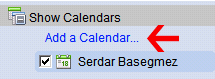
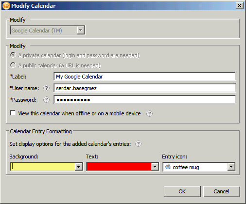
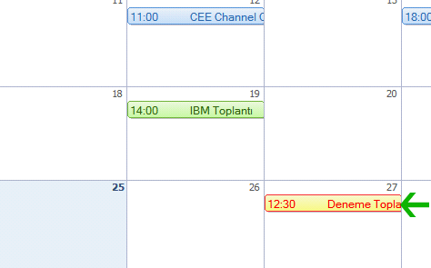

---
authors:
  - serdar

title: "Lotus Notes 8.5.1 ile Gelen Devrimsel Takvim Paylaşımı"

slug: lotus-notes-8.5.1-ile-gelen-devrimsel-takvim-paylasimi

date: 2010-01-25T12:54:17Z

---

Lotus Notes 8.5.1 itibariyle takvim paylaşımı bir üst noktaya taşındı. Bundan sonra kendi takvim görüntünüzde başkalarının da etkinliklerini görebiliyorsunuz.

En güzeli, bu ikinci takvimin Lotus üzerinde olması gerekmiyor. Herkese açık ya da özel bir Google Calendar da artık listenize eklenebilir. Üstelik bu takvim girdileri offline ya da mobil görünüm için kaydedilebiliyor.
<!-- more -->
Takvim ekranımızda sol altta çıkan Show Calendars bölümünü genişletiyoruz:

ve sonuç:

Eğer özel işleriniz için Google Calendar kullanıyorsanız bu araç sayesinde planlamalarınızı daha rahat yapabilirsiniz.

Google'a ek olarak Team Room veritabanı, ICS dosyaları ve kendi yazdığınız uygulamaların takvim görüntülerinin de eklenebildiğini hatırlatırız.

Görüşmek üzere.
