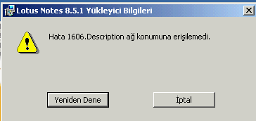
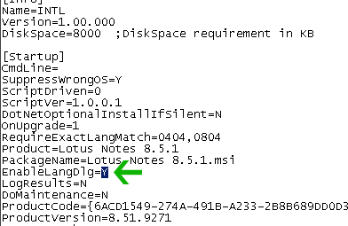

---
authors:
  - serdar

title: "Lotus Notes 8.5.1 Kurulum Problemi"

slug: lotus-notes-8.5.1-kurulum-problemi

date: 2010-01-19T11:15:25+02:00

---

Lotus Notes 8.5.1 kurulumu yapılırken bilgisayarın dili Türkçe ise aşağıdaki hatayla (Hata 1606.Description ağ konumuna erişilemedi) karşılaşıyoruz.

Bu konuda destek kaydı açmadık çünkü hatanın düzeltilmesi çok basit. Sırdan bir Java hatası olduğunu düşünüyorum.

Sorunu düzeltmek için öncelikle kurulum dosyasını bir klasöre açmak gerekiyor. Herhangi bir sıkıştırma uygulaması ile (Winrar, Winzip...) açtıktan sonra **setup.ini** dosyasını açıyoruz.

**EnableLangDlg** parametresini "**Y** " olarak değiştirdikten sonra tekrar kurulum yapıyoruz. Bu kez kurulum uygulamasının dilini seçme şansımız var. İngilizce seçerek kuruluma devam edebiliriz.
