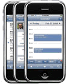

---
authors:
  - serdar

title: "Lotus Notes Traveler Companion"

slug: lotus-notes-traveler-companion

date: 2010-01-21T11:50:30Z

---

Geçtiğimiz aylarda (8.5.1 versiyonuyla) Lotus Notes Traveler'ın iPhone desteği duyurulmuştu.
<!-- more -->
**Bu desteği kullanan müşterilerimden şu ana kadar aldığım geribildirimler olumlu.** En azından Symbian versiyonundan daha stabil olduğu söyleniyor. Fakat bu ilk versiyonun yetenekleri oldukça sınırlıydı.

IBM geçen hafta iPhone AppStore'a yerleştirdiği ilk uygulama olan **Lotus Notes Traveler Companion** yazılımını duyurdu. Bizzat Ed Brill'in [blog](http://www.edbrill.com/ebrill/edbrill.nsf/dx/lotusphere-2010-lotus-notes-traveler-in-2010)'undan duyurulan yazılım ücretsiz olarak dağıtılıyor ve Lotus Traveler 8.5.1.1 (8.5.1 üzerine FP1) versiyonuyla çalışıyor. Dolayısıyla FP1 sayesinde şifreli mesaj desteği gibi özelliklerin de iPhone'da kullanılabilmesini sağlıyor.

Aynı mesajda Ed Brill, Traveler'ın Android versiyonunun da yakın zamanda ortaya çıkacağını duyurdu.

Traveler ürünüyle IBM'in bir çok platformda mobil mesajlaşma desteği sürecek gibi görünüyor. Ürünün en büyük eksiğinin merkezi yönetim olanaklarının son derece kısıtlı olması gibi görünüyor. Güvenlik açısından da Lotus Mobile Connect ürünüyle destekleniyordu.

Lotus Notes Traveler ve Lotus Mobile Connect ürünlerini kullanarak gerçekleştirdiğimiz bir projeyle 2008 yılında IBM'den **En İyi Proje ödülü** kazanmıştık. Yeni lisanslama modelinde Lotus Mobile Connect ürününün istemci lisanslarının **ücretsiz** sunulacak olması bu yönde en önemli gelişme. Çünkü alternatif teknolojilerin (RIM Blackberry ve Commontime mSuite) kendi güvenli bağlantı sistemleri mevcut. Son olarak mesajlaşma ötesine geçmek istediğinizde bu yönde basit bir çözüm yok. Oysa gene alternatif teknoloji sağlayıcılar bu yönde tatminkar uygulama geliştirme olanakları sunuyorlar.

Lotus Notes/Domino kullanıcılarına yönelik mobil platform desteği ile ilgili geniş bir yazıda Blackberry, mSuite ve Traveler karşılaştırması yapmayı planlıyorum. Gerçi blackberry kullanıcısı değilim ama bu konuda dışarıdan destek almam gerekecek.
