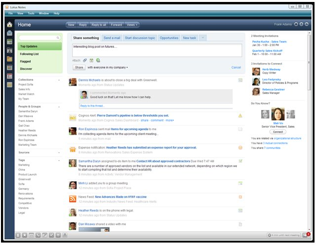

---
authors:
  - serdar

title: "Project Vulcan: Lotus Notes ve Geleceği"

slug: project-vulcan-lotus-notes-ve-gelecegi

date: 2010-01-22T10:02:14Z

---

Bu aralar Lotus dünyasında haber çok. Twitter hesabım doldu taştı. Ed Brill ve izlediğim diğer Lotus yöneticileri sürekli yeni tweet'ler yazıp duruyorlar. Lotussphere 2010'da saat başı yeni bir gelişme yaşanıyor.

Son gelişme de Project Vulcan. Biz bu ismi Avrupa Birliği'nin çevreci bir projesi olarak biliyorduk. Fakat Ed Brill'in yazdığı [blog](http://www.edbrill.com/ebrill/edbrill.nsf/dx/lotusphere-2010-ibm-project-vulcan), projeyi şu şekilde anlatıyor:
<!-- more -->
> "**IBM Project Vulcan is not a brand-new effort. It builds on the existing capabilities, and represents the future versions of, the IBM Lotus product portfolio - including Notes. One of its key themes is social analytics and business analytics combined and applied to industry-specific scenarios - making collaboration more focused and relevant. The vision of Project Vulcan intends to deliver collaboration across company boundaries; make it easy to deploy the technology; and include developer-friendly services and APIs.** "
>
> "**One of the key evolutionary thoughts in IBM Project Vulcan is to move from what we currently refer to as "linked value" across the IBM portfolio to the notion of "loosely-coupled" services. This makes sense in an increasingly-expected hybrid environment, and will simplify deployment and adoption of collaboration and productivity within your organization. Web services, xPages, HTML5, RESTful APIs, will all be tools in pushing Project Vulcan forward. Alistair Rennie made a key point about IBM Project Vulcan -- delivering to the Notes client, web browser, and mobile devices as a converged user experience.**"

 

Aslında Project Vulcan, yıllardır IBM'in gündemindeydi. [Bluemail](http://www.research.ibm.com/social/projects_bluemail.html) adıyla IBM Research tarafından yürütülen projenin hayata geçmesini uzun zamandır bekliyorduk. Fakat Google çok daha erken davranarak [Google Wave](http://wave.google.com/) servisini zaten açmıştı.

Project Vulcan, mevcut teknolojiler kullanılarak oluşturulan bir ***Social Software*** platformu sayılabilir. Yeni uygulama; E-mail/Calendar/Todo kullanımını Web 2.0 teknolojisiyle birleştirmeyi, mevcut ürün çemberindeki diğer uygulamaları da Web servisleri, XPages, REST gibi yöntemlerle bu platforma bağlamayı, daha interaktif ve bütünsel bir iletişim platformu oluşturmayı amaçlıyor. Lotus Notes (ve/veya iNotes) için yeni nesil bir arabirim olacak gibi görünüyor.

Yayınlanan [basın bildirisine](http://www-03.ibm.com/press/us/en/pressrelease/29204.wss) göre 2010'un ikinci yarısında beta versiyonu sunulacak. Project Vulcan'ın yetenekleri; LotusLive, Lotus Notes/Domino, Lotus Connections, Quickr ve Websphere Portal ürünlerinde kullanılacak. Ürünün demo videosuna [buradan](http://www.eweek.com/c/a/Video/IBM-Lotus-CTO-Demos-IBM-Project-Vulcan/) ulaşabilirsiniz.

Kişisel görüşüm, kullanıcıların bu tip uygulamalar için henüz hazır olmadığı yönünde. Şu anki E-mail paradigmasıyla çok uyumlu değil bu tip uygulamalar. Benzer paradigma değişikliklerini deneyen bir projede çalışmıştık daha önce. Kullanıcı kabullenmesi zaman alıyor diyebiliriz. Ama kullanıcı fayda elde etmeye başladığında kabullenme hızlanıyor.

Öte yandan iş dünyasında yavaş yavaş etkinlik kazanmaya başlayan bir "[Generation-Y](http://en.wikipedia.org/wiki/Generation_Y)" gerçeği var. Yerleşik iş yapma yöntemlerini değişime zorlayacak bu yeni nesil, Facebook, Friendfeed veya Twitter gibi sosyal medya platformlarını sıklıkla kullanıyor. İletişimi mesajlaşmanın ötesine taşıma fikri onlar için yabancı değil. Bu nesil, şirketlerimizdeki yönetici kadrolara taşındıkça Project Vulcan ve Google Wave gibi platformlara talebin artacağını düşünüyorum.

Geçmişte sürekli "Şirketler ciddi bir değişimin eşiğinde" klişesini duyuyorduk. Aslında bu değişim gerçekleşti ve hızla yayılmaya devam ediyor. Şirketler parçalanıyor; takımlar şirket sınırlarını aşıyor. Artık lojistik, üretim, mühendis, tasarımcı, satışçı ve müşteri farklı organizasyonel yapılara dağıldı fakat aynı platformda iş yapmaya çalışıyor. Şimdilik yöneticilerin vizyonlarıi kadroları ve/veya bütçeleri bu değişime ayak uyduramadığı için E-mail/FTP/USB üçlüsüne mahkum çalışanlar. En basitinden E-mail ile dosya paylaşımı o kadar arttı ki; mesaj boyutlarında kısıtlama yapan müşterilerim bu limitleri 4-5 MB seviyelerinden 20-30 MB'lara yükseltmiş durumda.

Yazılım şirketleri bu değişime ayak uydurabiliyor mu? O da tartışmalı. Microsoft istemci tarafına, IBM ise sunucu tarafına odaklanmış görünüyor. Ben IBM tarafını incelediğimde; aslında büyük bir dağınıklık olduğunu hissediyorum. Lotus Connections, Lotus Quickr ve Lotus Mashup gibi uygulamalar bu platform ihtiyacını karşılamaya yönelikler. Ama hiç biri tüm bu dağınıklığı tek başına toparlayamıyor. Her ürün kendi yolunda, yetenek havuzunu genişleterek ilerliyor. Project Vulcan belki toparlayıcı bir ürün olacak. Ya da sadece arabirim olarak göreceğiz ve diğer ürünler başka bir noktada toparlanacaklar. Örneğin IBM dışı bloglarda sıklıkla Lotus Quickr ile Lotus Connections uygulamalarının bir vadede birleşeceği söyleniyor.

Yine de Lotus'un şu konuda hakkını teslim etmek lazım; 2000'lerin başına kadar taşıdıkları hantal yapıyı üzerlerinden attılar. Ürün geliştirme süreçleri çok hızlandı. Girdikleri katmanda hızla yayılabiliyorlar. Lotus Connections örneğinde olduğu gibi çok cesur hamleler görüyoruz. Müşteri/Partner/Developer üçgeninde sosyal medya kullanımı ve ekosistem iletişiminde 5 yılda çok önemli bir gelişme gösterdiler.

Görüşmek üzere...
