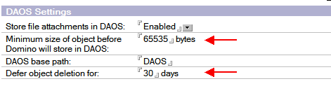

---
authors:
  - serdar

title: "DAOS Kullanımı ve Yedekleme"

slug: daos-kullanimi-ve-yedekleme

date: 2010-02-16T11:11:50+02:00

---

DAOS (Domino Attachment and Object Service) kullanmaya başlayan bir müşterimin sorusu üzerine bir takım testler yaptım ve sonuçlarını bu yazıyla paylaşmak istedim. Sizin de bu konuda tecrubeleriniz olduysa yorum eklemenizden mutlu olurum.

Bilgiye dayalı iş yapan çalışanlar (*Knowledge Worker* ) için çözüm üretmek çok güç oluyor. Yazılım endüstrisi genelde sektörel çözümler üretmeye konsantre olmuştur. Fakat çözümler çalışanların iş yapma alışkanlıklarını es geçiyor ve firmaların raporlama sistematiklerine yoğunlaşıyor. Bunun en önemli sonucu, bilgiye dayalı iş yapan çalışanların E-mail uygulamalarını bilgi yönetimi için kullanmaları oluyor. E-mail, bir çok çalışan için bir mesajlaşma sistemi olmaktan çıkmış durumda. İş takip, teklif yönetimi, müşteri ilişkileri yönetimi, fırsat yönetimi gibi bir çok fonksiyon E-mail araçlarıyla gerçekleştiriliyor. Bu fonksiyonlar için geliştirilmiş uygulamalar çoğu zaman es geçiliyor, hatta bu tip uygulamaların kullanımın ı özendirmek için komik yöntemler uygulanabiliyor. Herhangi bir sebeple mesajların ı kaybeden çalışan ise "tekliflerim kayboldu, mutlaka geri getirmeliyiz bunları" diye serzenişte bulunuyor. Dolayısıyla bir çok kurumda mesaj veritabanları uygulamalardan daha özenli bir şekilde yedekleniyor.

E-mail kullanımının yoğunluğuna, doküman yönetimi konusunda da iyi bir çözüm geliştirilememiş olması da eklenince, ekli dosyalar çok önemli bir depolama alanı kaplıyor. Yaklaşık on yıldır aynı mail veritabanını kullanıyorum ve veritabanı boyutumun 900 MB'ı geçmediğini gururla söyleyebilirim. Müşterilerimde 10 GB'ı geçen mesaj kutularını gördüğümde çok garipsiyorum bu açıdan.

Depolama verimliliğini arttırmak için geliştirilmiş olan DAOS özelliği, 8.5 serisinin getirdiği en önemli özelliklerden birisi. Bir kaç ay içerisinde onlarca upgrade yaptım ve yeni versiyonun tercih edilmesinde en önemli sebeplerden birisi gene DAOS fonksiyonalitesi idi. DAOS uygulamasına kısaca bakalım.
<!-- more -->

DAOS operasyonları, sunucuda çalışan DAOSMgr task'i tarafından y önetilir. Sisteme dahil edilmiş olan veritabanlarını sürekli izleyen DAOSMgr, bu veritabanlarına eklenen attachment'ları şifreledikten sonra veritaban ından çıkartarak NLO uzantılı bir dosya olarak kaydeder. Eğer attachment daha önce başka bir veritabanında yer almışsa onu referans olarak gösteren bir 'ticket' yaratır. Her 'ticket'; NLO dosya kodunu içerir ve dokümanın başlık kısmında tutulur. DAOS Catalog veritabanı ise NLO dosyalar ının veritabanı ve doküman bağlantılarını depolar. Bir attachment, iki farkı doküman tarafından kullanılıyorsa 'ticket count' 2 olacaktır.

DAOSMgr'nin iki işlevi daha vardır. '**Resync** ' işlemi katalog, NLO dosyaları ve veritabanları arasındaki ilişkilerin tekrar kurulmasını sağlar. Örneğin DAOS'a dahil olan bir veritabanını sunucudan manual olarak silerseniz 'Resync' işlemi yapılmalıdır. '**Prune** ' işlemi ise 'ticket count'ları sıfır olan NLO dosyaların temizlenmesini sağlar. 'Resync' otomatik olarak çalışmaz. Zaten DAOS kataloğunda bir sorun varsa konsolda hata mesajı görülecektir. 'Program' dokümanlarıyla periyodik 'Resync' yapılması önerilir. 'Prune' işlemi ise her gece 02.00'de otomatik olarak gerçekleşecektir. Örneğin aşağıdaki komut tüm sahipsiz NLO dosyalarının silinmesine neden olacaktır.

```
tell daosmgr prune 0
```

<br />



Veritabanları 'Compact' işlemiyle DAOS'a aktarılmadan önce DAOS'un öncelikle sunucu bazında aktive edilmesi gerekiyor. DAOS ayarlarında iki önemli parametre var. "Minimum size of object before Domino will store in DAOS" seçeneği, DAOS'a dahil edilecek ekli dosyalar için minimum boyuttur. Çok küçük dosyaların DAOS'a aktarılması performans sorunu yaratacak, yalnızca büyük dosyaların seçilmesi de konsolidasyon verimini düşürecektir. IBM'in optimum performans için önerdiği parametre windows için NTFS dosya sisteminin 'Bytes Per Cluster' değeridir ([link](http://www-10.lotus.com/ldd/dominowiki.nsf/dx/daos-best-practices#Optimum Minimum Size For Participation)). İkinci seçenek olan 'Defer object deletion for' değeri ise 'ticket count'u sıfırlanan NLO dosyalarının ne kadar süre tutulacağını belirler. Yukarıdaki örneğe göre periyodik 'Prune' işlemi sırasında 30 günden daha önceki sahipsiz NLO dosyalar silinecektir. Bu sürenin çok uzun tutulması ekstra disk kullanımına, çok kısa tutulması ise yedekten dönüşlerde zorluklara neden olacaktır.

Gelelim Yedekleme konusuna. Öncelikle yedek alırken DAOS klasörünün de yedeğini almamız gerekiyor. Bunu yaparken sıralama da önemli. Eğer önce DAOS klasörünü yedeklerseniz, veritabanları yedeklenirken oluşan yeni NLO dosyalar yedeğinize dahil olmayacaktır.

İkinci önemli konu DAOS'un Transaction Log ile birlikte kullanıldı ğıdır. Eğer sunucu açıkken NSF dosyaları işletim sistemi seviyesinde yedekliyorsanız veritabanının güncel halini alamazsınız. Çünkü tüm transaction'lar veritabanına aktarılmamış olabilir. Bu durumda ya sunucuyu kapatıp yedek almalısınız ya da Domino'ya uyumlu bir 'backup agent' kullanmalısınız.

Son olarak geri dönüş (restore) meselesine gelelim. Diyelim ki yukar ıdaki gibi bir konfigürasyon yapılarak 'Prune' zamanlaması 30 gün olarak ayarlandı. DAOS'a aldığımız bir veritabanında yanlışlıkla bir doküman silindi. 2 ay sonra bu dokümanı geri getirmek istedik. Veritabanını geri getirmemiz bir işe yaramayacaktır çünkü NLO dosyası artık silinmiştir. Hangi NLO dosyasını geri getireceğimizi bilmek için DAOSMgr'nin 'listnlo' komutunu kullanmamız gerekiyor.

```
tell daosmgr listnlo -o missing.txt MISSING restoreddb.nsf
```

<br />

Bu durumda önemli bir uyarı yapmamız gerekiyor. Veritabanını geri getirme işlemini mutlaka aynı sunucuda yapmamız gerekiyor. Yedeklenmiş veritabanındaki attachment'a local'den ya da ayrı bir sunucudan ulaşmamız mümkün değil. Başka bir sunucuya dönüş yapıp oradan 'New Copy' gibi bir yöntem kullanmamız da bir seçenek değil. Dolayısıyla yedeklenmiş veritabanı aynı 'Replica ID' ile aynı sunucuda yer alacaktır. **Eğer bir veritabanının çok eski bir versiyonu sunucuya yerleştirilirse olası bir replikasyonda silinmi ş dokümanların geri gelmesi sorunuyla karşı karşıya kalırız ki böyle bir sorunun kolay bir çözümü yoktur.** Dolayısıyla aynı veritabanı başka bir sunucuda (örneğin cluster sunucusu) varsa ciddi bir şekilde baş ımız derde girebilir. Cluster sunucusunu kapatmak, veritabanını restore eder etmez replikasyonunu kapatmak, tüm sunucularda 'replica' task'ini durdurmak gibi bir önlem alınması gerekir.

'Prune' zamanlamasını uygun bir değer alarak NLO dosyaları da yedek dönmekten kurtulabiliriz. İşin en önemli angaryası burasıdır. Çünkü eski veritabanını döneceğiz, 'Resync' yapacağız, NLO dosyanın ismini bulacağız, onbinlerce dosya arasından o spesifik dosyayı geri çağıracağız, tekrar 'Resync' yapacağız, ekli dosyayı kurtaracağız, eski veritabanını silecek ve son bir kez 'Resync' yapacağız. Eğer örnek durumumuzda 'Prune' zamanlaması 60 gün olsaydı bu zahmetten kurtulacaktık.

Bambaşka bir alternatif ise replikasyon yöntemiyle yedekleme yapmaktır. Eğer yeterli disk alanımız ve küçük bir sunucumuz varsa bu sunucuda yedeklenecek veritabanlarının birer replica'sı yaratılır. Gün boyunca veritabanları sürekli buraya güncellenir. Gece sunucu kapatılarak tam bir yedek al ınır. Çok eski verilere sıklıkla dönüş yapıyorsak, bu karmaşayla uğraşmak istemezsek ve disk alanımız da yeterliyse yedek sunucuda DAOS aktive edilmeyebilir. Hatta bu sunucu pasif bir cluster olarak tanımlanıp gün içerisinde sunucunun çökmesiyle işlerin durma riski minimize edilebilir.

Son olarak arşiv amaçlı yedeklemeyi de düşünmek gerekiyor. Örneğin ayrılan personelin mail veritabanını alıp kalıcı olarak saklamak istiyorsak bu veritabanını compact komutuyla DAOS'tan çıkarmamız gerekir.

```
load compact mail\maildb.nsf -c -daos off
```

<br />

Kaynak olarak Lotus Notes/Domino Wiki sayfalarını şiddetle öneriyorum. DAOS'la ilgili bir çok doküman bulunuyor [burada](http://www.lotus.com/ldd/dominowiki.nsf/xpViewTags.xsp?categoryFilterÚOS). Spesifik olarak '[DAOS Best Practices](http://www.lotus.com/ldd/dominowiki.nsf/dx/daos-best-practices)' ve '[DAOS Backup and Restore](http://www.lotus.com/ldd/dominowiki.nsf/dx/daos-backup-and-restore)' içeriklerine göz atabilirsiniz.
