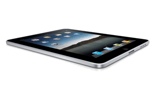

---
authors:
  - serdar

title: "iPad Çıktı: Steve Jobs'un Yeni Mucizesi mi?"

slug: ipad-cikti-steve-jobsun-yeni-mucizesi-mi

date: 2010-02-12T14:48:50+02:00

---

Apple ve dolayısıyla Steve Jobs'un uzun zamandır merakla beklenen ürünü geçen ay açıklanmıştı. iPad, beklentileri karşılamaktan epey uzak kaldı. iPod'un bir tık yukarısında bir tablet pc...

Piyasanın beklentisi bu değildi. Zaten lansman sonrası Apple'ın hisse senetlerinin bir miktar düşmesi pazar reaksiyonunu iyi özetledi.

Steve Jobs, innovasyonun Amerikan teknoloji kültüründeki karşılığıdır. Bugüne kadar el attığı her üründe, finansal başarı olsa da olmasa da, devrimsel ürünler ortaya koymuştur. Bunların bazıları **Apple Lisa** gibi ticari felaketle sonuçlanmış, bazıları da **iPhone** gibi pazarın seyrini değiştirmiştir. Hayalperest doğası, inatçı tavırları ve gerçeküstü yaklaşımları bir dönem Apple'dan uzaklaştırılmasına bile neden olmuştu. Apple'dan ayrı geçirdiği zamanlarda da boş durmamış ve Pixar, NeXT gibi projelere imza atmıştı. Huyu hiç değişmemişti. Örneğin **NeXT** 'in üretiminde laser destekli özel bir plastik üretim metodu bulunması için önemli bir ar-ge yatırımı yapmış ve benzerlerinden farklı olarak 'küp' şeklinde bir tasarım ortaya koymuştu. Ürün finansal olarak başarısız olmasına rağmen zamanının çok ötesindeydi. **Pixar** 'la yaptığı **Toy Story** ise bugün Avatar'a kadar gelen sinema devriminin önemli bir atlama taşı olmuştur.
<!-- more -->
Öte yandan yokluğunda Apple o kadar sıradan bir şirket olmuştu ki, geri çağırıldı ve gemisini tekrar kurtarma görevini başarıyla yürüttü. **iMac** , **iPod** , **iPhone** derken sektörün temellerini sarsma konusunda çok önemli adımlar attı ikinci Apple döneminde.

Uzun zamandır kanserle mücadele eden Jobs, "en önemli icadı"nın tüyolarını verdiğinde tüm dünyayı büyük bir heyecan kaplamıştı. Beklenti, iPhone'dan sonra o kadar yükselmişti ki, Apple bir UFO ürettiklerini söylese kimse şaşırmayacaktı.

Ama **iPad** hiç de beklenen bir ürün değildi. iPhone'dan biraz daha gelişmiş, büyük ekranlı bir tablet PC çıkmıştı ortaya. Duyurulduğu gün twitter'ın iki numaralı trend başlığı (iPad'in kadın pedlerine olan isim benzerliğiyle dalga geçilerek) **iTampon** olmuştu. Rakipler derin bir rahatlama yaşadıktan sonra dalga geçen açıklamalar başladı. Reklamlarında flash destekli sayfa görüntülerine yer verilmesi fakat işletim sisteminin flash desteği sunmaması gibi önemli hatalar da yapıldıkça herkesin ekmeğine yağ sürülmüş oldu. Bu konuda [yahoyt.com](http://www.yahoyt.com/)'da bir çok haber bulabilirsiniz.

Bir espriyi de IBM'den Ülkü paylaştı benimle. İzleyen resimler Financial Times'ın Almanca baskısından. iPad'den sonra ikinci dalga yeni ürünlerin geleceğini müjdeleyen yazının linki [burada](http://www.ftd.de/lifestyle/outofoffice/:apple-wahn-i-ner-geht-noch/50067373.html).

##### *Bett: Yatak, Floss: Sal demek. Gernordwand ise Alp'lerin dikliği dolayısıyla tırmanması en zor altı noktasından birisiymiş. Çeviri desteğinden ötürü Sinan'a teşekkürler.*
