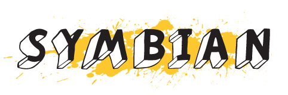

---
authors:
  - serdar

title: "Symbian: Açık Kaynak Koduna Doğru!"

slug: symbian-acik-kaynak-koduna-dogru

date: 2010-02-04T12:03:00+02:00

---

Açık Kaynak kodlarından gidiyoruz. Bir mutlu haber de Nokia'dan geldi.

[Symbian](http://www.symbian.org/); bildiğiniz gibi bir süre önce Nokia tarafından satın alınmış ve cep telefonlarında standart halini almıştı. Android, iPhone ve Windows Mobile ile olan rekabet içerisinde bir takım problemler yaşadığı söyleniyordu. Bir Nokia fanatiği olarak son yıllarda benim de memnuniyetsizliğim de artıyor Symbian'dan.

Sonuçta iPhone, prestijiyle; Android, Google desteğiyle ve Windows Mobile, Microsoft'un yaygınlığıyla kendisine avantaj sağlarken Nokia cep telefonlarının baskın pazar konumu Symbian'ın önemli üstünlüğüydü.

Yine de Nokia rahat değil bir süredir. İş telefonlarında HTC ve Blackberry gibi rakiplere pazar payı kaybederken diğer alanlarda Sony, Samsung ve iPhone ile çetin bir mücadele içerisinde.

330 milyon cep telefonunda kullanılan Symbian işletim sisteminin tüm kodları, bugün itibariyle (4 Şubat 2010) halka açıldı. Bu gelişmenin neler getireceğini zaman gösterecek.

Kaynak: Yahoyt'un [haberi](http://yahoyt.com/h/6831/symbian-kaynaginin-kapilarini-acti)...
