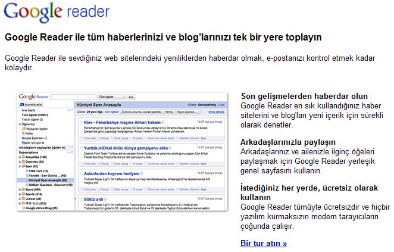

---
authors:
  - serdar

title: "Google ve Yerelleşme"

slug: google-ve-yerellesme

date: 2010-03-09T11:05:30+02:00

---

Bu Google Reader'ın ana sayfası. Bilmeyenler için söyleyeyim, Google'ın online RSS okuyucusu olan Google Reader çok faydalı bir eser. Uzun zamandır kullanıyorum ve diğer RSS okuyuculara göre çok büyük avantajları var. Değişik bilgisayarlardan, hatta cep telefonumdan bağlanabiliyorum, okuduklarımı eşimle paylaşabiliyorum, daha sonra okumak için saklıyabiliyorum vs.
<!-- more -->
Dünkü maç sonrası sinirlerim bozuk bir şekilde bilgisayarımı açıp bir iki haber okumak için niyetlendiğimde bu sayfa dikkatimi çekti. Bu sıradan bir Türkçeleştirme değil. Bu gerçekten "**yerelleştirme** "... Örnek resme dikkat ederseniz, Spor kategorisi altında CNN Türk, Fanatik, Hürriyet ve Sabah gazeteleri yerleştirilmiş. Haberler de Türkçe olmuş dolayısıyla. Yani **Türkiye'de yaşayan birisi** oturup böyle bir abonelik seti oluşturmuş bunun **ekran görüntüsünü** sayfaya yerleştirmiş. Bizim alışık olduğumuz Türkçeleştirme işlerinde imajın yanındaki metin saçma sapan bir çeviriden geçirilir, bir çok tarafı ne olduğu belirsiz yarı Türkçe kelime öbeklerinden oluşan cümleciklerden oluşur.

Bu basit bir örnek, fakat Google ürünlerini kullanan birisi olarak uygulamaların %80-90'ında durumun bu olduğunu söyleyebilirim. Bir de Türkiye'de 16 milyon kullanıcısı olduğu söylenen Facebook'a bakalım:

Resim neden İngilizce? Bir de Türkçe Yahoo'yu bulun (bulabilirseniz) ve yardım tuşuna basın. Gelen sayfada bastığınız tüm linkler İngilizce sayfalara gidiyor. Süper değil mi?
