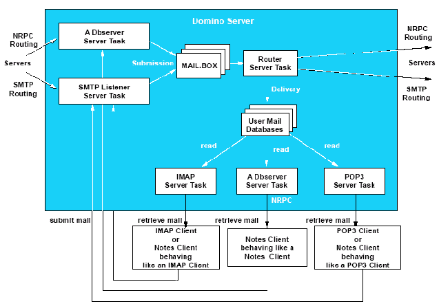
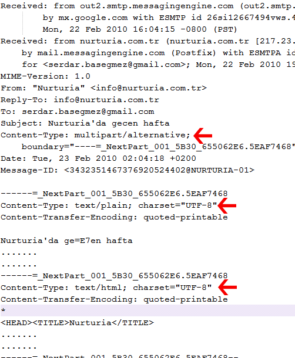
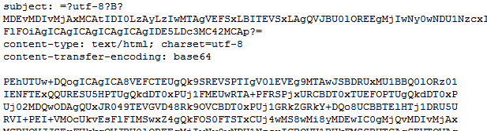
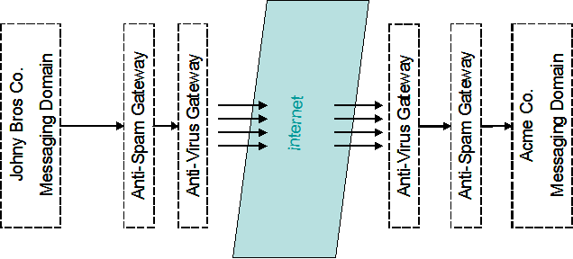
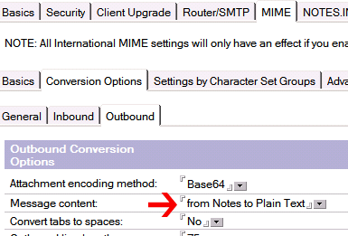

---
authors:
  - serdar

title: "Lotus Domino Sunucularda Internet Mesajlaşma Problemleri"

slug: lotus-domino-sunucularda-internet-mesajlasma-problemleri

date: 2010-03-01T18:00:00+02:00

---

Bir süredir yazamıyordum çünkü bu uzun yazıyla uğraşmaktaydım. Kendi çapımdaki ilk '**Whitepaper** ' denememi de yapmış oldum. Bu yazıyı kullanıcı grubunda açmayı düşündüğüm wiki bölümüne yerleştirip geliştirmeye açmak istiyorum. Umarım okuyuculardan da bol miktarda katkı alabilirim bu konuda...

Lotus Domino sunucular internet adreslerine gönderilen mesajları SMTP protokolü üzerinden gönderirler. IBM yazılım destek ekibi, zaman zaman karş ılaştığımız SMTP problemlerinde neleri kontrol edebileceğimiz konusunda küçük bir doküman oluşturmuşlar. Özellikle DNS problemlerine eğilen "[One stop shop for troubleshooting Domino and DNS](http://www.ibm.com/support/docview.wss?rs=899&uid=swg21420956)" konulu dokümana ek olarak benim de bazı önerilerim olacak.

Öncelikle kısaca "SMTP Routing" sürecinden ve DNS fonksiyonlarının nasıl işlediğinden bahsetmek gerekiyor. Sonrasında kısaca MIME ile ilgili bir kaç detayı anlatalım. Çünkü sıklıkla karşılaştı ğım sorunlar, Türkçe karakter ve kodlama problemleri. Biraz teknik detaylara gömüleceğiz ama umarım faydalı olur. Bildiğiniz kısımları atlayabilirsiniz :)
<!-- more -->

**I.DNS ve MX Kayıtları**

DNS sunucular her alan adı için bir takım kayıtlar barındırırlar. Bu kayıtlardan 'A' kaydı 'Address Record' olarak adlandırılır ve bu alan adına bağlı sunucu adreslerinin IP karşılığını tutar. Örneğin 'milliyet.com.tr' alan adının 'www' isimli 'A' kaydına bakarsak (www.milliyet.com.tr adresinin karşılığıdır) '83.66.140.10' IP adresine ulaşırız. Internet tarayıcımızın adres bölümüne 'www.milliyet.com.tr' yazdığımızda sayfanın hangi web sunucusundan geleceği bu DNS sorgusuyla bulunur.

'**MX** ' kaydı ise 'Mail Exchange Record' olarak adlandırılır ve bu alan adına adreslenen SMTP mesajlarının nereye gönderileceğini belirler. 'MX' kayıtları her alan adı için birden fazla olabilir. Bir alan ad ının bir kaç alternatif mesaj sunucusu olabildiği gibi alt alan adlarının da ayrı MX kayıtları tanımlanabilmektedir. Bu ikincisi bugünlerde pek kullanılmıyor çünkü E-mail adreslerinin basitliği daha önemli diye düşün ülüyor. Fakat eskiden merkezi yönetimin olmadığı üniversitelerde farklı böl üm/fakülteler kendi mail sunucularını işletirlerdi. Örneğin benim öğrencili ğimde üniversitede Bilgisayar Mühendisliği öğrencileri uzunca bir süre '*isim@mercan.cmpe.boun.edu.tr* ' gibi e-mail adresleri kullandılar. Deniz ürünü isimleri verilen sunucuları Bilgisayar Mühendisliği asistanları ve öğrencileri yönetiyordu. Bazı şirketler de ülke bazında alt alan adları kullanarak hem yük dağılımını bu yolla yapmakta, hem de yönetimi alt birimlere bölmeyi amaçlamaktalar. En yakın örnek olan IBM, her ülke için farklı adresleme kullanmaktadır: MX kayıtlarına bakarsanız '*xxx@tr.ibm.com* ' adresleri Almanya sunucularını, '*yyy@us.ibm.com* ' adresleri Amerika sunucularını işaret eder.

MX kayıtları aynı alan adı için yük dağılımı (load-balancing) ve/veya süreklilik sağlama (fail-over) amacıyla da kullanılabilir. Örneğin developi.com alan adının MX kayıtlarını sorgularsak:

```
developi.com    MX preference = 1, mail exchanger = developi.com.s200a1.psmtp.com
developi.com    MX preference = 2, mail exchanger = developi.com.s200a2.psmtp.com
developi.com    MX preference = 3, mail exchanger = developi.com.s200b1.psmtp.com
developi.com    MX preference = 4, mail exchanger = developi.com.s200b2.psmtp.com
```

<br />

Burada '**MX preference** ', tercih etme sırasını belirler. *Google Postini* 'den servis aldığım için mesajlarım öncelikle Postini sunucuları tarafından karşılanıyor. Dört farklı lokasyondaki sunucular sırasıyla deneniyor. Herhangi birisi erişilebilir durumdaysa mesajı o alıyor. Önceliklerin eşit olması durumundaysa belirlenmiş bir kural olmamakla birlikte rastgele birinin seçilmesi yaygın bir uygulama.

Linkini verdiğim dokümanda MX kayıtlarının nasıl sorgulanacağ ına dair örnekler verilmiş. Fakat bir küçük şey hatırlatmam gerekiyor. **TTNet** üzerinden sorgu yapıyorsanız; bazı durumlarda (örneğin TTNet Wi-Fi noktalarında) com.tr uzantılı adreslerin MX kayıtlarına doğru şekilde ulaşamıyorsunuz. Bunun SPAM gönderimine karşı bir önlem olduğunu düşünüyorum ama bu konuda resmi bir açıklama görmüş değilim. Sorgulanan alan adının sonunda '*mail.com.tr* ' gibi ekler yapıldığını görüyorsanız bu tip bir durumla karşılaşıyorsunuz demektir. En doğru ve güvenilir y öntemin internet üzerinden bu sorguları yapmanızı sağlayan siteler olduğunu söyleyebilirim. Ben bu amaçla ücretsiz servis veren [network-tools.com](http://network-tools.com/) ve [mxtoolbox.com](http://www.mxtoolbox.com/) sitelerini kullanıyorum. Alternatif olarak ücretli servis sunan [DNSStuff](http://www.dnsstuff.com/) sitesi; SPAM veritabanlarında arama yapmak, DNS sunucularının sağl ıklı işlediğini test etmek gibi çok daha karmaşık analizleri yapabiliyor.

**II.Routing ve SMTP**

Lotus Domino, diğer mesajlaşma sunucularından farklı şeyler yapmaz. Aşağı yukarı tüm süreçler aynı şekilde işlediği için bu anlatacaklarımı başka tip sunuculara da uygulayabilirsiniz.

SMTP mail gönderimi işlemini 'Router' görevi yürütür. Router'ın birincil işlevi mail.box (ya da mail(n).box) veritabanı üzerinde tutulan kuyru ğu izlemektir. Buraya bir mesaj düştüğünde öncelikle mesajın al ıcı alanları incelenir. Buna göre sürecin devamı '**delivery** ' (iç dağıt ım) ve '**transfer** ' (dışarı aktarım) olarak adlandırılır. Bu fark önemli, çünkü delivery ve transfer farklı süreçler ve farklı ayarlar gerektirir. Konfigürasyonlarda bu farklılıkları görebilirsiniz. Bizim daha çok ilgilendiğimiz 'transfer' işlemi NRPC ya da SMTP protokolleri üzerinden gerçekleşir. Çok fazla detaya girmeyeceğim. Burada çok çeşitli kombinasyon olu şabilir. Bir domino sunucu başka bir domino sunucuya SMTP üzerinden (tercih etmemekle birlikte) mesaj transfer edebilir. Ama %99 oranında geçerli olmak üzere Domino Domain içerisinde transferler **NRPC** üzerinden, Internet üzerindeki transferler **SMTP** üzerinden yürür diye genelleyebiliriz.

Router, kuyruktaki mesajı inceler ve bu gönderim işini kendi görev planı içerisine yerleştirir (dispatching). Alıcı alanı incelendiğinde mesajın NRPC üzerinden mi yoksa SMTP üzerinden mi gönderileceğine karmaş ık bir mekanizmayla karar verilecektir. Örneğin alıcı adresinde '*Serdar Basegmez/developi@Developi* ' gibi 'Notes Name' formatında bir adres görüldüğünü ve sunucunun bulunduğu domain'in de 'Developi' olduğunu varsayalım. Kullanıcı bu domain i çerisinde farklı bir sunucudaysa, mesaj NRPC üzerinden iletilecektir. Burada Router'ın yapması gereken 'CN=Serdar Basegmez/O=Developi' isimli kullanıcın ın hangi sunucuda bulunduğunu belirleyip mesajı o sunucunun mail.box veritabanına yazmaktır. Eğer bu kullanıcı aynı sunucuda ise mesaj doğrudan mail veritabanına 'deliver' edilir ve kuyruktan kaldırılır.

Eğer sözkonusu mesajın alıcısı 'isim@acme.com' gibi bir internet adresi ise iki alternatif bulunmaktadır. Öncelikle sunucu, içinde bulunduğu 'Local Internet Domain' bilgisinden haberdardır. Bu bilgi ya 'Global Domain' dok ümanından, o yoksa sunucu dokümanındaki '*Fully Qualified Internet Host Name* ' alanından türetilir. Eğer 'acme.com' yerel internet alan adlarından birisi ise bu adres doğrudan 'Notes Name' formatına dönüştürülüp yukarıdaki gibi işlem görür. Bu dönüştürme işi de belli bir mekanizmayla gerçekleşir. Aksi yönde bir ayar gerçekleştirilmediyse, genel adres defteri (names.nsf) üzerindeki kişi dokümanlarının 'InternetAddress' alanları incelenir. Burada verebileceğim en önemli ipucu, names.nsf veritabanı üzerinde '**($Users)** ' görüntüsüne bakmak olacaktır. Çünkü E-mail adresleri gruplara veya 'Mail-In Database' kayıtlarına da ait olabilir ve bu görüntü olası tüm adresleri barındırır. Yardım dokümantasyonunda (Administration Help) '*Specifying how Domino looks up the recipients of incoming SMTP messages* ' konulu bölüm bu adreslemenin ne şekilde yapıldığını ve nasıl ayarlanabileceğini uzun uzun anlatır. Eğer alıcı, yerel bir kullanıcı değilse mesajımız Internet'e gönderilecektir.

Nihayet Internet'e gönderilecek bir mesaj bulduk! Ama öncelikli işimiz bu mesajı SMTP üzerinden gönderilebilecek bir formata getirmektir. Lotus Domino üzerindeki mesajlar özel bir formata sahiptir. Bu format, mesaj iletiminden ziyade doküman iletimini mümkün kılarak uygulamaların çalışmasında önemli bir rol oynamaktadır. Internet üzerinde yer alan 'zengin metin' standartı olan MIME ise Domino tarafından desteklenen bir çok özelliğe sahip değil. Dolayısıyla burada bir çevrim (conversion) gerekiyor. "MIME Conversion" işleminden geçen mesaj artık gönderime hazır. Bu çevrim işlemi sırasında kullanılacak tüm ayarlar konfigürasyon dokümanında bulunmaktadır.



Bundan sonrası Router içerisindeki ayrı bir görev tarafından yürütülür. SMTP Router, DNS sunucuya erişerek 'acme.com' alan adına ait MX kaydını sorgular. Eğer bu alan adının MX kaydı yoksa 'acme.com' isimli 'A' kaydı aranır. Bu sorgulamalar hedef sunucuyu belirler ve bu hedef sunucuya SMTP üzerinden gönderim gerçekleştirilir. Yapılan DNS sorgusu hafızada uzun süre tutulur. Genelde yaşadığım sorunlardan birisi ilk sorguda MX kaydının bulunamaması yüzünden yaşanır. İlk seferde 'A' kaydı 'cache'lenir ve saatlerce bu adres denenir. Düzeltmek için Router görevini tekrar ba şlatmaktan başka bir şey yapılamaz.

SMTP 1970'lerden, yani bilgi çağının taş devrinden kalma olduğu için 7-bitlik karakter tabanlı bir oturum kullanan çok basit bir protokoldür. Tipik bir SMTP oturumu şu şekildedir (kaynak: [wikipedia](http://en.wikipedia.org/wiki/Simple_Mail_Transfer_Protocol)):

```

S: 220 smtp.example.com ESMTP Postfix
C: HELO relay.example.org
S: 250 Hello relay.example.org, I am glad to meet you
C: MAIL FROM:<bob@example.org>
S: 250 Ok
C: RCPT TO:<alice@example.com>
S: 250 Ok
C: RCPT TO:<theboss@example.com>
S: 250 Ok
C: DATA
S: 354 End data with <CR><LF>.<CR><LF>
C: From: "Bob Example" <bob@example.org>
C: To: Alice Example <alice@example.com>
C: Cc: theboss@example.com
C: Date: Tue, 15 Jan 2008 16:02:43 -0500
C: Subject: Test message
C:
C: Hello Alice.
C: This is a test message with 5 header fields and 4 lines in the message body.
C: Your friend,
C: Bob
C: .
S: 250 Ok: queued as 12345
C: QUIT
S: 221 Bye
{The server closes the connection}

```

<br />

<br />

**III. Mesajlar, Kodlama ve MIME**

Karmaşık resim, ekli dosya gibi gönderimler yaptığınızda burada harfler ve rakamlardan oluşan anlamsız şeyler görürsünüz. Bu, SMTP protokolünün eskimiş yapısından dolayı binary verilerin kodlanması gerekliliğinden kaynaklanır. Burada From, To, CC, Date, Subject gibi bölümlere '**Header** ' bilgileri adı verilir. SMTP standartlarını belirleyen RFC dokümanları (Internet Engineering Task Force tarafından üretilmiş standart belgeleri) bu alanların formatlarını ve kurallarını detaylarıyla anlatır.

Tipik bir mesajın kaynağına bakarsanız text dosyadan oluştuğunu göreceksiniz. Aşağıda basitleşmiş bir mesaj içeriği görülüyor. Mesaj ın multipart olması -ki mesaj boyutunu arttırsa da tavsiye edilen bir kullanımdır- hem sade metin, hem de HTML formatında iki mesajın peşpeşe depolandı ğını gösteriyor. Her bir 'part'ın ayrı kodlanmış olduğunu görebilirsiniz.



Daha önce söylediğimiz gibi SMTP, ASCII karakter seti aktarımına dayanıyor. 128 karakter haricinde kalan Türkçe karakterler gibi gelişmiş karakterlere yer yok. Bu yüzden içeriklerin 'encode' edilmeleri gerek. Yukarıdaki örnekteki '**quoted-printable** ' kodlamasında 'Ç' harfi 'ç' gibi bir ifadeyle değiştiriliyor. Aşağıda ise **base64** olarak kodlanmış bir mesaj görülüyor. Base64 binary verilerin de kodlanmasında kullanılan daha geniş olanaklara sahip bir kodlama sistemi. Fakat metin ağırlıklı mesajlarda verimsiz (%35-40 civarında boyut artışı) olduğu için tercih edilmez. Bir avantajıysa şifreli olmadığı halde gözle görüldüğünde içeriğin anlaşılamaması, dolayısıyla basit kullanıcılar tarafından okunamaması.



'**Received** ' etiketine sahip header alanları sırasıyla mesajın hangi sunuculardan geçtiği konusunda bilgiler verir. Ayrıca bu alanlarda anti-spam puantajları, mesajı atan istemci tipi (**X-Mailer** ) gibi çok yararlı bilgilere erişebiliriz. Lotus Notes'da mesaj kaynağını görmek için View\\Show\\Page Source menü kombinasyonunu kullanabiliriz.

Header bilgilerinden bahsetmişken tipik problemlerden birinden de bahsedelim. Türkçe karakter problemleri, SMTP protokolünün eski olması ve UTF-8 formatının yeterince yaygınlaşamaması nedeniyle oluşuyor. Aslında UTF-8 formatını, başka bir deyişle unicode formatları kullandığınızda bir sorunla karşılaşamazsınız. Çünkü bu standartlar çinceden kongocaya kadar tüm dillere ait harf ve sembolleri destekliyor. Fakat sistem yeterince yaygınlaşamayınca dünyanın yarısı bu formatı kullanmak konusunda ayak sürüyor. Sağolsun Microsoft, Yahoo gibi bir takım devler de bu ayak sürümede önemli katkılar sağl ıyor. Mesaj kaynağından metin dillerinin ne olduğuna dair bilgiler edinebiliriz.

Son olarak mesajların header bilgilerinin ayrı, body kısmının ayr ı kodlandığını hatırlatalım. Zaman zaman buna benzer konularla karşılaşıyoruz. From adresinde ya da konu satırında Türkçe karakter problemi olmazken mesajın içeriğindeki problemler bu farklılıktan ileri geliyor.

Bu süreçle ilgili iki önemli nokta da dönüş kodları ve '**Non-Delivery Report** ', ya da NDR. SMTP sürecinde her aşamada sunucu tarafından bir kod üretilir. Bu kod, örnekte gördüğümüz sunucu cevaplarında gizli. 200, 250, 221, 354 gibi 2XX ve 3XX şeklindeki kodlar normal, 4XX şeklindeki kodlar geçici hatalar ve 5XX şeklindeki kodlar kalıcı hataları belirler. Bu konuda yaygın davranış farklılıkları olmakla birlikte genelde 4XX kodlu hata kodlarında mesaj gönderimi tekrar denenir. 5XX şeklindeki kodlar ise hatanın sebebini detaylandıran bir NDR üretilerek geri döner. 'Non-Delivery Report' çok çeşitli nedenlerle oluşturulabilir. Gönderen IP'nin SPAM olarak işaretlenmesi, alıcı sunucunun mesaj boyutunu beğenmemesi, alıcı adresin sunucuda bulunamaması gibi sebepler 5XX kodlu hatalardan bir kaçıdır.

Tüm bu anlattıklarımı daha zengin detaylarıyla öğrenmek isterseniz [Wikipedia](http://www.wikipedia.org/)'da [MIME](http://en.wikipedia.org/wiki/MIME), [SMTP](http://en.wikipedia.org/wiki/Simple_Mail_Transfer_Protocol) gibi bölümleri incelemenizi tavsiye ederim.

**IV.Anti-Spam ve Anti-Virus Konuları**

Lotus Domino, anti-spam konusunda bir çok ayar barındırsa da günümüzde SPAM mesajlar klasik yöntemlerle engellenemiyor. Daha zeki puanlama ve aktif izleme sistemleri gerekiyor. Konvansiyonel mekanizmaların en popüleri 'Black List' izleme yöntemi. Fakat bizim ülkemizde bu yöntem, ciddi problemlere neden oluyor. Çünkü IP adreslerimizin önemli bir kısmı uluslararası veritabanlarında kara listelere alınmış durumda. Bunu düzeltmesi gereken kurum TTNet ise bu konuda oldukça ağır davranıyor. Dolayısıyla hatalı olarak SPAM işaretlenen mesajların sayısı (false-positive) oldukça fazla oluyor. Öte yandan spam gönderenler de sürekli farklı IP adresleri kullanıyorlar. Örneğin çok klasik bir saldırı olan 'Directory Harvest Attack' yöntemi, sürekli olarak anlamlı/anlamsız e-mail adresleriyle mesaj göndermeyi deniyor. Akıllı bir anti-spam yazılımı, belirli bir yönden yüksek frekansta hatalı mesaj gönderimi durumunda bu adresleri geçici bir süre kapatmaktadır. Domino'nun anti-spam mekanizması bu kadar gelişmiş değil.

Genel uygulama, mesaj girişinde farklı bir yazılım ya da cihaz (appliance) kullanımı. Müşterilerimde kullanılan çözümler arasında çok çeşitli ürünler görüyorum. Başta IBM Lotus Protector olmak üzere Trend Micro, Symantec, Cisco gibi üreticilerin bu konuda bol miktarda yazılımı ve kutu ç özümü var. Bunlara ek olarak SpamAssassin, ClamAV gibi açık kaynak kodlu yaz ılımlar da kullanılabiliyor.

Bir başka alternatif ise **SaaS** (Software as a Service) yaklaşım ı. Türkiye'ye servis sunmakta olan Google Postini (Türkiye iş ortağı: [Global IT](http://www.globalit.com.tr/)) ve MessageLabs (Türkiye iş ortağı [Seynur](http://www.seynur.com/)) bu konuda incelediğim iki çözüm. Bunların haricinde Cisco, Trend ve Symantec de 'Hosted Messaging Security' adı altında benzer servisler vermeye ba şladı. SaaS modelinde herhangi bir lisans/donanım yatırımı yapılmıyor. Sistem yönetimi web platformundan yapılıyor. Kullanıcı başına fiyatlandırma yapılıyor. Bu tip sistemler aynı zamanda fail-safe mesaj alışverişi, Archiving, user-profile bazlı SPAM ayarları, mobil erişim gibi değişik özellikler de sunabiliyor.

Artık topolojiler kademeli sunucular içeriyor. Bu yapı mesaj izlemeyi oldukça zorlaştırıyor. Sistem yöneticisine 'xxx adresinden gelmesi gereken mesaj gelmedi/yyy adresine gitmesi gereken mesajımız gitmedi' gibi bir soru sorulduğunda aşağıdaki topolojiye göre mesajın takılma ihtimali olan 6 değişik nokta incelenmeli. Bunların üçü de bizim kontrolümüzde olmayan noktalar. İşi daha kompleks hale getiren, birçok anti-spam ve anti-virus çözümünün hata mesajı vermek konusunda isteksiz davranması. Bunun sebebi de anlaşılabilir. Spammer ya da hacker'lar bu hata mesajlarını bilgi toplamak amacıyla kullanabiliyorlar.



Dikkat edilmesi gereken unsurlardan birisi burada kullanılan gateway'lerin nasıl çalıştıkları. Bazı ürünler mesaj alışverişini izlemek üzerine 'transparent' bir yöntem kullanırlar. SMTP oturumu izlenir, oturum sürecinde gerekli kontroller yapıldıktan sonra (spam puanlaması, ekli dosya kontrolü gibi) oturumun kesilmesi gerekiyorsa araya girip oturumu sonlandırırlar. Diğer çözümlerde ise 'Store\&Forward' yöntemi kullanılır. Yani mesaj bir mesajlaşma sunucusu gibi kabul edilir. Temiz mesajlar bir sonraki sonucuya aktarılır. Her iki durumda da prensip olarak 'gateway' ürünlerini seçerken 'message tracking' imkanı sunan çözümlere öncelik verilmesini tavsiye ediyorum. Çünkü bir çok ürün geriye dönmeleri gereken hata mesajları konusunda çok ketum davranıyorlar.

İkinci bir nokta da 'recipient-checking' özelliğinin sunulup sunulmad ığı. Özellikle anti-spam yazılımlarının gelen mesajda önce alıcı alanının geçerli olup olmadığını kontrol etmesi gereklidir. Bu kontrol, yazılım ın kendi içindeki adres tabloları kullanılarak (pasif) ya da mesajlaşma sunucusu üzerinden LDAP sorgularıyla canlı olarak (aktif) yapılır. Bu desteği sunmayan servisler mesajlaşma sunucusu üzerinde gereksiz trafik yaratırlar. Bu trafiği küçümsememek gerekir. Gerçekten kirli bir ağ üzerinde (örneğin yeterince kontrol edilmeyen bir datacenter ortamında) bu '**directory-harvest** ' ataklarının mesajlaşma sunucusunun çökmesine neden olduğunu gözlerimle gördüm.

**V. Mesajlaşma Problemlerinin Tespit Edilmesi**

Paylaştığımız dokümanda sorun çözmek amacıyla yapılacak kontrollerle ilgili bir çok öneri var. Giden (ya da gidemeyen) mesajlarla ilgili sorunlarda debug parametreleri en büyük yardımcımız olacaktır. Debug parametreleri log büyüklüklerimizi arttırdığı ve sistemlerimizde yavaşlıklara neden olduğu için gerekmedikçe kullanmamamız gerektiğini hatırlatmak isterim. Nslookup komutu ve/veya daha önce önerdiğim internet sayfaları kanalıyla MX kayıtlarının kontrol edilmesi de epey yardımcı olacaktır.

Bütün bunların yanısıra mesajlaşma topolojisine hakim olmak çok büyük önem taşıyor. Özellikle çok sunuculu ortamlarda sistemimize giren mesajın nerelerden geçmesi gerektiğini bilmek çoğu zaman hiç bir kontrol yapmamıza gerek kalmadan hatayı bulmamızı sağlar.

Daha önce yaşamış olduğum örneklerden bir kaç tanesini payla şırsam yararlı olacağını düşünüyorum.

1. Çeşitli 'Black List' veritabanları, Trend'in kullandığı '*Network Reputation Service* ' ya da Cisco'nun kullandığı SenderBase veritabanı gibi kaynaklar global SPAM kaynaklarını network adresleri bazında gruplandırma ve puanlama işini yürütüyor. Daha önce söylediğim gibi bu veritabanlarının TTNet IP blokları hakkında hayli kötü önyargıları bulunuyor ve bu durum karşılaştığımız problemlerin sebepleri arasında ciddi bir y üzde oluşturuyor. Mesaj gönderdiğiniz IP adresi bu bloklar arasındaysa bir çok anti-spam yöntemi hata mesajı vermeden mesajları bloklayabiliyor. Benzer şekilde eğer siz bu yöntemleri kullanıyorsanız mesajlar bir şekilde reddedilebiliyor ya da karantina listelerine aktarılabiliyor.

Bu IP'lerle ilgili sorgulamalar için liste veritabanlarını kullanmak iyi bir fikir olacaktır. Bu konuda ücretli servis veren siteler, küçük bir ücret karşılığında periyodik raporlama olanakları sağlarken [mxtoolbox.com](http://www.mxtoolbox.com/) gibi siteler çok geniş sorgulama imkanı sunmaktadır.

2. Temiz bir network adresinden gelen mesaj da SPAM olarak algılanabilir. Karantinaya alınmış bir mesajın header bilgilerini analiz etmek sa ğlıklı bilgi verecektir. Aşağıdaki örnekte SpamAssassin uygulaması taraf ından gerçekleştirilen SPAM puanlamasının sebepleri yer alıyor.

```

X-Spam-Flag: YES
X-Spam-Checker-Version: SpamAssassin 3.1.8 (2007-02-13)
X-Spam-Level: ******
X-Spam-Status: Yes, score=6.9 required=5.0 tests­VANCE_FEE_1,DEAR_SOMETHING,
 FORGED_MUA_OUTLOOK,FORGED_OUTLOOK_HTML,FORGED_OUTLOOK_TAGS,HTML_MESSAGE,
 MIME_HTML_ONLY,MISSING_HEADERS,TO_CC_NONE,X_PRIORITY_HIGH autolearn=no
 version=3.1.8
X-Spam-Report:
 *  0.1 X_PRIORITY_HIGH Sent with 'X-Priority' set to high
 *  0.2 MISSING_HEADERS Missing To: header
 *  1.6 DEAR_SOMETHING BODY: Contains 'Dear (something)'
 *  0.0 HTML_MESSAGE BODY: HTML included in message
 *  0.0 MIME_HTML_ONLY BODY: Message only has text/html MIME parts
 *  2.5 FORGED_OUTLOOK_HTML Outlook can't send HTML message only
 *  2.4 FORGED_OUTLOOK_TAGS Outlook can't send HTML in this format
 *  0.1 TO_CC_NONE No To: or Cc: header
 *  0.0 ADVANCE_FEE_1 Appears to be advance fee fraud (Nigerian 419)
 *  0.0 FORGED_MUA_OUTLOOK Forged mail pretending to be from MS Outlook

```

<br />

Bazı durumlarda mesajların neden SPAM olarak işaretlendiğine dair nemli ipuçları bulabilirsiniz. Bu örnekteki mesaj Outlook'dan gönderilmi ş gibi gösterilmiş fakat bunun yanıltıcı olduğu tespit edilmiş.

3. Mesajların multipart olarak gönderilmemesinin da SPAM olarak algılanabileceğine dikkat etmemiz gereklidir. Yukarıdaki örnekteki gibi bazı mesajlar 'plain text' olarak hazırlanır fakat içinde HTML tag'leri bulundurur. Bu durum sıklıkla yanlış 'disclaimer' uygulamalarında görülür. Bir örnekte mesajların plain text olarak gittiği fakat disclaimer eklentisinin HTML olduğunu tespit etmiştik.



Buna benzer ayarlar da SPAM olarak algılanma benzeri problemlere neden olabilmektedir. Genel uygulamada multi-part mesajları ya da HTML mesajları tercih etmekten yanayım. Gönderici adreslerinin düzgün yapılandırılması da önemli. Eğer özel bir ayar yapmazsanız Domino gönderici adresini standart dışı şekillerde oluşturabilir. Örneğin RFC822 ayarlarının düzgün yapılarak "Name_Surname/Acme%Acme " gibi adreslerden kurtulmak gerekir.

4. DNS sorunları mesaj gönderiminde tekrarlanması ve dolayısıyla tespit edilmesi güç problemlere neden olmaktadır. Özellikle yerel ağda 'Microsoft DNS Server' gibi çok güvenilir olmayan DNS sunucular kullanıyorsanız zaman zaman MX kayıtlarının sorgulanmasında ya da Router'ın çalışmasında aksaklıklar ortaya çıkar. Bunun en açık örneği aşağıdaki gibi yaşan ır.

```

Router: Transferring mail to domain YAHOO.COM (host YAHOO.COM) via SMTP
Router: Message 003903B3 NOT transferred via SMTP to YAHOO.COM for xxx@yahoo.com from Serdar Basegmez/developi Size: 124K Error transferring to yahoo.com; Some Error Message

```

<br />

Aslında YAHOO.COM alan adının MX kaydı vardır. Fakat Router bir an için bu kaydı öğrenemez ve -daha önce söylediğimiz gibi- onun yerine YAHOO.COM için kayıtlı 'A' adresini alır. Bunun devamında adres hafızaya alındığı için sürekli bu işlemi denemeye devam eder. Bu tip hatalar DNS sunucunun kaliteli hizmet vermemesinden kaynaklanır.

Bu problemler haricinde sizin de paylaşmak istedikleriniz olursa yorumlar ınızla katılabilirsiniz...
