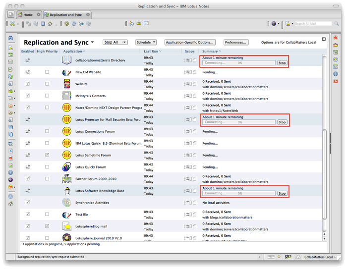
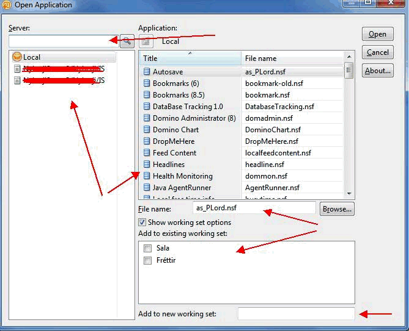

---
authors:
  - serdar

title: "Lotus Notes/Domino 8.5.2 geliyor..."

slug: lotus-notes-8.5.2-geliyor...

date: 2010-04-19T18:30:51+02:00

---

**Lotus Notes / Domino 8.5.2** ocak ayından bu yana beta kullanımdaydı. Geçtiğimiz hafta sonu gizlilik bildirimi kaldırıldı. Bunun anlamı beta kullanıcıların ürünün özellikleriyle ilgili konuşma yasağının ortadan kalkması anlamına geliyor.

Yasak kalkar kalkmaz yağmur gibi bloglar yazılmaya başlandı. Bir kaç özelliğe yer vermek istedim bu yüzden.
<!-- more -->
**1.** Peter Presnell yeni **Lotusscript editörünün** yeni özellikleri ve yeni Lotusscript geliştirmeleriyle ilgili bir [yazı](http://www.bleedyellow.com/blogs/dotdomino/entry/product_review_else_8_5_2_lotusscript_8_5_23?lang=en_us) yazmış.

* Eski lotusscript editörü gibi yenisinde de **büyük küçük harfler** otomatikman düzeltiliyor.
* **'Auto-indent'** özelliği gelmiş. Yani girinti düzeltme özelliği otomatize edilmiş. 8.5.1'de bunu Ctrl-L tuşuna basarak yapmak zorunda kalıyorduk.
* 'Database Scripts' kısmı da yeni lotusscript özelliğine dahil olmuş. Bu kısım 8.5.1'de klasik editörle açılıyordu.
* **NotesDomain** , **NotesDirectory** , **NotesDirEntry** gibi objeler geliştirilmiş, Bu sayede kullanıcı ve gruplarla ilgili önemli aksiyonları lotusscript üzerinden gerçekleştirebileceğiz.
* NotesDatabase üzerinde **Archivenow()** , **Archivenowbypolicy()** , **Replicatewithclientoptions()** , **Retrievepop3mail()** gibi metodlar ve özellikler eklenmiş.
* NotesAgent: **Runwithdocumentcontex()** metodu eklenmiş. Bu özellikle XPages uygulamalarında beklediğimiz bir özellikti. Bu sayede 'WebQuerySave' fonksiyonalitesini XPages uygulamalarında da kullanabiliyor olacağız.

 

**2** . John D. Head veritabanı icon'larıyla ilgili gelişmeyi [müjdelemiş](http://www.johndavidhead.com/jhead/johnhead.nsf/dx/8.5.2-finally-makes-database-icons-rock).

* Artık **veritabanı ikonu** olarak BMP, JPG, GIF veya PNG dosyalar yükleyebiliyoruz.

 

**3** . Ulrich Krause DAOS'la ilgili bir geliştirmeyi [paylaşmış](http://www.eknori.de/2010-04-19/daos-enhancement-in-8-5-2/).

* Veritabanları '-a' parametresiyle arşivlenirken DAOS'a da aktarılabiliyor. Daha önce bu iki işlem ayrı ayrı yapılıyordu.

 

**4** . Stuart McIntryre bence en güzel geliştirmeyi [müjdelemiş](http://blog.collaborationmatters.com/blog/cmblog.nsf/dx/my-favourite-enhancement-in-notes-8.5.2).

* Artık **replikasyon işlemi 'multi-thread' çalışıyor**. Yani replikasyon sırayla işlemiyor, farklı sunuculardan aynı anda bilgi çekiyoruz.

 

**5** . Erik Brooks XPages ağırlıklı bir kaç geliştirme [duyurmuş](http://www.bleedyellow.com/blogs/erik/entry/8_5_2_notes_domino11?lang=en_us).

* XPages'de Checkbox group ve radio button group gibi yeni objelerimiz var.
* Dojo versiyonu 1.4.1 olmuş.
* Server-side-javascript'te **sessionAsSigner()** fonksiyonu getirilmiş. Bu sayede aynı XPages üzerinde hem geliştirici, hem de kullanıcı yetkileri aynı anda kullanılabiliyor.
* Database script'leri @Formula olarak da tanımlanabilecek.
* 8.5.2 Web sunucusunda **REST API**'leri kullanılabilecek.

 

**6** . Palmi, aşağıdaki görüntüyü [paylaşmış](http://northrenlotusblog.wordpress.com/2010/04/18/8-5-2-notesdomino-funs-stuff/). Sanırım açıklama gerektirmiyor :)

 

 

**7** . Darren Duke, client tarafıyla ilgili bir kaç geliştirmeden [bahsetmiş](http://blog.darrenduke.net/Darren/DDBZ.nsf/dx/8.5.2-unleashed-with-some-really-nice-features.htm).

* Sistem yöneticisi kullanıcıların lokal replika kullanımlarında yeni düzenlemeler yapabiliyor. Örneğin **ekli dosyaları otomatik alma** , **lokal veritabanlarının ODS versiyonlarını otomatik yükseltme** gibi ayarlar 'Desktop Policy' altına eklenmiş.

 

* **Silent fail-over** özelliği, sunucu erişilebilir olmadığında kullanıcıya uyarı vermeden diğer cluster sunucusuna ya da lokal replikaya geçmeyi sağlıyor.

\* Tabi tüm bu özelliklerin değişebileceğini belirtelim. Bunlar IBM tarafından kesinlikle garanti edilmiş özellikler değil...
