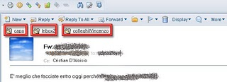

---
authors:
  - serdar

title: "SwiftFile Mail Assistant"

slug: swiftfile-mail-assistant

date: 2010-04-02T18:57:18+02:00

---

SwiftFile son yıllarda kullandığım en güzel eklentilerden biri. Normal şartlarda bu tip eklentileri sevmem. Genelde upgrade'ler sırasında çok problem çıkarırlar ve sistemde ekstra yavaşlıklara neden olurlar. Ama onlarca klasör kullanmam nedeniyle SwiftFile'ın önemli bir takipçisiyim.

Bu eklenti, sizin klasörlerinizi özel bir algoritmayla indeksler ve her mesaj için üç öneride bulunur. Böylece mesajları çabucak ilgili klasöre göndermenizi sağlar. Önerdiklerine uymadığınız zaman bunları da bir kenara yazan bu zeki programcık 1-2 hafta içerisinde klasör önerilerinde %80-90 civarında bir başarıya ulaşıyor.

Patronunuza kurabileceğiniz güzel bir uygulamacık :)

Şimdi sırada güzel bir mesaj 'tag'leme eklentisi bekliyoruz.

Maalesef şimdilik sadece Windows kullanıcıları için sunulan bu eklentiye [şu linkten](http://www.ibm.com/support/docview.wss?uid=swg21305206)ulaşabilirsiniz.
