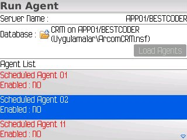
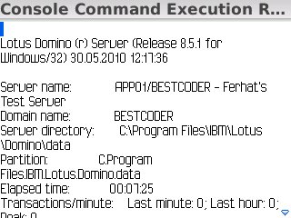
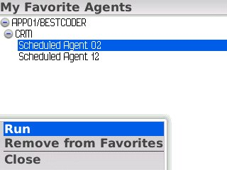

---
authors:
  - serdar

title: "Blackberry üzerinden Mobil Sistem Yönetimi"

slug: blackberry-uzerinden-mobil-sistem-yonetimi

date: 2010-05-31T09:47:37+02:00

---

Blackberry üzerinde Domino uygulamaları geliştirmek konusunda blog yazan değerli dostum [Ferhat](http://www.bestcoder.net/), üzerinde çalıştığı Mobil Sistem Yönetimi uygulaması konusunda bir blog yayınladı. Uygulama Blackberry platformunda çalışıyor ve **sunucu konsoluna komut göndermek** , **uzaktan agent çalıştırmak** gibi bazı sistem yönetimi fonksiyonları sunuyor.
<!-- more -->

Uygulama şu an beta testlerinde ve kullanıcılardan yorum/fikir bekliyor. İlgili yazı [burada](http://www.bestcoder.net/?p=171)...
