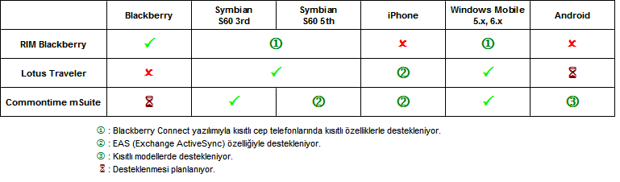

---
authors:
  - serdar

title: "Lotus uzmanları için yeni açılımlar: Mobil Platformlar (1)"

slug: lotus-uzmanlari-icin-yeni-acilimlar-mobil-platformlar-1

date: 2010-05-14T15:11:34+02:00

---

Bugün, uzun zamandır aklımda olan bir diziye başlamak istiyorum. Lotus uzmanlarının önümüzdeki dönemde ne tip yeniliklere adapte olması gerektiği üzerinde duracağız.

Genelde konuştuğum Lotus uzmanlarında bir tıkanıklık görüyorum. Bir çok arkadaşımız yalnızca Lotus'la ilgilenmiyor, bir çok sorumluluk almış durumda. Bu durumu küçük altyapılar için anlayabilirim fakat 300-500 kişi üzerindeki sistemlerde uzmanlaşmanın ve odaklanmanın kaçınılmaz olduğuna itiraz edilemez sanırım. Bunu başarabilenlerin bile zamansızlıktan sürekli şikayet ettiğini görüyorum. Oysa teknik uzmanlar için bilgileri ve tecrübeleri güncellememek en büyük tehlikedir. Ürünler ve teknolojiler çok hızlı değişiyor. Bugün 6 ay için askere gidenlerin bile döndüklerinde bir çok şeyi değişmiş buldukları klişe de olsa gerçek.
<!-- more -->
IBM Lotus ürün ailesi son bir kaç yıldır önemli bir dönüşüm gösterdi. Biraz pazarın zorlaması, biraz da taban geliştirme ihtiyaçları ön plana çıktı. Mobil uygulamalara gösterilen talep, daha geniş platform desteği, önemi giderek artan entegrasyon konuları, artan maliyet baskısı ve müşterilerin birlikte çalışma uygulamalarında da paket yaklaşımı beklentisi göstermeye başlaması; bu ürün ağacındaki değişimin önemli nedenlerinden oldu. Bunun yanısıra diğer yazılım şirketleriyle rekabette yeni kulvarlar açmak gerekiyordu. Ürün geliştirme stratejileri de bu yönde tekrar düzenlendi.

Bu değişimin birinci adımı **mobil uygulamalar** . Mobilizasyon sürecinin yakın gelecekte Lotus uzmanlarını nasıl ilgilendireceğini masaya yatırmak gerekiyor. Neler değişiyor hayatımızda ve iç müşteriler neler talep etmeye başlayacak?

Mobil uygulama geliştirme konusunu ayrıca ele almayı düşünüyorum. Yine de mobil uygulamalara giden yol, mobil platformları güvenli ve yönetilebilir şekilde desteklemekten geçiyor. Hepinizin bildiği gibi mobil kullanıcı desteğinin en somutlaştığı konu **mobil mesajlaşma** . Hayatımıza Blackberry'lerle giren, bu günlerde Traveler ile ucuzlayan mobil destek, önümüzdeki yıllarda genişleyecek.

Bu konuyu bir kaç boyutta incelemek gerekiyor. Öncelikli boyutun bir çok şirkette olduğu gibi**güvenlik** olduğu aşikar. Mobil ağlar farklı katmanlarda önemli güvenlik açıkları içeriyor. İki önemli güvenlik problemiyle karşı karşıya kalmamız çok olası:

Birincisi, cihaz ile sunucu erişiminin farklı şekillerde güvenlik altına alınması gerekiyor. Lotus Traveler'ın bu konuda eksikliklerini daha önce de anlatmıştık. Traveler, normal kurulumda SSL protokolüne güveniyor. Oysa rakipleri olan mSuite ve Blackberry, hem mesajlaşma, hem de uygulama katmanında cihaz ile şirket ağı arasında AES gibi şifrelemelere dayalı güvenli kanallar oluşturabiliyor. Sertifikasyonla bu kanaldaki iletişim de güvenlik altına alınabiliyor. Lotus Traveler, bu yöndeki ihtiyaçları Lotus Mobile Connect adlı güvenlik yazılımıyla karşılamaya çalışıyor.

Güvenlik konusunda bir yaklaşım da operatör destekli özel ağlar yaratmak. Belirli bir sayının üstünde hattınız varsa, cep telefonu operatörleri Radius sunucular kullanarak şirkete özel APN'ler yaratıp kullanıcıları bu ağa dahil edebiliyorlar. Bu yöntem, özellikle son yıllarda çoğalmaya başlayan cep telefonu virüslerine karşı şirketleri koruyan bir uygulama aynı zamanda. Çünkü kullanıcıların internet erişimleri de bu yapı sayesinde güvenlik altına alınabiliyor. Aynı yapı VoIP uygulamaları için de kullanılabiliyor.

Bir başka önemli nokta, mobil cihazların kolayca çalınabilmesi, kopyalanabilmesi ve kaybedilebilmesi dolayısıyla ortaya çıkan güvenlik problemleri. Bu noktada hem kullanılan yazılımın, hem de cihazın özellikleri devreye giriyor. Örneğin bu yazılımlar, kaybolan cihazların uzaktan silinmesi (remote wipe-out) özelliğine sahipler. Blackberry buna ek olarak cihaz üzerindeki veriyi şifreleme yeteneğine sahipken mSuite cihaz güvenliğinde işletim sistemi özelliklerini kullanıyor (Windows Mobile ve Symbian'ın cihaz şifreleme özellikleri var).

**Yönetilebilirlilik** de mobilizasyon sürecinde dikkate alınması gereken bir boyut. Yüzlerce mobil kullanıcının konfigürasyonlarını, kısıtlamalarını, sunucu adreslemelerini, güvenlik ayarlarını, kurulumlarını ve versiyon yönetimini merkezi olarak yapamadığınızda mobil kullanıcılar, sistem yönetimi üzerinde ciddi bir yük oluşturacaktır. RIM Blackberry ya da Commontime mSuite gibi büyük paketler kullananlar, bu fonksiyonları merkezi olarak kullanabilirken Lotus Traveler, bu konuda yavaş bir gelişim gösteriyor. Örneğin mSuite üzerinde versiyon güncellemelerini merkezi olarak anında dağıtabiliyorsunuz. Tüm ayarları policy paketlerine yükleyerek kullanıcıya şifre giriş ekranı haricinde bir şey göstermeden dağıtımınızı tamamlayabiliyorsunuz. Mobil uygulamalar da işin içine girdiği zaman yönetilebilirlik daha da önem kazanıyor. Uygulama ve uygulama bileşenlerinde versiyon güncelleme, mesajlaşma bileşenlerinden daha sık gerçekleştiriliyor.

Mobilizasyon altyapısını seçerken **platform desteğine** de dikkat etmek gerekiyor. Şirketler tüm cep telefonlarını standartlaştırmayı seçebildiği gibi bu seçimi kullanıcılara bırakma kararı da verebiliyor. Bu durumda mobil altyapınızın değişik istemci tiplerini desteklemesi bir anda önem kazanıyor. Şu anda mobil altyapılarda sıklıkla kullanılan platformlar Blackberry, Symbian, Windows Mobile ve iPhone olarak öne çıkıyor. Son zamanlarda Android'in artmaya başladığını, iPad'in de radarımıza girdiğini görüyoruz. Peki mevcut yazılımların desteği ne durumda?

 

 

Görüldüğü gibi Blackberry platform konusunda katı sınırlar çiziyor. Öte yanda mSuite tüm platformları destekleme stratejisi çiziyor. Bunun beraberinde getirdiği problemler yok değil. Blackberry, cep telefonunu, telefon işletim sistemini ve sunucu yazılımını kendisi ürettiği için (AS/400 örneğinde olduğu gibi) daha problemsiz bir sistem ortaya koyuyor. Fakat şirketler için maliyet otomatikman artıyor. Çünkü bu platform seçildiğinde Blackberry'nin ve operatörlerin yüksek maliyetlerine katlanmak durumunda kalıyoruz.

Bu tablo, yalnızca mesajlaşma özelliğine yönelik. Mobil uygulamalar söz konusu olduğunda, Lotus Traveler'ın şu an için bir çözümü yok. Blackberry'nin MDS uygulaması, yalnızca Blackberry telefonları destekliyor. mSuite'in mDesign Studio uygulaması ise yalnızca Windows Mobile platformunu destekliyor. Fakat mDesign bu yıl içinde Symbian (S60 5th), iPhone, iPad, Android ve Blackberry desteğini açıklayacak.

Bu yapılara ek olarak iç müşterilerden gelen talepler arasında PIM (Personal Information Management) mobilizasyonu öne çıkıyor. Takvim, adres defteri ve benzeri bilgilerin de mobil cihazlardan takibi önemli hale gelmeye başladı. PIM senkronizasyonu mevcut durumda yerel senkronizasyon çözümleriyle (ActiveSync, Nokia PCSuite) çözülüyor. Fakat değişen çalışma şartlarında insanlar birbirlerinin boş zamanlarını anında görmek, takvimlerini asistanlarının kullanımına açmak gibi taleplerde bulunmaya başlıyor. Bu da OTA (over the air) senkronizasyon özelliğini ön plana çıkarıyor. Senkronize edilen verilerin içeriğiyle oynamak da ek özelliklerden birisi. Örneğin mSuite, müşteri iletişim bilgilerinin, doğrudan müşteri veritabanından, belirli kriterlerle cep telefonuna senkronize edilmesini sağlayabiliyor.

Kurumsal ses altyapısı ve mobil cihaz entegrasyonu da günümüzün önemli bir teknoloji başlığı haline geldi. Bu konuyu başka bir başlık altında incelemeyi düşünüyorum.
