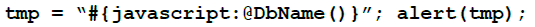
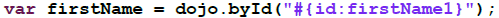

---
authors:
  - serdar

title: "Lotus uzmanları için yeni açılımlar: XPages yol haritası (2)"

slug: lotus-uzmanlari-icin-yeni-acilimlar-xpages-yol-haritasi-2

date: 2010-05-28T10:04:11+02:00

---

Lotus uzmanlarının kariyer gelişimleri konusunda ipuçları vermeye devam ediyoruz. Bu kez konumuz uygulama geliştirme uzmanlarını ilgilendiriyor.

IBM Texas Innovation Center tarafından düzenlenen üç günlük XPages Virtual Workshop eğitimlerine katıldım. Yaşım bu işler için çok mu ileri, artık yeter mi diye düşünüyordum, ama Lotus R1'in doğuşuna bile tanıklık etmiş 'dinazor'ların da aynı eğitimi aldığını görünce içim epey rahatladı. Saat farkı nedeniyle derslerim 17:00'de başlayıp geceyarısı bitiyordu ve bu kızım [Defne](http://www.bebekdefne.com/)'nin pek hoşuna gitmemişti ama XPages hakkında epey bir pratik kazandığımı söyleyebilirim :)
<!-- more -->
Eğer Lotus uygulamaları geliştiriyorsanız XPages doğrultusunda bir yol haritası çizmenin vakti geldi. Geliştirdiğiniz uygulamalar uzun bir süre daha çalışmaya devam edecek fakat XPages tüm hızlı uygulama geliştirme kategorilerini altüst edecek şekilde hayatımıza girmiş bulunmaktadır artık. Lab kısımlarında bir kaç saatlik uğraşlarla çok şık web 2.0 uygulamaları geliştirdik, widget'lar oluşturduk ve bunları iNotes'a bile eklemeyi başardık. Sanırım Borland [Turbo Vision](http://en.wikipedia.org/wiki/Turbo_Vision)'la karşılaştığım günlerden beri (1992) bir uygulama geliştirme altyapısından bu kadar etkilendiğimi hatırlamıyorum. İtiraf etmeliyim, IBM Lotus, yeni Domino Designer'ı duyurduğunda bu ortamın her türlü kurumsal bilgi altyapısı için bir arabirim görevi üstleneceğini söylediğinde biraz şüphe duymuştum. Fakat şimdi bunun mümkün olabileceğini görüyoruz.

Neyse, konumuza dönelim. Temel Lotus bilgilerinizin üzerine neler eklemeniz gerektiğini maddelemeye başlayacağız. Ama önce **unutmamız gerekenlerden** bahsedelim.

**Lotusscript** 'i unutmaya başlayabiliriz. Yeni platformda Lotusscript'in pek yeri yok. Hemen korkutmayalım, özellikle eski uygulamalarımızda yazdıklarımızı sil baştan yapmamamız için bir takım ara yollar üretilmiş. Lotusscript, XPages uygulamalarında doğrudan kullanılamasa da **agent'lar** üzerinden eski kodlarımızı çalıştırabiliyoruz. Tabi bunun için mevcut uygulamalarımızın Lotusscript'i nasıl kullandıklarının büyük önemi var. Fonksiyonlarımızı objeler düzeyinde güzelce parametrize etmişsek, geçişimiz o kadar da sancısız olmayacak. Fakat uzun vadede bu dili kenara bırakmanın zamanı geldi.

Frame, iframe, CGI gibi tarih öncesi çağlardan kalma hikayeleri de artık unutabiliriz. Zorunluluklardan dolayı kullandığımız bu yapıların artık bize pek yararı yok.

Formula diline gelince, aslında formula dili de şu an can çekişiyor. Bildiğimiz anlamda formula dilini yeni uygulamalarımızda yanlızca 'computed field', 'default value' veya 'input translation' gibi kısımlarda pratik olduğu için kullanıyor olacağız. Ama güzel bir haber, javascript içerisinde kullanmak üzere yeni bir formula notasyonu geliştirilmiş. %70-80 oranında tüm fonksiyonların burada karşılığı var. Büyük küçük harflere dikkat etmek, noktalı virgül yerine virgül kullanmak ve parantezleri unutmamak kaydıyla çabuk alışıyorsunuz bu yeni notasyona. Bir örnek vermek gerekirse buyrun yeni bir formula:

Şimdi kendimizi geliştirmemiz gereken kısımlara geldik:

#### XML

 

Halen XML konusunda bir şey bilmiyorsanız bu haftasonunu buna ayırın. XML yaklaşık on yıldır hayatımızda. Ne iş yapıyorsanız yapın XML notasyonlarına aşina olmanız gerekiyor.

XPages üzerinde XML'in çok yaygın bir kullanımı var. Çünkü bir XPage, aslında xsp uzantılı XML bir dosyadan oluşuyor. Bazı geliştirmeleri pratik hale getirmek için bu XML dosyaya doğrudan yazıp çizmek gerekebiliyor. Bunun dışında widget'lar veya theme'ler gibi daha ileri uygulamalar yine XML üzerinden yürütülüyor. Web tarafında tarayıcı uyumunu arttırmak istiyorsak ve HTML hatalarını minimize etmek istiyorsak sayfalarımızı XHTML (XML kurallarına daha sıkı bağlı HTML) standardında geliştirmemiz gerekiyor. Diğer veri sistemleriyle olan alışverişte de XML, XSL ve XSLT gibi teknolojiler kullanmak hayat kalitemizi bir kaç santim yukarı çekecektir.

#### Java

 

Zorunlu olmasa da Java kullanımı uygulama entegrasyonunu ve uyumluluğunu arttıran ayrıca bizi daha yetenekli kılan bir araç. Herhalde 5 yıldır karşılaştığım tüm Lotus uzmanlarına Java öğrenmelerini tavsiye ediyorum. Java'nın çok ağır, işe yaramaz ve hantal bir dil olduğu ön yargısı var maalesef. Ama IBM teknolojileri içinde kariyerinize devam ediyorsanız bu dilden kaçış yok.

2000'li yıllarda web servisleri konusunda Microsoft ve IBM'in ortaklaşa oluşturduğu ve W3C konsorsiyumuna sunduğu standartlar sonrası iki firma iki farklı strateji oluşturdu. Microsoft '**her dili desteklerim, ama tek platformda** ' yaklaşımıyla '**.Net** ' platformunu oluşturdu. Buna göre geliştiriciler Visual Basic, Cobol, C++, C# (Java benzeri) gibi bir çok dili kullanabiliyor ama yalnızca Windows tabanlı platformları kullanabiliyorlar. Aksi yönde IBM '**tek bir dili tanırım ama her platformda çalışırım** ' dedi ve **Java** 'yı (J2EE) benimsedi. Geliştiriciler bu dili kullanarak Windows, Linux, Solaris, AIX gibi çok geniş bir yelpazede uygulama yazabiliyorlar.

XPages, JSP (Java Server Pages) teknolojisinin üzerine geliştirilip daha sonra özgürlüğünü ilan eden JSF (JavaServer Faces) çatısı üzerine kurulmuş bir yapı aslında. Yaptığınız her şey arka planda Java Servlet'leriyle hayata geçiriliyor. Dolayısıyla Java desteği, XPages'in doğasından kaynaklanıyor. JSF'in sunduğu 'Managed Bean' gibi yapılar da aynen kullanılabiliyor. Bu yapılar bugün pek çok kurumsal uygulama tarafından kullanılıyor ve arkalarında mobil çözümlerden özelleştirilmiş gömülü sistemlere kadar çok geniş üretici ve topluluk desteği var.

#### JavaScript

 

JavaScript XPage'lerin standart dili. Sunucu ve istemci tarafında yapmak istedğiniz her şey JavaScript diliyle gerçekleştiriliyor. Bunu sağlamak için Lotusscript'te kullanılan obje yapısı tamamiyle JavaScript için de oluşturulmuş. Lotusscript ve JavaScript notasyonlarına aşinaysanız adapte olmanız son derece hızlı olacaktır. Örnek olarak şöyle bir kodu verebiliriz:

Bununla bitmiyor, istemci tarafından sunucu fonksiyonları çağırabiliyorsunuz ve bunun için gene JavaScript kullanabiliyorsunuz. Aşağıdaki kod, sayfa tekrar yüklenmeden bir JavaScript fonksiyonunu AJAX üzerinden çağırmanızı sağlıyor:

XPage'ler üzerinde tüm obje özellikleri, örneğin, bir objenin görünüp görünmeyeceği, genişliği, css tipi, veritabanında hangi alana bağlanacağı gibi, JavaScript fonksiyonları ile belirlenebiliyor. Bugüne kadar hiç JavaScript kullanmadıysanız öğrenmeye başlamalısınız.

Yaygın kanının aksine JavaScript'in notasyon olarak benzemesi haricinde Java'yla hiç bir ilgisi yoktur. Örneğin Java nesne yönelimli (object-oriented) bir programlama dili iken JavaScript prototip tabanlı (prototype-based) nesne yönelimli (object oriented) 'script' dilidir. Java 'class' yapısına dayanırken, JavaScript 'prototip' yapısına dayanır. Java derlenerek 'bytecode'lara çevrilir fakat JavaScript (istemci tarafında) derlenmez. Ayrıca JavaScript notasyonu Java'ya benzemez, ikisi de C'ye benzer :)

Burada altını çizmemiz gereken konu prototype yapısıdır. Bir çok bilgisayar mühendisinin bile bu farkı söylememesi düşündürücü. Aslında bu farkı bilmeden çok yaygın olarak kullanıyoruz. Daha detaylı karşılaştırma için ilgili [Wikipedia makalesini](http://en.wikipedia.org/wiki/Prototype-based) ve [Sun makalesini](http://docs.sun.com/source/816-6409-10/obj2.htm) incelemenizi öneririm. Bu farklılık ileri düzey programlamada çok işinize yarayacaktır.

#### Dojo

 

Dojo da yıllarca uzaktan izlediğimiz ama artık zamanı geldi dediğimiz araçlardan birisi. XPages geliştirme konusunda Dojo zorunlu değil. JavaScript bilginizle idare edebilirsiniz. Fakat Dojo kullanarak çok pratik bir şekilde ileri düzey Web 2.0 uygulamaları tasarlayabilirsiniz.

Dojo JavaScript üzerinde geliştirilmiş, açık kaynak kodlu çok geniş bir kütüphanedir. Menülerden diyalog kutularına, istemci tarafında veri depolamadan Ajax rutinlerine kadar bir arabirimde ihtiyaç duyabileceğiniz her şeyi içerir. JavaScript kullanırken farklı tarayıcı standartlarını unutup Dojo notasyonlarını kullanabilir ve her türlü fonksiyonu pratikleştirebilirsiniz.

#### CSS

 

İlk kez 1996 yılında ortaya çıkarılan 'Cascaded Style Sheets', HTML üzerinden görsel makyaj yükünü almayı amaçlar. Amaç MVC (Model View Controller) modelindeki üç bacaklı ayrımı kesin olarak sağlamaktır. Fakat geçen süreçte tarayıcı meydan savaşları dolayısıyla net bir standart yakalayamamanın acılarını çekmiş, ne tam olarak öğrenilebilmiş, ne de tam anlamıyla uygulanabilmiştir. Son yıllarda tarayıcı savaşlarında Microsoft'un güç kaybetmesi, açık kod ordularının ileri doğru hamle yapması, XHTML'in yaygınlaşması gibi faktörler CSS'in de oturmasını sağlamıştır.

CSS'in öğrenilmesi, uygulama tasarımlarında hayati bir hal almaya başlamıştır. Bunun en önemli nedeni, uygulama geliştirme ortamında milimetrik tasarım yapmanın zor ve anlamsız kalması. Artık (X)HTML, sırayla dizilen bir sürü 'tag' halini almıştır. Bunların renklendirilmesi, konumlandırılması ve boyutlandırılması büyük oranda CSS'lerle yapılmaktadır.

Bu sayede CSS üzerinde küçük değişiklikler yaparak uygulama görüntüsü tamamiyle değiştirilebilir. Özellikle paket program üretenler veya aynı uygulamanın farklı departmanlar ve farklı işlevlerde görsel değişiklik içermesini isteyenler CSS'in hiyerarşik yapısını iyi öğrenmelidir.

#### Bileşen Modeli ve Widget'lar

 

Xpages, Eclipse platformuyla gelen komposit uygulama yapısına uyumludur. Bunun sonucu olarak birden fazla uygulama parçası komposit ve etkileşimli olarak çalıştırılabilir.

Kurumlarda uygulama sayısı giderek artarken fonksiyonların küçülmesi yaygın bir eğilim halini almıştır. Eskiden insan kaynakları uygulaması personel özlük bilgilerini, iş başvurularını ve aday havuzlarını aynı veritabanı üzerinde depolarken şimdi her biri için ayrı yazılımlar geliştiriliyor. Çoğu zaman bir üreticinin başvuru takip bölümü beğenilirken özlük bilgilerini ERP uygulamasında tutmak tercih edilebiliyor. Fakat kullanıcı bu uygulamaların hepsini aynı ekranda görmek istiyor. Bunu frame'lerle yapmanın ne kadar zor olduğunu deneyimli geliştiriciler bilir. Hele bir de etkileşim gerekirse; mesela view'da tıklanan kişinin üç farklı pencerede farklı yerlerden gelen bilgileri açılsın istenirse vay halinize.

Bileşen modeli buna çözüm oluyor. Üstelik uygulamalarınızda önemli değişiklikler yapmadan. Bir kaç verici ve alıcı mesaj oluşturup bunları ayrı bir uygulamada birleştirebiliyorsunuz. Hatta yaptığınız basit bir XPage'i widget olarak sunup kullanıcılara oyuncak olarak gönderebiliyorsunuz. Örneğin sipariş bilgilerini arayıp gösteren bir XPage yaptınız. Kullanıcı mesajla gelen sipariş numarasını tıklayıp anında veritabanından bu bilgiye ulaşabiliyor.

Sonuç olarak; uygulama geliştiricilerin önümüzdeki dönemi oldukça yoğun. Benim tavsiyem haftalık sabit bir zaman ayırıp bu teknolojilere aşina olmadan XPages kullanmaya başlamamanız. Aksi halde epey zorlanacağınızı tahmin ediyorum. Bildiğinizi varsaydığınız konularda bile ne kadar çok pencere açılabildiğini tahmin bile edemiyorsunuz.
