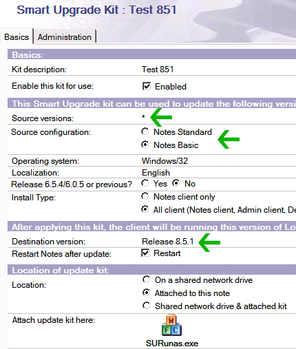

---
authors:
  - serdar

title: "Zincirleme SmartUpgrade..."

slug: zincirleme-smartupgrade...

date: 2010-05-10T17:58:02+02:00

---

Yürüttüğümüz upgrade projeleri sırasında smart upgrade özelliğini kullanmayı seviyoruz. Özellikle düzenli tutulan geniş kurulumlarda çok etkili bir şekilde yükseltme sağlıyor. Çok kısa bir yazıyla bu mekanizmayı anlatmak istiyorum. Bu konuda tecrübelerinizi paylaşırsanız sevinirim.
<!-- more -->
Smart Upgrade sisteminin bize sağladığı en önemli avantajlar şunlar:

* **Policy**'ler kullanarak aktive edebiliyoruz. Böylece kullanıcıları grup grup yükseltme imkanımız var.
* Lokal yönetici hakları olmayan kullanıcılar için **SUSetRunAsWizard** aracı kullanarak yönetici haklarıyla kurulum yapmamızı sağlıyor.
* **InstallShield Tuner for Lotus Notes** (Passport Advantage sitesinden C84T5NA koduyla indirilebilir) uygulamasıyla çok ilginç özelleştirmeler yapılabilir.
* Birden fazla sürüm **zincirleme** olarak yüklenebilir (buna birazdan geleceğiz).

 

Tabi bir takım noktalara dikkat etmemiz gerekiyor. Örneğin client kurulumları düzgün yapılmadığı zamanlar başımıza iş açabilir bu yöntem. Bazen ilk kurulum "C:\\Program Files\\Lotus\\Notes" klasörüne yapılmışken bu dosyalar "C:\\Lotus\\Notes" klasörüne taşınıyor ve kısa yol değiştiriliyor. Bu durumlarda smart upgrade kurulumu registry kaydına göre hareket ediyor ve kullanıcı sıfırlanmış bir kurulumla karşılaşıyor. Sonrası tahmin ettiğiniz gibi panik, telefon ve gergin serzeniş :)

Benim de henüz test ettiğim ve çözemediğim bir takım durumlar yok değil. Örneğin bazı durumlarda kullanıcılar otomatik yükseltme yapmıyorlar. Ya da bir müşterimde karşılaştığım gibi, policy olarak tanımlanmadığı halde kullanıcıya otomatik yükseltme uyarısı gelebiliyor. Bunlar üzerinde halen çalışıyoruz. Bir kısmı için IBM'den destek almayı düşünüyoruz. Gelişmeleri blog'umdan vermeye devam edeceğim.

Bu konuda **Marc Champoux** ve **Patrick Darke** tarafından yürütülen "[The New Domino Admin](http://www.thenewdominoadmin.com/)" isimli blog çok faydalı bilgiler veriyor. PDF dokümanlarla smart upgrade sürecini adım adım anlatmışlar. Lotus Türkiye Kullanıcı Grubu'nda bunu Türkçe'ye çevirmekle ilgili bir takım çalışmalar planlıyorum.

Bu mekanizmayı epeydir kullanıyordum. Geçen haftalarda çok güzel bir özellik farkettim.

Örneğin R7 kullanıcılarımızı R851'e yüklemek istiyorsak sorun yok. Bir paket hazırlıyorsunuz ve policy üzerinden hedef versiyonu "Release 8.5.1" olarak ayarlıyorsunuz ve yükseltme süreci başlıyor.

Eğer 8.5.1 versiyonuna bir de Fix Pack #2 yüklemek istiyorsak Smart Upgrade bu işi zincirleme bir şekilde yapabiliyor. Yine "Release 8.5.1" için bir paket hazırlıyoruz. Bir paket daha hazırlayıp kaynak versiyonu "Release 8.5.1", hedef versiyonu "Release 8.5.1 FP2" olarak belirliyoruz. Buna göre Smart upgrade iki paketi peşpeşe yüklüyor ve client versiyonunu doğrudan "Release 8.5.1 FP2" yapabiliyor.

Aşağıda birinci paketi görebilirsiniz: Kaynak versiyon "\*", Hedef versiyon "Release 8.5.1"

İkinci paketimizin kaynak versiyonu "Release 8.5.1", hedef versiyonu "Release 8.5.1 FP2"

İki küçük hatırlatma;

Birincisi testlerimiz sırasında 7.0.3 versiyonundan 8.5.1 FP2 versiyonuna geçişi denedik. Fakat zincirleme yükseltmenin çalışmadığını farkettik. Biraz inceledikten sonra sebebi bulduk. İkinci pakette kaynak konfigürasyonu "**Notes Standart** " olarak veriyoruz. Fakat R8 öncesi versiyonlar "**Basic** " olarak geçiyorlar. Dolayısıyla zincirin tamamlanması için aşağıdaki gibi bir paket daha yarattık ve problem çözüldü.

İkinci hatırlatmamız, 8.5.1 versiyonu için daha önce dil sorunuyla ilgili yazdığımız yazı.

Bu yöntemi önümüzdeki hafta bir müşterimizde deneyeceğiz. Bakalım başarım yüzdemiz ne olacak...
