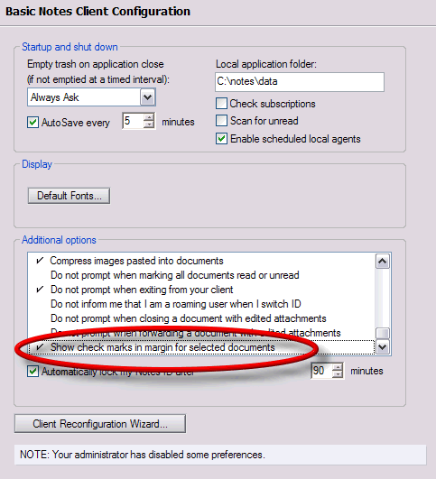
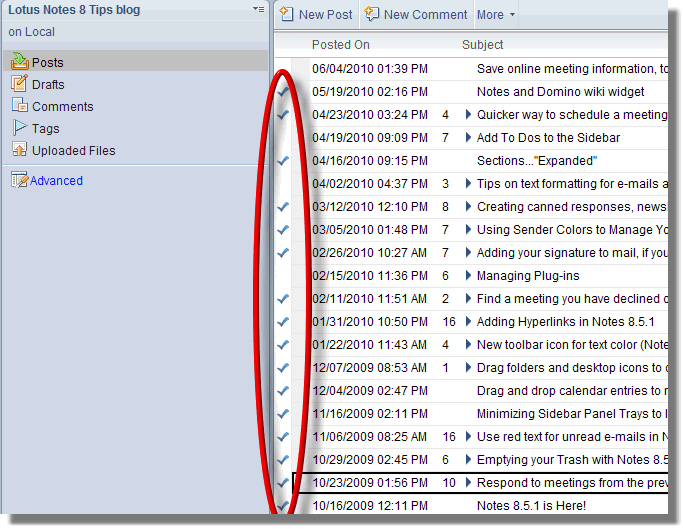

---
authors:
  - serdar

title: "Eski moda doküman seçmek isteyenlere..."

slug: eski-moda-dokuman-secmek-isteyenlere...

date: 2010-06-13T15:30:00+02:00

---

Lotus Notes 8.x serisi ile gelen yeni doküman seçme metodu pek çok kişiyi rahatsız ediyor. Bilindiği gibi artık dokümanları 'tik' atarak seçemiyoruz. [Lotus Notes 8.x Tips blog'unda verilen bir ipucu](http://www-10.lotus.com/ldd/notestipsblog.nsf/dx/old-school-document-selection-in-a-view) var... Daha önce farketmemiştim ama eski doküman seçme metodunu yine kullanmamızı sağlıyor.
<!-- more -->

Preferences altında 'Basic Client Configuration' seçeneklerinden birisi 'Show check marks in margin for selected documents'. Bunu tıklarsanız aşağıdaki gibi seçim yapabiliyorsunuz.

Mail veritabanında çirkin durduğunu söyleyebilirim. Bu özelliği kullanmak istemiyorsanız ben de bir ekleme yapayım. Bildiğiniz gibi mail veritabanının 'Basic' arabirimi de var. Eğer bir veritabanını **Ctrl-Alt** tuşlarına basarak açarsanız '**kompozit** ' görüntü yerine '**basic**' arabirim açılıyor.
