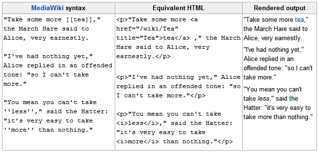
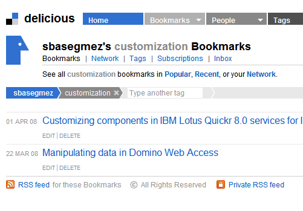
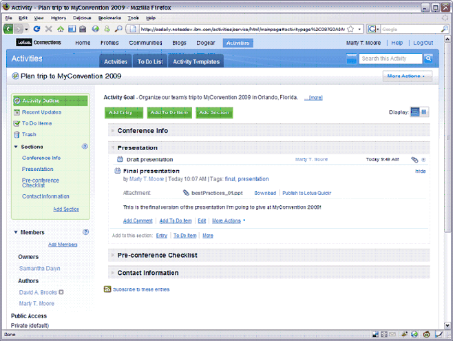

---
authors:
  - serdar

title: "Kurumsal Sosyal Ağ Yazılımları: Malzemeler (4)"

slug: kurumsal-sosyal-ag-yazilimlari-malzemeler-4

date: 2010-06-18T10:14:47+02:00

---

Daha önce sosyal ağ yazılımlarının değişik boyutlarını ele almıştık. Serimizin dördüncü yazısında sosyal ağ yazılımlarının nelerden oluştuğuna değinmek istiyorum. Daha önce belirttiğim gibi, sosyal ağ yazılımlarının 'gerçek' iş problemlerini analiz ederek çözecek klasik bir yaklaşım içermediğini, bunun yerine bilgi sistemleri tarafından yönetilen ve yeni çalışma şekillerine meraklı çalışanlara sunulan bir servis olarak ele alınması gerektiğini düşünmek gerekiyor.
<!-- more -->
Elbette bu durumun bazı istisnaları var. Örneğin Lotus Quickr yazılımı Domino.doc yerine geçmesi için tasarlanan, doküman ve içerik yönetimi gibi önemli iş problemlerini çözmek için kullanılan bir ürün. Yakın zamanda Quickr'ın yeni versiyonu çıkıyor ve çok radikal değişiklikler geliyor. Bunlar hakkında ayrı bir yazı yazmayı planlıyorum ama henüz IBM geliştirme ekibi yenilik listesini 'gizli' tutuyor.

Şimdi kurumsal sosyal ağ yazılımlarının önemli bileşenlerine göz atalım. Bazılarını ayrıntılı olarak anlatmayacağım. Çünkü tartışma forumları, anında mesajlaşma/farkındalık veya doküman kütüphaneleri gibi bileşenleri zaten biliyor ve (muhtemelen) kullanıyorsunuz.

#### Wiki'ler

 

Wiki kavramı [wikipedia](http://www.wikipedia.org/) ile popülerleşti ve kollektif içerik üretimi adına çok önemli bir adım oldu. Bu yüzden bir çok organizasyon (küçük sivil toplum örgütlerinden büyük şirketlere kadar) wiki sistemlerini iç ve dış müşterileri için kullanmaya başladılar.

Wiki, temel olarak, bir çok yetkili/anonim kullanıcı tarafından değiştirilebilen zengin metinli bir içeriği temsil ediyor. Her değişiklik, boyutundan bağımsız olarak kronolojik bir sırayla versiyonlanıyor. Herhangi bir editör, iki düzenleme arasındaki değişiklikleri silebiliyor ya da eski bir versiyona dönüş yapabiliyor.

Wiki'ler 'çevrimiçi doküman oluşturma' ile karıştırılmamalıdır. DocVerse (GoogleApps) veya Microsoft Groove tarafından sunulan bu servislerin aksine wiki'ler aynı içerik üzerinde eşzamanlı çalışmaya imkan vermezler. Benzer şekilde wiki'ler doküman yönetim sistemlerinin de alternatifi değillerdir. Bu sistemlerde sunulan 'check-in', 'check-out', 'lock in' fonksiyonları wiki'lerde bulunmaz. Wiki, anlık olarak değiştirilir ve yayınlanır.

Wiki'lerin kurum içi ve kurum dışında kullanılmaları oldukça etkin ve ucuz olabilmektedir. Ürün portföyleri wiki'lerle dokümante edilebilir, iş ortakları, dağıtım kanalı, bayiler ve müşterilerin değişiklik yapmasına izin verilerek zenginleştirilebilir. Çok yaygın örnekler [IBM DeveloperWorks Wiki](http://www.ibm.com/developerworks/wikis/) ve [SAP Developer Network Wiki](http://www.sdn.sap.com/irj/sdn/wiki) gibi yazılım şirketlerinden verilebilir. Değişik şirketler de wiki'leri kurum içinde farklı amaçlarla kullanmaktadır. Şirket yönergeleri, kalite dokümanları gibi bazı içeriklerin üretilmesinde değişik takımların iş birliği gerekebilmektedir. Bunların 'oluştur/gönder/düzenle/onayla' gibi klasik doküman yönetimi zincirlerinden geçirilmesi doküman oluşturma sürecini oldukça yavaşlatırken bir organizatörün geniş bir çerçeveyi hazırlaması ve ilgili kişilerin kendi bölümlerini doldurması daha verimli olmaktadır. Daha önce Lotus Connections kullanmış olması gereken adam videosunda değişik uygulamalar görmüştük.

Wiki'ler, sayısız avantajlarının yanında çok basit bir kullanıma sahiptir. Çok basit bir kullanıcı bu mekanizmayı bir kaç dakikada öğrenebilir. Zengin metin editörleri kullanılabildiği gibi **MediaWiki** notasyonu kullanılarak da HTML bilmeye gerek duymadan içerik üretilebilir...

 

 

#### Blog'lar

 

Bu yazıyı okuyorsanız, zaten blog kavramına aşinasınız demektir. Blog (Weblog ya da web günlüğü) her biri tek bir yazar tarafından oluşturulmuş içeriklerdir. Kategorize edilebilir, etiketlenebilir (tagging), oylanabilir ve yorum yapılabilirler.

Blog'lar günümüz sosyal ağlar dünyasının çok popüler bir uygulamasıdır. Bireyler (tek tek ya da grup halinde) fikirlerini blog'lar kanalıyla yayınlamaktadır. Şirketler stratejilerini aktarırken, aktivitelerini duyururken ve pazarlama yaparken blog'ları kullanmaktadırlar. Politikacılar, ünlüler, gazeteciler ve bir çok meslek grubu takipçilerine blog'lar kanalıyla ulaşmaktadır. Kurum içi bloglar da organizasyonların değişik katmanları arasında stratejik ve taktiksel mesajlarını iletmek amacıyla kullanılmaktadır.

Aslında bloglar sosyal yazılımların getirdiği bir yenilik değildir. Bu tip uygulamalar şirketlerde çok uzun zamandır kullanılmaktaydı. Bir çok şirket tartışma veritabanları ya da duyuru sistemleri adı altında benzer yapılar zaten kurmuşlardı. Blog'lar, kavramsal anlamda sosyal yazılımları tamamlamakta ve yorumlama, etiketleme gibi dikey mekanizmalarla da işlevsel olarak zenginleşmektedir.

#### Microblog'lar

Eğer Twitter ya da Friendfeed kullanıyorsanız veya en azından Facebook durumunuzu güncellemişseniz, microblog kullanmışsınız demektir. Microblog'lar normal blog'ların kısaltılmış versiyonlarıdır. Genelde bir kaç cümleden, linkten, resimden ya da videodan oluşurlar. Microblog siteleri şaşırtıcı derecede basit yapılarına rağmen sosyal medya iletişiminde ve pazarlamada geniş bir uygulama alanı oluşturmuştur.

 

 

Microblog'lar kurumsal sosyal ağ yazılımlarındaki yerlerini almışlardır. En önemli avantajları basit ve pratik olmaları ve çalışanlar arasında **anında** ve **asenkron** iletişim olanağı sunmalarıdır. Öte yandan bazı problemleri de öne çıkmaktadır. Örneğin **gizlilik** endişesi, yani yazılan metnin herkes tarafından okunuyor olmasının yarattığı endişe, bireylerin kullanımını sınırlandırmaktadır. Ayrıca **bilgi güvenliği** açısından kritik bilgilerin yanlışlıkla ifşa edilmesi riski yaratmaktadırlar.

#### Social Bookmarking

 

Social bookmarking, diğer mekanizmalar gibi, yeni bir kavram değildir. Temelde 'social bookmarking', web sayfalarının adreslerinin kategorize edilerek veya etiketlenerek bir havuza eklenmesi ve diğer bireylerle paylaşılmasıdır. Kökenleri 90'lı yıllara kadar uzansa da en yaygın örnek 2005 yılında Yahoo tarafından satın alınan '[del.icio.us](http://delicious.com/)' olarak düşünülebilir. Delicious'un popülaritesinin artmasında kolay kullanımı ve daha öncekilerden farklı olarak sunduğu etiketleme mekanizması çok etkili olmuştur. Kurumsal anlamda **Lotus Connections Dogear** mekanizması (daha sonra bookmark olarak isim değişikliğine uğramıştır) ilk sunulan örneklerden biridir.

Son zamanlarda link paylaşımı facebook, twitter ve friendfeed gibi sosyal ağlarla yapılmaktadır. Bookmarklet'ler (url paylaşımını hızlı bir şekilde yapmayı sağlayan araç çubuğu ya da sayfa tuşları) bu yönde çok yaygın kullanılmaktadır. Örneğin bu yazıyı Facebook arkadaşlarınızla anında paylaşmak için sayfanın altındaki Facebook ikonunu kullanabilirsiniz. Fakat bu yaygın kullanım yalnızca paylaşımı içerir. kategorize edip ileride kullanmak üzere saklamak Social Bookmarking'in temel yararıdır.

 

 

Çok temel bir problem, paylaşılan link'lerin zaman içerisinde geçersiz hale gelmesidir. Çünkü içerik değil referans paylaşılmaktadır. Bir çok içerik sağlayıcı bu problemin önüne geçebilmek için 'kalıcı link' (permanent link) üretmektedir.

#### Görev ve İş Paylaşımı

 

Aslında birlikte çalışma sistemlerinin ilk çıkışı bilgi paylaşımından çok **ortak amaca** sahip ve **ortak gündemle** hareket eden grup üyelerinin **koordinasyonu** probleminden kaynaklanmıştır. **Takım çalışmalarının** organizasyon yönetiminde öne çıkmaları ortaklaşa iş yapma (yapamama) problemlerine neden olmuştur. Karmaşık süreçlerde (örneğin inşaat projelerinde) mühendislik metodolojileri zaten akademik olarak çalışılmıştır. Fakat '**proje yönetimi** ', görev paylaşımı ve iş dağılımı yerine kaynak yönetimi ve risk/maliyet optimizasyonunu temel almaktadır.

 

 

Lotus Quickr'ın sunduğu takım alanları (team space) veya Lotus Connections'da kullanılan aktiviteler güzel örneklerden ikisidir. Bu araçlar takımlar için aynı zaman çizelgelerini içeren, görev listeleri oluşturma olanağı sunan ve belli bir projeyle ilgili dokümanların paylaşılabildiği ortak bir alan oluşturmaktadır. Proje yönetim uygulamalarının aksine hızlı (ad-hoc) planlar hazırlanması ve takım üyelerine işlerin dağıtılması ve görevlerin kolaylıkla takip edilebilmesine olanak sunarlar.

#### Dikey Mekanizmalar

Tüm sosyal yazılım bileşenleri kullanıcı etkileşimine açık ortak bir yapı kullanırlar. **Yorumlama** , **oylama** ve **etiketleme** mekanizmaları kullanıcılara içerikleri organize etme, derecelendirme ve zenginleştirme imkanı sunar. Entegre bir sosyal yazılım, her tür bilgi ve veri parçasını kullanıcı etkileşimine açmalıdır.

Katılım, sosyal yazılım için olmazsa olmaz bir mekanizmadır. Bireyler bilginin ve verinin yalnızca kaynağı değil, aynı zamanda katılımcısıdır. İçerik havuzuna katkıda bulunan kullanıcılar bu araçlar yardımıyla bilginin doğruluğunu, bütünlüğünü ve geçerliliğini onaylar, yorumlarıyla zenginleştirerek oylarıyla değerini belirler.

#### Arabirim Sorunsalı

 

Sosyal yazılım kullanımı, kullanıcıların bir sürü yeni bilgiye maruz kalmaları demektir. Kendi ağlarındaki microblog'lar, blog'lar, wiki güncellemeleri, haberler ve güncellemeler klasik uygulamalardaki değişimlerle birleşince izlenecek 'bilgi adacığı' sayısı bir anda artar. Tüm yeniliklerin kullanıcı ekranlarına 'ittirilmesi' pratik değildir. Bunun yerine 'içerik toplayıcılar' (content aggregator) kullanılır.

Yeni masaüstü değişik kaynaklardan gelen bilgileri toplayacaktır (mash-up). Neye benziyor bu Project Vulcan videosunda IBM'in bu iş için düşündüğü çözümü daha önce paylaşmıştık. Günümüzde kullanılan pano (dashboard) uygulamalarını ilkel bir 'mash-up' uygulaması olarak düşünebilirsiniz.

Basit görünebilir fakat farklı bilgi kaynaklarını tek bir ekranda birleştirmenin bir takım zorlukları bulunmaktadır. Veriyi çekmek çok önemli bir problem değildir. Fakat bunu gerçek zamanlı yapmak gerekir. Facebook sayfanızı açıp bir süre beklerseniz yeni girdilerin sayfayı tekrar yüklemeden ekrana geldiğini görebilirsiniz. Bu 'pull-aggregation' ve 'push-aggregation' sistemleri arasında temel bir farklılıktır. Standart bir 'dashboard' uygulamasından farklı olarak 'mash-up' sayfası tüm bilgileri tutmaz (tutmamalıdır da). Çünkü güncelleme listesi anlık hesaplanır ve sizin ağdaki yeriniz, yetkileriniz veya aboneliklerinize göre değişiklik gösterir. Böyle bir sayfayı sürekli tekrar yüklemek kullanıcı açısından sıkıcı olmanın ötesinde maliyetli de bir işlemdir.

#### Kurallar ve İdari Konular

 

Sosyal yazılım yapma/satın alma kararı özel bir iş problemine yönelik klasik bir çözüm üretme süreci değildir. Bir çok şirket doküman paylaşımı/yönetimi, uzmanlık araştırma, personel profilleme gibi belli kritik problemleri çözüme kavuşturmak amacıyla değişik çözümler uygularlar. Fakat sosyal yazılım bundan daha fazlasıdır. Benim fikrim burada kilit farklılığın sorumluluk dağılımında yattığıdır. MIS departmanları artık çözüm tasarımcısı değil; servisi barındıran ve kurum hassasiyetleri özelinde regülasyon görevini üstlenen departman haline gelmektedir. Blog'lar, microblog'lar ve içerik paylaşımları yönergeler ve kurallar dahilinde hazırlanmalıdır. Kurum kültüründe değişimler oluşacak ve değişik organizasyonel kademeler farklı beklentiler, endişeler ve dirençler gösterecektir. IBM'in 'blogging policies' gibi yönergeler oluşturması güzel bir örnektir.

#### Çok mu Karmaşık Görünüyor?

 

Sosyal yazılımın bileşenleri bunlarla sınırlı değildir. Ama kritik nokta şöyle özetlenebilir: **Sosyal yazılımlar tüm bu bileşenler için bir altyapı sunarlar. Bu altyapı yalnızca yönetim ve güvenlik katmanını değil; birikim, analiz, arama ve etkileşim araçlarını da işlevsel hale getirmelidir** .

Peki bütün bunların sonucunda sosyal yazılımın arkasındaki iş değeri nedir? Bu ayrı bir blog konusu. Fakat özetle, iş yapma şeklimiz (değişiyor az kalır) değişmiştir.

Verileri (information) bir kenara bırakın, fakat kollektif bilgi (knowledge) artık üretilebilir, depolanabilir, kiralanabilir, işe alınabilir veya satınalınabilir bir şey olmaktan çıkmıştır. Dağıtıktır, pahalıdır ve ölümcüldür. Yakalamak, kayıt altına almak, kategorize etmek veya dosyalamak zorlaşmıştır. Dolayısıyla tekil, düzenli ve ortak bir platformda üretilmesi gerekmektedir.

Burada anlattığımız bileşenler oyuncak gibi görünebilir. Çoğu zaman bu yanlış algı sosyal yazılımların iş dünyasında ciddiye alınmamasına neden olmaktadır. Benim önerim internet aramalarınızı 1 hafta boyunca google üzerinden değil; delicious, stumpleupon, twitter ve blog'lar gibi ortamlardan yapmanız. O zaman sosyal araçların farkını daha net olarak hissedeceksiniz.
