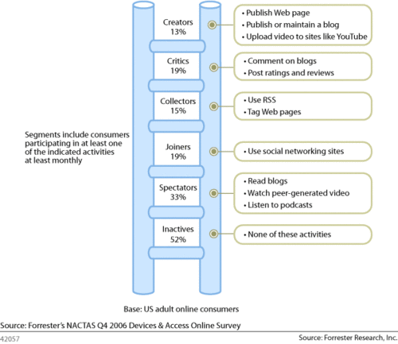

---
authors:
  - serdar

title: "Türkiye'de blog yazan 'Lotus'çu olmak..."

slug: turkiyede-blog-yazan-lotuscu-olmak...

date: 2010-06-25T10:00:00+02:00

---

Forrester'ın meşhur [araştırmasında](http://forrester.typepad.com/groundswell/2007/04/forresters_new_.html) ismi geçen Sosyal Medya Piramidi'ni duymuşsunuzdur.
<!-- more -->

Bu piramid aslında müşteriler için hazırlanmış. Ama bana da uyuyor. İnaktif dönemden sonra blog okumayla başlayan, sosyal ağ yazılımları kullanarak devam eden ve 'creator' olarak (kendimce) zirve yapan bir sosyal medya kariyerine sahip oldum zaman içerisinde.

Türkiye bu açıdan enteresan bir ülke. 'Otobüsten indim', 'şimdi eve girdim', 'televizyonda güzel bir film var' şeklinde 3'er dakika aralıklı mikro-blog'lar yayınlayan bir 'Y-kuşağı'nı da barındırıyoruz, hayatında hiç bir blog okumamış ama gününün 3-4 saatini Internet'te geçiren beyaz yakalıları da... 17 milyon Facebook kullanıcısı olan bir ülkede yaşıyoruz. Cep telefonu gibi sosyal ağ penetrasyonunun da zirve yaptığı ilginç bir toplum görüntümüz var.

'Ata sporumuz' futbol konusu Türk internet kullanıcısının her açıdan en sevdiği konu sanırım. Futbolla ilgili Türk blog'larının bir çatı altında toplandığı '[Blog İdman Yurdu](http://www.blogidmanyurdu.com/)' sitesinde 2 yıl içerisinde (sıkı durun) 91.242 yazı yayınlanmış. Şaka gibi bir içerik, gerçek üstü bir katılım söz konusu. Sıkı bir futbol fanatiği olarak popüler bazı blogları ben de izliyorum. Yorumlarda birbirine girenler, tartışmanın dozunu kaçıranlar ve hatta blog yazarlarına ters düştükten sonra 'bana ne ya' diyen ve kendi blog'unu açanlar var.

Gelelim Lotus konusuna... Lotus yazılımlarıyla ilgili tüm blog'lar [planetlotus.org](http://planetlotus.org/)sitesi altında toplanmış durumda. Burada listelenen 350 civarında blog sitesi var. LotusNotus ve henüz listelenmemiş olan bestcoder.net haricinde bu topraklardan hiç bir ses duyulmuyor. Arada şöyle bir baktığımda bu konuda blog açmayı düşünen bir kaç kişi olduğunu görüyorum. Bu sayı artarsa blog yazmak benim için çok daha keyifli hale gelecektir.

Bir süredir Lotus Notus'un İngilizce versiyonu da yayında. Hatta IBM'in Türkçe dil paketlerini 90 günde yayınlaması gibi bizim blogun İngilizce versiyonu da 3.ay yayına girdi :)

Yazdığım yazıların bir çoğunu İngilizce'ye de çeviriyorum. Bu ikinci dil benim ziyaretçi sayımı beşe katladı. Bu da Türkiye'de iş kullanıcılarının blog izleme alışkanlıklarının yerlerde olduğunu gösteriyor. Detaylı analiz ettiğimde ise Türkiye'deki okuyucularımın bu sayfalara ağırlıklı olarak Google'dan arama yoluyla ulaştıklarını gösteriyor. Genelde problem çıktığında ya da bir şey merak edildiğinde ziyaret ediliyorum demek bu. Oysa yurtdışı kaynaklı ziyaretler PlanetLotus üzerinden ya da çeşitli RSS okuyuculardan geliyor. Bu yüzden yoğunluk sebebiyle yazmaya ara verdiğimde Türk ziyaretçi sayısı sabit kalırken yabancı ziyaretçilerimin sayısı tepe taklak düşüyor.

Son olarak, ziyaretçilerimin genelde izleyici olarak kalmayı tercih ettiklerini görüyorum. Abim ve bir kaç arkadaşım dışında pek yorum yazan yok. Bunun nedenini kendimde aramakla birlikte katılımın ve geribildirimin bu işi en zevkli yapan şey olduğunu düşünüyorum. Nitekim İngilizce yazmaya da yurtdışından gelen geribildirimler nedeniyle karar vermiştim. Katılım sorununu Lotus Türkiye Kullanıcı Grubu'nda da yaşıyoruz. Bunu yalnızca zamansızlıkla açıklamak bana çok mantıklı gelmiyor artık.

Blog'umu okuyan partner'lar, öğrenciler, IBM çalışanları ve müşteriler olduğunu görüyorum. Bu blog'u açarken kişisel fikirlerimin ve düşüncelerimin propogandasını yapmayı amaçlamadım. Bildiklerimi ve yaşadıklarımı paylaşmanın zevkli olacağını düşünüyordum, öyle de olduğunu açık yüreklilikle söyleyebilirim. İçerik konusunda ise geriye dönüp eski yazılarıma gözatıyorum. Daha iyi olabilir diye bir özeleştirilerim oluyor.

Güncel gelişmeleri buraya yazıyorum fakat bunu yazarken bir 'haberci' olmak istemem. Gelişmeleri daha çabuk öğrenmek isteyenler ekranın sağ tarafındaki diğer blogları okuyabilir, çünkü bunların bazılarının haberdar etme misyonu var. Haberdar ederken Türkiye'deki topluluğa bir şeyler katabilmeyi amaçlıyorum. Örneğin Lotus Quickr 8.5 versiyonunun çıktığını öğrenirken bu versiyonda yapılan geliştirmelerin alt metnini okumak gerekiyor. Daha sonra detaylı bir şekilde anlatacağım gibi bu versiyon Connections ve Quickr uygulamalarında bir birleşmenin habercisi. Aynı zamanda Quickr'ın portal versiyonunun Filenet gibi kompleks ürünlere arabirim olarak konumlandırılmaya çalışıldığının göstergesi.

Bir başka amacım, Lotus profesyonellerinin masalarına gömülmüş dünyalarından bir an için kalkmalarını ve etrafı görebilmelerini sağlamak. Halen Lotusscript ve formula ile uygulama geliştirenlerin bir an önce XPages'e başlamaları gerekiyor. Tıpkı ASP dilinde ısrar ettikten sonra Dot Net platformuna geçmekte geç kalanlar gibi sorun yaşayacaklar.

Bunların dışında içerik eleştirilerine ve önerilerine her zaman açık olduğumu belirtmek isterim. Günümün büyük bir kısmı Starbucks'larda çalışırken geçiyor. İstediğiniz zaman buluşup bir kahve içmeye ve bu konuları tartışmaya açık kapı bırakıyorum. Bunun için her zaman vakit yaratabilirim.

İzleyenlere ve katılanlara şimdiden sonsuz teşekkürler...
