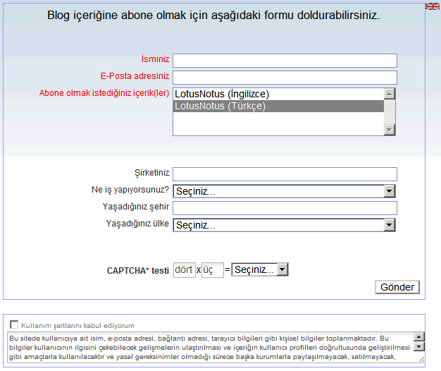

---
authors:
  - serdar

title: "İlk XPages uygulamam"

slug: ilk-xpages-uygulamam

date: 2010-07-30T17:03:41+02:00

---

Az önce ilk XPages uygulamamı tamamladım. Ne dediğinizi duyar gibiyim... Evet, biraz geç oldu ama iyice hazır olmak istedim :)))
<!-- more -->
İlk XPages uygulamam web-tabanlı bir abonelik modülü. LotusNotus'un ziyaretçi istatistikleri, özellikle Türk Lotus profesyonellerinin RSS kullanmadıklarını gösterdi. Bir çoğu newsletter'ları tercih ediyor.

Ben de workshop'larda öğrendiklerimi uygulamak için güzel bir fırsat diyerek küçük bir modül tasarladım. Tabi şu anda beta aşamasındayım. Bir kaç arkadaşım kayıt oldu. Halen mesaj gönderim modülünü test ediyorum.

Aşağıda Developi laboratuvarlarından en son sızan ekran görüntüsü var :)

Çirkin göründüğünün farkındayım. Açıkçası görselliğiyle uğraşamadım henüz.

Bir sonraki yazımda ilk izlenimlerimi paylaşacağım...
