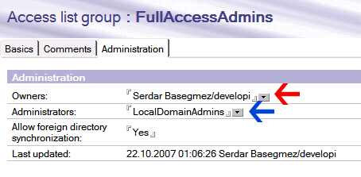
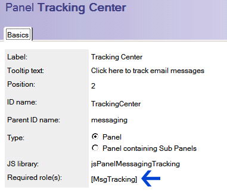

---
authors:
  - serdar

title: "Lotus Domino Adminleri: Bırakın başkaları da iş yapsın!"

slug: lotus-domino-adminleri-birakin-baskalari-da-is-yapsin

date: 2010-07-26T18:30:00+02:00

---

Geçtiğimiz hafta biraz müşteri ziyaretleriyle geçti. Bu sırada çok genel geçer bir problemi hatırlamış oldum. Bir çok şirkette Domino sistem yöneticileri ciddi bir iş yükü altındalar. Ortalama 200 kullanıcıya bir sistem admin gerekir diye düşünsek de benim müşterilerimde ortalama bunun iki katı. Bu sağlıklı değil. Gelin bu acayip iş yükünü kırabilmek adına bir kaç ipucu verelim bugün.
<!-- more -->
**1. Yeni kullanıcı yaratma işini delege edin:**
Çok büyük şirketlerde kullanıcı yaratma işini otomatikleştirmeyi her zaman önermişimdir. Bu tam otomatik yapılabilir (İK, kendi uygulamasında yeni bir personel kaydı yaratır, domino tarafında bir agent bunu görüp yeni bir kullanıcı oluşturur), yarı otomatik olabilir (İK bir form doldurur, sistem yöneticisi bazı alanları kontrol edip onaylar ve kullanıcı yaratılır) veya delege edilebilir (İK teknik operatöre söyler, teknik operatör yaratır).

Burada dikkat edilmesi gereken bir kaç nokta var. Örneğin en değerli hazinemiz olan Certifier ID ve onun şifresini birilerine vermemiz gerekmiyor. **CA (Certification Authority) konfigürasyonu** bizim için çok yararlı bir araç. CA, temel olarak sertifika bilgilerini özel bir veritabanında şifreli bir şekilde tutmamızı sağlar. Bizim belirlediğimiz sistem yöneticileri bu bilgiyi kullanarak yeni ID dosyaları yaratabilirler. Şifreleme, bu kullanıcıların public key'lerine göre yapılacağı için onların ID şifreleri güvenle saklandığı sürece sistem gayet güvenli bir şekilde çalışacaktır.

Kullanıcılar, LotusScript ile de yaratılabilir. Bunun için **NotesRegistration** objesi kullanılabilir. Bu obje ile doğrudan certifier id kullanılabildiği gibi güvenlik açısından CA kullanılmasını tercih ediyoruz.

CA, ayrıca sertifika yenileme, isim değiştirme veya kullanıcı taşıma gibi işlemleri de delege etmemizi sağlar.

**2. Şifre işlemleri**
Burada tek bir sihirli sözcük var: '**ID Vault** '. Eğer halen 8.5 kullanmıyorsanız, hemen upgrade edin :)

ID Vault, bildiğiniz gibi, alt kademe admin'lerin şifre sıfırlamasını sağlar. Eğer bir kaç yüz kullanıcınız varsa ve her gün bir kaç şifre problemi almıyorsanız, şifre politikalarınızı gözden geçirmelisiniz.

**3. Grup yönetimi**
Kullandığımız sistemlerde gruplar bir çok işe yarar. Mesaj grupları olarak takım ve departman listelerini tutarlar veya uygulamalarda yetkilendirme amacı taşıyabilirler.

Bir çok sistem yöneticisi gruplarla ilgili yetki vermekten haklı olarak kaçınırlar. Çünkü belli gruplar tehlikelidir. Bir kullanıcı, kendisini 'FullAccessAdmins' grubuna koyarak her şeyi görebilecek bir duruma gelebilir, kendisini finans departmanına ekleyerek maaş bilgilerini ele geçirebilir vs. Aslında bir çok sistem yöneticisi, grupların yönetilebilir olduğunu bilmez. Bu yüzden adres defterinin bazı özelliklerinden bahsedelim.

Eğer bir kullanıcıya names.nsf veritabanının ACL'inden '**\[GroupModifier\]** ' rolü verirsek, o kullanıcı tüm gruplarda değişiklik yapabilir. Bu durumda alt kademe sistem yöneticilerine bu rolü vermememiz gerekir. Yalnız, dikkat! Bu yetki reader/author alanlarına dayanır. Dolayısıyla bir kullanıcı, ACL'de editor düzeyinde erişim yetkisine sahipse bu role sahip olmasa bile tüm gruplarda değişiklik yapabilir. Çünkü **author alanları yalnızca 'Author' seviyesinde işlerlik kazanır, 'Editor' seviyesinde geçersizdir.**

Bunların dışında grup dokümanlarında iki alan bulunuyor:

Grup sahibi (owner) ve yöneticileri (administrators) olarak belirlenen kullanıcılar, ACL'de 'Author' olarak yetkilendirildilerse o gruba ait üyeleri düzenleyebilirler. Owner ve Administrator arasında bir fark bulamadım, fakat ikisi de yalnızca 'Editor' düzeyinde kullanıcılar tarafından değiştirilebilir. Dolayısıyla bu alana koyduğunuz ve ACL üzerinde 'Author' olarak belirlediğiniz kullanıcılar bu alanı değiştiremezler (ki bu iyi bir şey :)) Benim önerim, değişik sistem yöneticisi grupları oluşturmanız, bu alanları kullanarak grup yönetimini delege etmeniz. Bir örnek vermek gerekirse:

Üç grup yaratın ve ACL seviyelerini şu şekilde ayarlayın: LocalDomainAdmins (Manager), GroupAdmins (Author seviyesinde ve \[GroupModifier\] rolü verin) ve LocalAdmins (Author). Bu konfigürasyonda LocalDomainAdmins grubundakiler her şeyi yapabilir. GroupAdmins grubundakiler, mevcut grupların üyelerini değiştirebilir. LocalAdmins grubundakiler ise yalnızca (Administrator alanıyla) yetkilendirildiği grupların üyelerini değiştirebilir. Böylelikle üç seviyeli bir güvenlik kurduk. İstenirse ek seviyeler eklenebilir. Örneğin IKAdmins gibi bir grup yaratılıp departmantal grupları düzenleme yetkisi insan kaynaklarına verilebilir.

Grup yönetimini delege etme işi biraz karmaşık ve yorucu gibi görünebilir ama bu işi yalnızca bir kez yapacağınızı düşünün.

**4.Names.nsf veritabanını tanıyalım**
Grup dokümanlarında olduğu gibi, names.nsf üzerindeki bir çok konfigürasyon dokümanı benzer alanlara ve rollere sahiptir. Bu da çok katmanlı sistem yönetimi uygulanmasını sağlar. Belirli kullanıcılar belirli sunucuların konfigürasyonundan sorumlu tutulabilir. Sistem yönetim operasyonunu dikey ve yatay olarak bölebilir ve belirli gruplara belirli hakları devredebilirsiniz.

Örneğin test ve geliştirme sunucularınız var ve bir sebepten uygulama geliştirme ekibine yönetimsel haklar vermek istemiyorsunuz. Fakat onlar da test platformu üzerinde diledikleri gibi hareket etmek istiyorlar. Test domain'ini ayırmak bir çözüm olabilir, ya da uygulama geliştirme ekibine test sunucu dokümanlarında Administrator yetkisi (hem Administration, hem de Security tabında) verebilirsiniz. Ayrıca test kullanıcılarında da aynı yetkilendirme yapılabilir. Uygulama geliştiriciler bu sayede test ortamında diledikleri gibi at koşturabilirler, fakat ana sisteme dokunamazlar.

Policy ayarları da benzer şekilde delege edilebilirler. Yalnızca hatırlatmak isterim, bazı policy ayarları, son kaydeden kişinin belirli yetkilere sahip olmalarını gerektirir. Örneğin bir kullanıcıdan "\[PolicyModifier\]" rolünü kaldırırsanız o kullanıcının en son kaydettiği policy ayarları kullanılamaz duruma gelir.

Son olarak, bu alanların kullanımları, yetki verdiğiniz kullanıcıların ACL'de 'Author' seviyesinde tanımlanmasını gerektirir.

**5. Veritabanı operasyonları**
Updall, compact ve fixup gibi veritabanı operasyonları son derece sık karşılaşılan ve zaman alıcı işlemlerdir.

Çeşitli nedenlerden veritabanları bozulabilir, view indeksleri zarar görebilir ve veritabanları fixup gerektirebilirler. Kotasını aşmış bir kullanıcı bir kaç mesaj silip kotanın altına inmek için sizden veritabanını compact etmenizi isteyebilir veya uygulama ekibi büyük bir veritabanını replicate etmenizi isteyebilir. Konsola bir komut vermekten öte, çoğu zaman işlemin sonucunu görmeniz gerekir. Bu da işlerin uzamasına neden olur.

En kolay delegasyon yöntemi, alt seviye sistem adminlerine '**Full Remote Console Administrator** ' hakkı (Server dokümanında Security tabında) vermektir. Konsol yöneticisi replicate, compact, fixup, trace gibi bir çok konsol komutunu kullanabilir. Fakat aynı zamanda yanlışlıkla sunucuyu kapatabilir, tekrar başlatabilir. Bu yüzden bu yöneticileri iyi eğitmeniz gerekir.

**6.İzleme işlerinizi devredin**
DDM (Domino Domain Monitoring), 7'inci versiyon sırasında sunulmuştu. Bence Lotus ekibinin yaptığı en iyi iştir. Uygun ayarlanıp kullanıldığında çok güçlü bir izleme aracıdır. Değişik sunuculardan çok değerli bilgiler toplayıp organize bir şekilde sunabilir. DDM aslında başlı başına bir blog konusu. Kullanmanızı şiddetle tavsiye ederim.

DDM sayesinde alt seviye admin'lerin güvenlik olaylarını, bağlantı problemlerini, agent'ların CPU ve süre kullanımlarını, veritabanı bozulmalarını ve replikasyon sorunlarını gözleyebilmesini sağlar. Hatta uygun hakları varsa, düzeltme işlemini (örneğin fixup komutu) doğrudan DDM içinden uygulayabilir.

Alt kademedeki sistem yöneticileri Administrator istemcisinin monitoring kısmını kullanarak sunuculardan gerçek zamanlı durum bilgileri ve uyarıları alabilir.

İzleme operasyonları genellikle sunucu dokümanlarında security bölümündeki 'View-only Administrator' yetkisi gerektirir. DDM veya Log veritabanları ayrıca ACL üzerinden ayarlanmalıdır.

**7. Web Administrator aracını keşfedin**
Web yöneticisinin görünüşünü özelleştirebildiğinizi biliyor muydunuz? Webadmin.nsf veritabanını açıp panel ayarlarına bakarsanız her panelin bir rol bağlantısı bulunmaktadır.

Bir rol yaratıp panelleri bu role bağlayabilir, hatta özel yönetim uygulamaları tasarlayıp bu panellere yerleştirebilirsiniz. Tabi upgrade'ler öncesi yedeklemeyi unutmayın.

**Son sözler...**
Sistem yöneticiliği, özünde biraz paranoya barındırır. Fakat delege edebileceğiniz şeyleri kendiniz yapmaya çalışmanız da çok akıllıca değil. Müşterilerime operasyonel süreçleri alt seviye admin'lere, yardım masası operatörlerine veya self-servis uygulamalara delege etmelerini sürekli tavsiye ediyorum. Bunun en önemli yararı bariz bir şekilde zaman kazanmaktır.

Başka bir fayda da alt seviye adminlerin sistem yönetim operasyonlarına katılmalarıyla işi öğrenmeye başlamaları olacaktır. Bir çok uzmanda, bulunduğu işe fazlaca yapışmaktan kaynaklanan terfi edememe, görev değişikliği yapamama problemine rastlıyoruz. Astlarınızı yetiştirerek pozisyonunuzu ileri doğru taşıma imkanı bulabilirsiniz.
