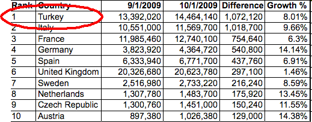

---
authors:
  - serdar

title: "LCTY sonrası: Müşterinin beklentileri ne kadar farklı?"

slug: lcty-sonrasi-musterinin-beklentileri-ne-kadar-farkli

date: 2010-08-11T10:00:15+02:00

---

Dün yorucu bir Lotusphere günüydü...
<!-- more -->
Bu tür organizasyonları seviyorum. Pazarımızda neler döndüğünü öğrenme fırsatı veriyor bana. Kim ne yapıyor, kim nereden ayrılmış, hangi partner neyle uğraşıyor vs. Amerika ve Avrupa'dan önemli insanlar gelip Türkiye pazarı hakkında güzel düşüncelerini ifade ediyorlar. Şu meşhur grafiği de onuncu kez görüyorum:

Bu İstanbul'da düzenlenen üçüncü Lotusphere organizasyonuydu. Özellikle yazılım zirvesi gibi diğer toplantılar giderek Lotus'dan uzaklaştığından bizim için daha önemli hale geldi Lotusphere.

Neyse, konumuza dönersek:

Dünkü giriş sunumları, 'Lotus Knows' mottosu (yerel Lotus ekibi bu sloganı ilk kez bu kadar net kullandı) ve Lotus Connections ürünü ile başlayan yeni 'sosyal yazılım' kavramı üzerineydi. Paralel oturumlara baktığımızda Lotus Live, Lotus Quickr 8.5 üzerine sunumlar ve bir kaç müşteri uygulaması sunumu vardı.

Tüm bu oturum aralarında konuştuğum müşterilerin gündemi, genel organizasyon gündeminden bir kaç kilometre uzaktaydı:

|-----------------------------------------------------------------------------------------------------------------|------------------------------------------------------------------------------------------------------------------------------------------------------------------------------------------------------------------------------------------------------|
| **IBM ne sundu?**                                                                                               | **Müşteri neyi merak etti?**                                                                                                                                                                                                                         |
| Sosyal yazılımlar Sosyal Ağların iş uygulamaları Takım işbirliği Mobil işbirliği Wikiler, bloglar Bulut bilişim | Domino ile SAP nasıl konuşur? Lotus'dan raporlama nasıl yapılır? Lotus Workflow ne olacak? Blackberry'den onay vermek mümkün mü? Kalite dokümantasyonu, Doküman tabanlı iş akışları nasıl yapılacak? Yeni versiyonların Türkçe'leri neden gecikiyor? |

Hem IBM için, hem de biz çözüm ortakları için bir ders olabilir mi bu? Daha çok pazar araştırması, daha çok müşteri toplantısı ve daha gerçekçi olmak gerekiyor sanırım...

Pazarı sürüklemek mi? Müşteri beklentisini karşılamak mı? IBM'in ikisini de yapacak gücü var...
