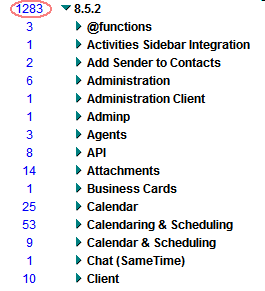

---
authors:
  - serdar

title: "Lotus Notes/Domino 8.5.2 sonunda duyuruldu..."

slug: lotus-notesdomino-8.5.2-sonunda-duyuruldu...

date: 2010-08-10T08:55:51+02:00

---

IBM sonunda beklenen [8.5.2 duyurusunu](http://www-01.ibm.com/common/ssi/cgi-bin/ssialias?subtype=ca&infotype=an&appname=iSource&supplier=877&letternum=ENUSZP10-0306) yaptı. Sabırsızlanmaya başlamıştık...
<!-- more -->
Duyuru geldi ama kullanmadan önce biraz daha bekleyeceğiz. Çünkü paketler **24 Ağustos 2010** tarihinde sunulacak. Her zamanki gibi Türkçe versiyon için 2-3 ay beklemek zorundayız. Türkçe paketlerinin Kasım ayında çıkması bekleniyor.

Yeri gelmişken, Türkçe paketler konusunda bu gecikme nedendir diye çok soru alıyorum. Biz, dil grubu olarak üçüncü sırada bulunuyoruz. Emin olun, IBM yöneticileriyle her toplantımda bu konuyu dile getiriyorum, fakat müşterilerden de bu tür talepler almaları gerekiyor. Konuştuğum yöneticilerin çoğunluğu bu konuyu ilk kez benden duymuş gibi bakıyorlar.

Yeni özellikler bir yana, fix listesi epey kabarık göründü:

Detaylara ilerleyen günlerde bakacağız. Şimdi LCTY İstanbul 2010 sunumum için son hazırlıkları yapmam gerekiyor :)
