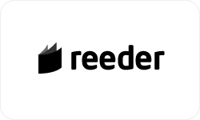
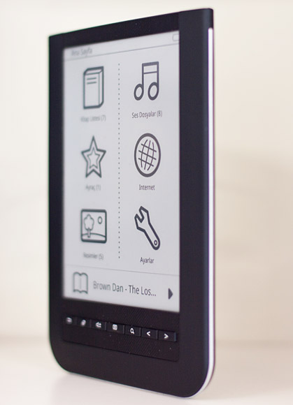

---
authors:
  - serdar

title: "Bu cihaz için çok bekledim: Reeder E-Kitap Okuyucu"

slug: bu-cihaz-icin-cok-bekledim-reeder-e-kitap-okuyucu

date: 2010-09-19T14:30:44+02:00

---

Son yazımdan bu yana epey zaman geçti... Ama bir bahanem var. Yıllardır süren yüksek lisans eğitimimi tamamlamak için yazdığım master tezimin son aşamasına geldim. Tez danışmanım onaylarsa bu ay sonu savunmam var. Çok istediğim gibi olmasa da öğretici bir çalışmaydı. Detayları daha ileride paylaşırım.

Neyse, konu neydi?

Yeni oyuncağım hakkında yazacaktım. Bir kaç yıldır istediğim bir alete en sonunda kavuştum. Sevgili eşimin gecikmeli doğum günü hediyesi olan Reeder marka E-Kitap okuyucum sonunda geldi.
<!-- more -->
Bu güne kadar yüzlerce PDF'ten oluşan kütüphanemi okumak büyük bir problem olmuştu benim için. Bir ara hepsini büyük baskı evlerinden birinde bastırmayı düşünüyordum ama tutacakları yer benim kütüphanemin 5 katı olunca, biraz da kızımın oyuncaklarının büyüme hızını düşününce vazgeçtim :)

Bilgisayardan doküman okumayı da hiç sevemedim. Zaten sandalyeler rahat değil. Bir de bilgisayar başında konsantre olmam çok mümkün olmuyor. Mesajdı, twitter'dı vesaire... Ayrıca dizüstü bilgisayar yarı-mobil bir cihaz. Hem pili yeterince dayanmıyor, hem de büyük ve ağır bir cihaz. Bir ara cep telefonu üzerinden okumayı denedim, onun da küçük parlak ekranı çok kullanışlı değil. Etrafta bu e-kitap okuyucuları da görüyordum ama genelde gittigidiyor'da ya da kadıköy piyasasında grey-market satışlar vardı. Benim için her türlü elektronik cihazda düzgün bir şirket tarafından temsil edilme parametresi en öndedir.

En sonunda [Reeder](http://reeder.com.tr/) ile karşılaştım. Yurtdışında [Necvox ES600](http://www.punch-video.com.tw/products/main.php?cat=19&topage=1#201) olarak satılan ve Qisda (eski BenQ) tarafından üretildiğini sandığım bir cihaz bu.. Wi-Fi, dokunmatik ekran, sözlük gibi güzel özelliklere sahip. Tek problemi Amerika kaynaklı alternatiflerine göre biraz daha pahalı olan 400 USD civarındaki fiyatı. Tabi Kindle veya Nook'tan bahsetmiyorum, onlar Amazon ve B\&N'ın kitap satışı için geliştirilmiş ve kendi içeriğinizi yüklemekle ilgili sorunlar yaşatan cihazlar.

Bir kaç hafta sabır gösterdikten sonra Twitter kampanyası sayesinde hatırı sayılır bir indirim aldığım Reeder'ıma da kısa zamanda kavuşmuş oldum.

Şu ana kadar cihazdan memnunum. Kitap okuma ve o arada müzik dinleyebilme gibi işlevlerin haricinde çok pratik kullanımı yok. Aksi yöndeki reklamları biraz abartılı olmakla birlikte bu işlevleri gayet tatmin edici. Normal kitap okumaktan daha iyi bir deneyim sunuyor. Internet'te çokça dolaşan, 'ben kitabın kokusunu duymalıyım' falan gibi gereksiz duygusallıklara yerim olmadığı için belki de, ben çok memnun kaldım şu ana dek :) Ailede kitap paylaşımı yapamayacak olmamız sorunuyla daha sonra ilgileneceğiz...

Şunu da söylemeliyim, geçenlerde Assos plajında bir kaç Lotus Domino redbook'u okudum. Yanlış duymadınız. E-Ink teknolojisi sayesinde parlak güneş ışığında bile kitap okuyabiliyorum! Bu sabah eşim, kucağında Defne'yle, uçağın küçültülmüş ekonomi sınıfı koltuklarında çayını içip kitabını okuyordu, siz düşünün pratikliğini...

Şimdi tek problemim kaldı: Eşim bu cihazı çok sevdi. Bu tarihte bir ilk! Daha önce hiç bir elektronik oyuncağım eşim tarafından beğenilmemişti :) Şimdi elinden bırakmıyor ve gelecek için içaçıcı mesajlar da vermiyor bu konuda.

Son olarak, aynı dönemlerde birlikte üniversite okuduğumuz Uygar Saral, ürünü Türk pazarına sokan kişi. Bu ürün etrafında kurdukları sosyal medya stratejileri dikkat çekici. Bu tip küçük elektronik 'gadget'ların niş pazarlarda nasıl güzel pazarlanabileceğine dair önemli dersler veriyor Reeder markası. Şirketin çok aktif bir [Facebook sayfası](http://www.facebook.com/reederebr) ve renkli bir [Twitter hesabı](http://twitter.com/reederebr) bulunuyor. Onların bu sosyal medya aktifliği benim satınalma kararımda epey etkili oldu diyebilirim. Neredeyse iki ayda bir firmware yükseltiyorlar, Türkçe sorunlarına önemle eğiliyorlar, cihazı çökenlere veya ekranı kırılanlara çok hızlı bir şekilde pozitif geri dönüş yapıyorlar vs.

(Biraz Hıncalvari bir bitiriş oldu ama cihazı parayla aldım gerçekten :)))
