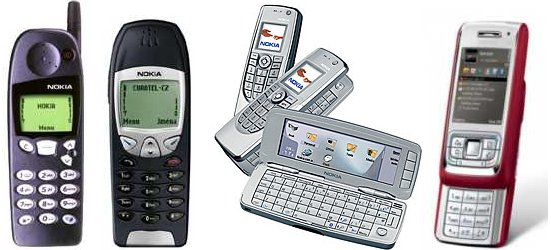

---
authors:
  - serdar

title: "Sadık bir Nokia müşterisi daha 'sosyal' bir telefon arıyor..."

slug: sadik-bir-nokia-musterisi-daha-sosyal-bir-telefon-ariyor...

date: 2010-09-30T17:56:31+02:00

---

En başından beri Nokia kullanıyorum. Sanırım 9300 faciasından sonra vazgeçmeliydim, E65 ile bir şans daha verdim. Ama artık yürütemiyoruz...
<!-- more -->

Bardağı taşıran son damla, Commontime'ın Symbian S60 3. sürüm (9.1) üzerindeki mSuite istemcisini daha fazla devam ettirmemesini açıklaması oldu. mSuite, artık yalnızca Mail for Exchange uygulamasını destekleyecek ve bu uygulama tek kelimeyle rezalet!

Umalım ki IBM Traveler desteğini sürdürsün, çünkü epey bir müşteri kullanıyor şu anda.

Bir zamanlar Nokia iş ihtiyaçlarına yönelik telefon pazarının lideriydi. Şimdiki durumu takip ediyorsunuzdur. Eski hallerine dönmeye çalışıyorlar.

Yine de, bazı müşterilerim E66, E71 ve E72 serisi telefonlardan epey memnunlar. Kabul etmek lazım ki Symbian sağlamlık ve telefon özellikleri en güçlü telefon. Tabi eğer uygulama yüklemem diyorsanız...

Ayrıca uygulama geliştiriciler için daha geniş olanaklar sundukları kesin.

Ama benden bu kadar!

Telefon önerisi olan?
