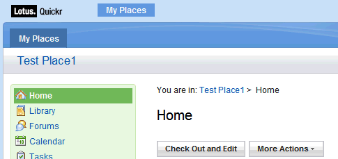
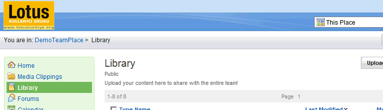
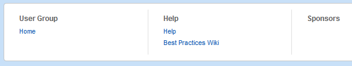

---
authors:
  - serdar

title: "Nasıl isterseniz değiştirin: Quickr for Domino 8.5.1 (Bölüm 1)"

slug: nasil-isterseniz-degistirin-quickr-for-domino-8.5.1-bolum-1

date: 2011-01-26T13:51:00+02:00

---

Bir kaç gündür kullanıcı grubunun yeni web sitesiyle uğraşıyorum. Birkaç yıl önce, daha önceki siteyi tasarlarken, "Quickr for Portal'de görsel değişiklik yapmak çok da kolay değil, şunu, bunu ve bir de şunları bilmek lazım" diye atıp tutmuştum. Erken konuşmuşum...

Adım adım bir rehber sunamayacağım size fakat değişiklik yapmam gereken kısımları aktarıp ne çözüm bulduğumu anlatmak istiyorum. Böylece aynı yoldan geçerseniz biraz zaman kazanabilirsiniz. Anlatacağım şeyleri biliyorsanız da yorumlarınızla hatalarımı düzeltmekten çekinmeyin lütfen...
<!-- more -->

#### Elimizde ne var?

<br />

Öncelikle şu [wikileri](http://www-10.lotus.com/ldd/lqwiki.nsf/dx/Quickr_8.5_Theme_Customization__list_of_related_Wiki_articles) inceleyebilirsiniz. Gösterdikleri çabayı takdir etmekle beraber IBM'in kötü bir dokümantasyon çıkardığını düşünüyorum. Bu tip konulara daha fazla eğilmek lazım. Lotus topluluğundaki insanlar önemli katkılarda bulunsa da ürün dökümantasyonlarını wiki ortamına taşımak sizi sosyal bir şirket yapmaz...

#### Nedir bu tema denilen şey? Neyi uyarladığımızı biliyor muyuz?

<br />

Temanın ne olup ne olmadığını anlamak için ciddi bir zaman harcadım. Dokümantasyon bir html dosyasının (page.htm) genel sayfa düzenini oluşturduğunu söylüyordu. "html/qphtml/skins" klasöründe bu iş için aday bol miktarda page.htm dosyası var. Hepsini tek tek değiştirdim fakat hiç bir şey olmadı. Bunların kullanılmadığı aşikar. Place'lerin tema bilgilerini kendi veritabanlarından aldıklarını biliyorum ama ana sayfayı kontrol eden bir html aradım durdum. Şimdi gördüğüm şey ise aslında böyle bir şeyin olmadığı. Anladığım kadarıyla ana sayfanın tutulduğu main.nsf veritabanı da kendi içerisinde bir tema konfigürasyonu barındırıyor ve bizim buna erişmemiz yasak.

#### Örnek bir place ve özel bir tema yaratarak başlayalım...

<br />

Sonuçta ana sayfadan vazgeçtim ve kendi temamı tasarlamaya başladım. Örnek bir Place yarattım, "/html/qphtml/skins/quickr" klasöründeki dosyaları kendi bilgisayarıma kopyaladıktan sonra onları özel bir temaya yükledim.

Özel bir tema yaratmak için place'inize girdikten sonra sağ üstteki "Özelleştir" tuşuna basın, "Özel Temalar" kısmından "Özel bir Tema oluştur" seçeneğini seçin. Temanızı isimlendirin, dosyalarınızı yükleyin ve "Sonraki" tuşuyla temanızı kaydedin. Özelleştirme menüsünde "Tema Seçin" kısmından yeni oluşturduğunuz temayı bu alana yükleyebilirsiniz. Eğer tema oluşturma aşamasında bir hata yaparsanız ve tekrar bu menüye ulaşamazsanız "http://\[DOMINO SERVER\]/LotusQuickr/\[PLACE NAME\]/Main.nsf/?opendatabase\&ResetTheme" şeklinde bir URL ile temayı sıfırlayabilirsiniz.

Unutmadan, 8.5.x versiyonundan itibaren değişik düzenler için değişik html dosyalara gerek duymuyoruz. Eskiden, "Page - Sayfa düzeni", "Edit - Düzenleme düzeni" ve "List Folders - Liste Klasörü düzeni" olarak üç ayrı html dosya kullanıyorduk. Artık yalnızca page.htm dosyası yeterli oluyor. Diğerlerine boş sayfa da yükleyebilirsiniz. Bu bölümde ayrıca bir stil dosyası (css) da isteniyor. Buraya da boş sayfa yükleyebilirsiniz çünkü her değişiklikten sonra tekrar tekrar upload etmek cidden gereksiz.

Sunucunun data klasöründe "/domino/html/qphtml/skins/lugtheme" adında bir dizin yarattım. Temayla ilgili tüm dosyalarımı burada tutacağım. Css ve image klasörlerinin ne olduğu belli. Diğer ikisini daha sonra açıklayacağız.

![@@\[BANNER.LOGO_ALT\]@@](../../images/imported/nasil-isterseniz-degistirin-quickr-for-domino-8-5-1-bolum-1-M2.gif)

#### Sayfa düzeni

<br />

Page.htm dosyası genel sayfa düzeninin ne olduğuna karar veriyor. Diğer bütün sayfa güncellemeleri dojo/ajax rutinleriyle gerçekleşiyor. Genel düzen (enteresandır) [burada](http://www-10.lotus.com/ldd/lqwiki.nsf/dx/Quickr_8.5_Theme_Architecture_Overview) güzel açıklanmış. Eğer oneuiv2 teması hakkında bilgi sahibiyseniz bu sihiri çabuk çözersiniz :)

Aslında bu sayfada çok değişiklik yapmayacağız. Genel olarak neler yaptığımı anlatayım:

**CSS dosyamızı çağıralım:**
CSS dosyasını page.htm içinde HEAD kısmında çağırabiliriz. İki seçeneğimiz var: Temanıza yüklediğiniz CSS dosyasını çağırmak isterseniz:

```
<link rel="stylesheet" type="text/css" href="stylesheet.css" />
```


Daha önce söylediğim gibi ben bunu tercih etmedim. Her değişiklikten sonra tekrar tekrar upload etmek zor geldiği için kendi tema klasörümde bir CSS dosyası yarattım:

```
<link rel="stylesheet" type="text/css" href="/qphtml/skins/lugtheme/css/stylesheet.css" />
```


**Logoyu değiştirelim:**
page.htm sayfasını incelerseniz logonun standart bir IMG tag'i olarak yerleştirildiğini görebilirsiniz:

```

```


Bu dosyayı CSS düzeyinde (background-image) değiştirebiliyorsunuz. Fakat ben HTML kısmını tekrar yazmayı tercih ettim.

```
HTML code:


CSS File:
.lugLogo {position:absolute; z-index:1;}
```


**Breadcrumb'ın yerini değiştirelim:**
Breadcrumb nedir diye merak edenler için söyleyelim, kelime anlamı ekmek kırıntısı. Hansel ile Gratel'in hikayesi gibi, dikey navigasyonda o anda nerede olduğunuzu ve nerelerden geçtiğinizi gösteren bölüme breadcrumb deniyor.

Quickr'ın standart temasında en sevmediğim şey ekranın verimsiz kullanılması. Örneğin şu görüntüye bakın:



Esas önemli olan şey içerik iken 220 piksel civarında bir alan boş yere harcanmış durumda. Ben şöyle bir tercih kullandım:



Place adının yerine breadcrumb koydum. İşlemler menüsünü de CSS'le oynayarak başlıkla aynı hizaya çektim. Burada küçük bir sorun var, eğer başlık altındaki detay kısmı biraz uzarsa button'ların oryantasyonu bozuluyor. Bu yüzden oradaki font'u da küçülttüm. CSS kodu şu şekilde:

```
div.lotusHeader { margin-top:0px; margin-bottom:5px;}
div.lotusHeader div.lotusMeta {font-size:0.9em; }
div.lotusHeader { float:left; }
div.qkrActions { float:right; width:auto; margin-top:0px; margin-right:-5px;}
div.lotusMeta div.qkrTextField {width:auto !important; }
```


**Chrome problemini çözelim:**
Tasarımınızı değişik tarayıcılarla test etmenizde fayda var. Örneğin Chrome'da ekranın sağ üstünde şöyle bir abukluk görebilirsiniz:


Oradaki UL elementi yatay olması gerekirken dikey bir hale gelmiş. Bu gizemli durum daha da garipleşiyor. Chrome'un developer araçlarını kullanarak o objenin CSS'ine "display:list-item;" stilini ekliyorum ve düzeliyor. Fakat aynı özelliği CSS dosyasına yazdığımda gene dikey görünüyor. Benim çözümüm de biraz komik, objeye bir ID atayıp şöyle bir script ekliyorum:

```
//Chrome fix
dojo.addOnLoad(
  function(){
          dojo.byId('topRightUL').style.display="list-item";
  });
```


**Alt kısmı güncelleyelim:**
Footer alanı biraz ilginç. Biraz uğraşmam gerekti ama nasıl çalıştığını anladım sonunda.Page.htm dosyasında footer alanının bir dojo widget'ı gibi eklendiğini görebilirsiniz...

```
<div dojoType="quickr.widgets.misc.footer"></div>
```


Bu widget, Javascript API'si tarafından işlemden geçiriliyor. Bu yapılırken de "\\domino\\html\\qphtml\\widgets\\misc" klasöründe bulunan bir XSL dosyası (footer.xsl) kullanılıyor. Bilmeyenler için XSL, XML bir bilgiyi başka bir XML'e (bizim durumumuzda HTML'e) çevirmek için kullanılır. Bu dosyayı kendi tema klasörlerimize kopyaladıktan sonra widget tanımını şu şekilde değiştiriyoruz:

```
<div dojoType="quickr.widgets.misc.footer" xslSource="/qphtml/skins/lugtheme/widgets/cFooter.xsl"></div>
```




Benzer bir alternatif [bu adreste](http://www-10.lotus.com/ldd/lqwiki.nsf/dx/Editing_the_footer_links_in_a_Quickr_Domino_Place) anlatılmış. Unutmayın, xslSource önbellekte tutuluyor. Bu dosyayı değiştirdikten sonra sunucuda HTTP işlemini tekrar başlatmanız gerekiyor.

Widget özelleştirmeleri önemli. Çok ayrıntılı bir dokümantasyon yok bu konuda. Ben xslSource parametresini javascript API'sini kurcalarken farkettim. Bu değişiklik, daha farklı seçenekler yaratabilir size. Çünkü sayfadaki bir çok element widget'larla yapılmış durumda ve bunların bir kısmı da XSL dosyalar kullanıyor... [Burayı](http://www-10.lotus.com/ldd/lqwiki.nsf/dx/Extending_the_Widget_Registry) okuyun...

#### Özelleştirmeniz birden çok dil desteği içeriyor mu?

<br />

Kullanıcı grubu sayfası Türkçe olacak olsa da biz 8.5.x ile gelen çok dil desteğinden vazgeçmiyoruz.

Çok dil bilgisi bir kaç katmanda tutuluyor. Bir tanesi servlet tarafından çevrilen HAIKU adı verilen içerikler. Bunlarda değişiklik yapamıyoruz tabii ki. İkinci katman dojo'nun sağladığı çoklu dil desteği ki buna da dokunmak istemeyiz :)

Tema tabanlı çoklu dil içeriği string depoları olarak "/domino/html/qphtml/skins/quickr/nls" klasöründe tutuluyor. Bu bilgiler q_LocaleUtils adlı bir javascript objesi ile yükleniyor. Eğer klasörleri incelerseniz string'ler javascript array objeleri halinde .js dosyalarına yerleştirilmiş durumda olduğunu görürsünüz Bir tane varsayılan "QuickrStrings.js" dosyası nls klasöründe bulunur ve her dil için tercüme edilmiş versiyonlar ilgili alt klasörlerde tutulur (en, tr, de, vs.).

```
{

 GENERAL: {
         LOADING:                                        "Loading...",
         WORKING:                                        "Saving...",
         WINDOWTITLE:                   "Lotus Quickr",
         SKIPTOMAINCONTENT:         "Skip to main content link. Accesskey S",
         NOT_IMPLEMENTED:                  "This is not yet implemented",
         DROPDOWNMENUICON_ALT: "Show menu"
 },
         
 BANNER: {
 
         LOGO_ALT:         "Lotus Quickr",
....
```


Bu dosyaları doğrudan değiştirebilirsiniz fakat bunu çok önermiyorum. Herhangi bir upgrade ya da fix pack sonrasında bu dosyalar ilk hallerine dönebilir. Ben benzer bir klasör yapısını kendi tema klasörüme kurdum ve gereken string'leri buralara yükledim. Bunu yaparken UTF8 dosya formatını kullanmaya da özen gösterdim. Sonrasında Javascript motoruna benim de dil dosyalarımı yüklemesini söylemem gerekiyordı:

```
<script type="text/javascript">q_LocaleUtils.loadStringFiles("LUG_ext", "/qphtml/skins/lugtheme", "quickrstrings");</script>
```


Bu kodu sayfanın HEAD bölümüne yerleştirebilirsiniz. Şimdilik böyle devam ediyoruz, en son tüm bu script'leri toparlayarak tek bir dosyaya koyacağız ve işimiz daha şık görünecek :) Yüklediğiniz string'leri göstermeniz gerekirse iki seçeneğiniz var: Dojo veya Javascript:

```
<div dojoType="quickr.widgets.misc.textlocalizer" key="CUSTOM.CUSTOMKEY"></div>

<script>alert(q_LocaleUtils.getStringResource("CUSTOM.CUSTOMKEY"));</script>
```


Javascript notasyonunu özellikle dillere göre değişik link'lere ihtiyaç duyarsanız kullanabilirsiniz.

#### Sırada ne var?

<br />

Yeni tema üzerine halen çalışıyorum. Bu konuda bir yazı daha yazacağım. Fakat halen çözemediğim ve yorum beklediğim konular var:

* Ana sayfayı ne şekilde özelleştirebilirim, bu kısım karanlık. Sanırım lotusquickr\\main.nsf veritabanında bazı şeylerle oynamam gerekecek...
* "What's new" sayfasının bir kısmını place'in ana sayfasına yerleştirmek güzel olabilir.
* Genel içerik düzenini değiştirmek için bir arayıştayım. Örneğin RSS aboneliği link'inin yerini değiştirmek için bir kaç XSL dosya kurcalayabiliriz fakat bu upgrade'lerde problem yaratacaktır.
* Kartvizit widget'ını özelleştirmeyi düşünüyorum.

<br />

Umarım buraya kadarki kısım size de yardımcı olur :)
