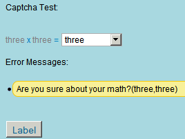

---
authors:
  - serdar

title: "XPages için basit bir CAPTCHA testi..."

slug: xpages-icin-basit-bir-captcha-testi...

date: 2011-01-29T15:41:44+02:00

---

Herkes Lotusphere 2011'de vakit harcarken ben boş durmadım ve uygulama geliştirenlere küçük bir hediye hazırladım.

İşte size XPages için küçük bir CAPTCHA testi...
<!-- more -->
CAPTCHA, form dolduranın insan olup olmadığın anlayan bir Turing testi... Aslında benim yaptığım tam bir Turing testi değil. Ama takıntılı olmayan internet bot'larını engellemeye yeterli :)

Örnek veritabanını [buradan](http://www.developi.com/_files/CaptchaSample.zip) indirebilirsiniz (***problem yaşıyorsanız aşağıdaki notu okuyun*** ). Kullanabilir, değiştirebilir, genişletebilir ve dağıtabilirsiniz. Yeter ki kaynak gösterin :) Ekran görüntüleri şöyle:




Uygulama bir Custom Control ve Script Library (SSJS) içeriyor. Bu ikisini veritabanına koyduktan sonra custom control'ü sayfanıza yerleştirmeniz yeterli. Dediğim gibi bu bir turing testi değil. Web formunuzun sömürülmesini zorlaştırır, ama imkansız hale getirmez :)))

Custom Control çoklu dil desteğine de sahip. Desteklediği dilleri ayarladıktan sonra setStrings() fonksiyonunu değiştirerek gerekli metinleri yükleyebilirsiniz.

```
.....
var LANGUAGES=["en","tr"]; // Languages supported. First is default...
.......
this.setStrings=function() {

captchaTexts["en"]=["zero","one", ... ,"twentyfour","twentyfive"];
captchaTexts["tr"]=["sıfır","bir", ..., "yirmidört","yirmibeş"];

switch(captchaLanguage) {
     case "en":
             this.validationMessage="Are you sure about your math?";
             this.emptyMessage="You forgot? Or you don't know about Math...";
             this.chooseString="Choose...";
             break;
     case "tr":
             this.validationMessage="Matematik bildiğinizden emin misiniz?";
             this.emptyMessage="Unuttunuz mu? Yoksa matematikle sorununuz mu var?";
             this.chooseString="Seçiniz...";
             break;                
     }                
}
```

<br />

<br />

**GÜNCELLEME:**
8.5.2 öncesi versiyonlarda bir 'serialization' problemi farkettim ve javascript objesini değiştirerek V2.0 olarak [buraya](http://www.developi.com/_files/CaptchaSample_R2.0_201105.zip) yükledim. Obje yapısı ve custom control kodunun değiştiği konusunda bir uyarı yapayım. Diğer diller konusunda yapacağınız değişiklikler de aynı alandan yapılacak...
