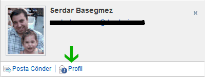

---
authors:
  - serdar

title: "Nasıl isterseniz değiştirin: Quickr for Domino 8.5.1 (Bölüm 2)"

slug: nasil-isterseniz-degistirin-quickr-for-domino-8.5.1-bolum-2

date: 2011-02-23T17:10:01Z

---

En son[](2011-01-nasil-isterseniz-degistirin-quickr-for-domino-8.5.1-bolum-1.md "nasil-isterseniz-degistirin-quickr-for-domino-8.5.1-bolum-1.htm")yazımda Lotus Quickr for Domino uyarlamasını ele almıştım. [Lotus Türkiye Kullanıcı Grubu](http://www.lotusturkiye.org "Lotus Türkiye Kullanıcı Grubu") siteleriyle uğraşırken epey şey öğrenmiş oldum bu konuda.

Daha önce dokümantasyonun zayıf olduğunu söylemiştim. Bu arada IBM [güzel bir sunum](http://www-10.lotus.com/ldd/lqwiki.nsf/dx/Lotusphere_2011-AD305-Deep_Dive_on_UI_and_Server-side_Customizations_for_IBM_Lotus_Quickr_for_Domino_8.5) paylaşarak özellikle widget'larla nasıl oynanacağını anlattı. Bunu daha önce görmüş olmayı isterdim. Böylece saatlerimi harcamamış olurdum... Kader işte :)))
<!-- more -->
Neyse, [LUGTR Quickr sitesinin](http://www.lotusturkiye.org/lugtr) business card ve footer kısımlarını (ki kabaca anlatmıştım daha önce) widget'ları kullanarak nasıl değiştirdiğimin hikayesini anlatacağım...

Bu kartvizit konusunda beklentiniz çok yüksek olmasın. Çünkü esas kısmını (kartvizit için ekstra veriler almak) yapmaya zamanım olmadı. Sadece fotoğraf yerleştirmeyi ve genel görüntüyü biraz değiştirmeyi açıklamaya çalışacağım. Lotus Connections Profiles modülünü kullanmıyor olduğumuzu da hatırlatırım. Öyle olsa işimiz daha kolay olurdu (reklamlar!).

Öncelikle neyi değiştireceğinize karar vermelisiniz. Yapacağınız değişiklikler tüm Quickr siteniz için mi yoksa sadece uyarlanmış bir tema için mi olacak? Kartvizit konusunda tüm siteyi etkileyecek bir değişiklik yaptım. Fakat alt kısım (footer) yalnızca belli bir tema için geçerli.

Footer kısmıyla başlayalım. Bu bölüm aslında bir widget. "**footer.js**" ismiyle "\\qphtml\\widgets\\misc" klasöründe ("/data/domino/html" içerisinde) bulunuyor. Widget isimlerinin aynı zamanda klasör isimlerine uyduğuna dikkat edin...

Eğer widget kaynağını incelerseniz aşağıdaki satırları *postCreate* fonksiyonu içinde görebilirsiniz:

```
....
var xmldoc = this.getXmlDocFromString('<?xml version="1.0" encoding="utf-8" ?><entry></entry>');

this._xsl = (this.xslSource.length == 0) ? this.getWidgetLocation() + "/footer.xsl" : this.xslSource;

var _xslParams = new Array();
_xslParams['WIDGETID_PARAM'] = this.id;
_xslParams['TABLE_SUMMARY'] = window.q_LocaleUtils.getStringResource("FOOTER.SUMMARY");
_xslParams['IS_OFFLINE'] = window.q_BaseLoader.environment.isOffline;

var res = this.transformContent(xmldoc, this._xsl, _xslParams);
....
```


"*this.getXmlDocFromString()* " veya "*this.transformContent()* " fonksiyonlarını burada aramayın, onlar "*quickr.widgets._transformer* " widget'ından miras alınmışlar. Bu kodun yaptığı iş çok basit aslında. Bir XML DOM objesi yaratılıyor (burada boş bir tane), içine bir takım ek parametreler konuluyor ve bir XSL dönüşümüyle (XSLT) HTML DOM objesi oluşturuluyor. Bu objenin içeriği deklarasyonun yapıldığı "div" objesinin (page.htm dosyasında) içine konuluyor. Bunu daha detaylı olarak önceki yazıda anlatmıştım.

```
<div dojoType="quickr.widgets.misc.footer"></div>
```


Varsayılan XSL dosyanın da (footer.xsl) aynı klasörde (\\html\\qphtml\\widgets\\misc) bulunduğunu farketmişsinizdir. Kod, eğer "xslSource" parametresiyle tanımlanmadıysa varsayılanı kullanıyor.

Burası önemli. "xslSource" parametresi kullanışlı bir şey. Bu sayede widget koduna dokunmadan format ile oynayabiliyoruz. Bazı widget'lar deklarasyon kısmında parametre almıyorlar. Kartvizit kısmında bu tür durumlarda ne yapabiliriz onu anlatacağım.

Şimdi XSL dosyasına bakalım. Önemli kısımları alıntıladım:

```
...
<xsl:output method="html"  encoding="utf-8" />

<xsl:param name="WIDGETID_PARAM" select="'*DEFAULTWIDGETID*'" />
<xsl:param name="IS_OFFLINE" select="''" />
<xsl:param name="TABLE_SUMMARY" select="''" />
...
<div class="lotusFooter" id="lotusFooter">
<table cellspacing="0" width="100%" summary="{$TABLE_SUMMARY}">
<tr>
<th><div dojoType="quickr.widgets.misc.textlocalizer" key="FOOTER.LOTUSQUICKR"></div></th>
<th><div dojoType="quickr.widgets.misc.textlocalizer" key="BANNER.HELP"></div></th>
<xsl:choose>
<xsl:when test="$IS_OFFLINE = 'true'"></xsl:when>
<xsl:otherwise>
<th class="ConnectorSection"><div dojoType="quickr.widgets.misc.textlocalizer" key="FOOTER.CONNECTORS"></div></th>
</xsl:otherwise>
</xsl:choose>
...
<li><a href="javascript:;" onclick="dijit.byId('{$WIDGETID_PARAM}').openQuickrInfoPage('0337C2FE18A2F9EB05257291006F0D04');"><div dojoType="quickr.widgets.misc.textlocalizer" key="FOOTER.ABOUT"></div></a></li>
...
```


İlk kısım XSLT dönüşümü sırasında kullanılacak parametreleri tanımlıyor. Javascript kodunda bu parametrelerin değerlerini ayarlamıştık. "*{$TABLE_SUMMARY}* " notasyonunda gördüğünüz gibi HTML içinde parametreleri kullanabiliyoruz. Çok dilli metinlerinizi "*textlocalizer* " widget'ını kullanarak yerleştirebiliyorsunuz. En önemli kısım, XSL içinde seçici çıktı verebiliyorsunuz. Örneğin Quickr Connector programcığını yüklemek için verdiğimiz link, offline kullanıcılarda görünmeyecek şekilde ayarlanmış.

XSL dosyanın bir kopyasını kendi tema klasörüme kopyaladım ve gerekli değişiklikleri yaptım. Sonunda "page.htm" dosyasındaki widget deklarasyonunu da şu şekilde verdim:

```
<div dojoType="quickr.widgets.misc.footer" xslSource="/qphtml/skins/lugtheme/widgets/cFooter.xsl"></div>
```


Detaylara girmeyelim, sadece HTML değişiklikleri yaptım bu XSL içinde. 4 kolonlu tabloyu üç kolona indirdim, büyük kolonlu kısma da sponsor logolarını yerleştirdim. İki konu var dikkat edilmesi gereken. görsel ayarlamaları CSS dosyasına bırakın ve bu XSL'i çok değiştirmeyin. Tarayıcı ve sunucu bunu önbelleğe alıyorlar. Ayrıca XSL dosyanın içinde XML notasyonu kullanın. Yani, tag'lerinizi kapatın (örneğin, çoğu programcı "\< br \>" tag'ini kapatmaz)...

Biraz daha karmaşık kısma, kartvizit olayına girelim. QuickrD'de standart kartvizit şöyle görünüyor:

![@@\[CPEOPLE.MOREINFO\]@@](../../images/imported/nasil-isterseniz-degistirin-quickr-for-domino-8-5-1-bolum-2-M2.gif)

Basit olanla başlayalım: Fotoğraf koyma. Fotoğraf kaynağı qpconfig.xml tarafından konfigüre ediliyor. Burada bir tartışma açmakta fayda var (ki ilk olmadığımı sanıyorum). Neden Quickr, Sametime'ın kartvizit mekanizmasını kullanmaz ki? Bu biraz gizemli, biraz da aptalca görünüyor bana. Belki Sametime'ın yeni versiyonu otursun diye bekliyorlar.

Bildiğiniz gibi Sametime'da kartvizitler için en mantıklı yol, fotoğrafları LDAP üzerinde tutmak. Denediğim alternatif metodların çok verimli olduğunu söyleyemiyorum.

QuickrD'de ise fotoğraflar URL talebi olarak geliyor. [Bir tavsiye Vincent Cailly'den](http://www-10.lotus.com/ldd/lqwiki.nsf/page.xsp?documentId=0BAA2AB5789BB1A385257535005F7595&action=openDocument): Wiki makalesinde fotoğrafları doğrudan LDAP'dan alan bir servlet tasarlamış.Java servlet'leri çok kaynak harcadığından ben bu metodu tercih etmiyorum. Benim kendi check-in uygulamam var (Julian - [YouAtNotes](http://www.youatnotes.com/) sayesinde) ve bütün avatarlar burada duruyor. Basit bir agent yazıp qpconfig.xml dosyasını değiştirdim:

```
...
email = LCase(getURLParam(session.documentContext.query_string(0), "e="))
... /*** avatar url'ini hesapladım ***/
if result(0)="" Then
Print "["+default_avatar+"]"
Else
Print "["+result(0)+"]"
End If
```


```
...
<user_photo_source>
<directory>
<url>
<![CDATA[ /registration.nsf/getavatar?OpenAgent&e={email} ]]>
</url>
</directory>
</user_photo_source>
...
```


Bu kolay kısım :) Zor olan bölüm ise içeriği ve görünümü değiştirmek. Şu business card widget'ını inceleyelim (/qphtml/widgets/people/personcard.js):

```
...
var xsl = this.getWidgetLocation() + "/personcard.xsl";

// default: search for member name (in Contacts db)
this.generateXmlString = this.generateXmlString_Member;
var xmldoc = this.getXmlObject();
var xmlParams = new Array();
xmlParams['WIDGETID_PARAM'] = this.id;
xmlParams["GROUP_ROLE"] = this.role;
var content = this.transformContent(xmldoc, xsl, xmlParams);

var bFound = (typeof content == "string" ? content.length > 0 : content.firstChild != null);
if (!bFound) {
// Name not found (empty response), so force new search for name in directory.
// We must supply the role in this case!
this._xmlString = "";
this.generateXmlString = this.generateXmlString_LDAP;
xmldoc = this.getXmlObject(true);
content = this.transformContent(xmldoc, xsl, xmlParams);
this._xmlString = "";
}
...
```


Burada küçük bir hile var. Quickr'da kişi kayıtları internal ya da external olabilir. Bizim kodumuz önce ilkini deniyor, olmazsa ikinciyi.

Koda baktığımızda iki temel problemle karşılaşıyoruz. Birincisi XSL dosya için deklaratif bir parametre yok. Dolayısıyla, eğer görüntüyü değiştireceksek iki opsiyonumuz var. İlki "*personcard.xsl*" dosyasına girişmek. Ama inanın bunu yapmak istemezsiniz :) Çünkü, her versiyon geçişinde (minor'lerde bile) bu dosyanın akıbetini merak edersiniz. Benim yaptığım daha eğlenceli bir çözüm. Bu widget'ı miras olarak alan ikinci bir widget yazdım ve tema klasörüme yerleştirdim (/qphtml/skins/lugtheme/widgets/personcard.js). Bunu yaparken XSL dosyayı kullanan fonksiyonu da bir daha tanımladım:

```
dojo.provide("quickr.widgets.people.personcard");

dojo.provide("lugwidgets.personcard");
dojo.require("quickr.widgets.people._personcard");

dojo.declare("lugwidgets.personcard",  [quickr.widgets.people._personcard],
{
postCreate: function() {
try{

......... (aynı şeyler)...........

//Burası değişti*****************
var xsl = "/qphtml/skins/lugtheme/widgets/cpersoncard.xsl";

......... (aynı şeyler)...........

}catch(ee){
}
}
})
```


Yeni bir de XSL dosyası yarattım ve kendi widget klasörüme yerleştirdim. Bu yeni dosyada "Send Mail" tuşunun yanına da şunu ekledim:

```
<li>
<a href="javascript:openProfile('{@ca:email}')">

<span class="qkrPaddingLeft2px" dojoType="quickr.widgets.misc.textlocalizer" key="CPEOPLE.MOREINFO"></span>
</a>
</li>
```


Şimdi widget registry'ye girişmemiz gerekecek. Çünkü sistem bizim yazdığımız widget'tan haberdar değil. QuickrD bu iş için bir javascript dosyası bulunduruyor (*/qphtml/widgets/resources/widgetRegistryConfig_ext.js*). Bu dosya sayesinde widget ekleyebiliyor ya da değiştirebiliyorsunuz. Yukarıda link'ini verdiğim sunum bu konuyu güzel örneklerle açıklamış. Ben şöyle bir ek yaparak normal personcard widget'ını kendiminkiyle değiştirdim:

```
//*** Customized for LUGTheme

{
registerWidgets:
[
{
type: 'registerstrings',
id: 'lugtr',
path: '/qphtml/skins/lugtheme',
fileName: 'quickrstrings.js'
},

{
type: 'REGISTERMODULEPATH',
name: 'lugwidgets',
path: '/qphtml/skins/lugtheme/widgets'
},

{
type: 'globalreplace',
source: "quickr.widgets.people.personcard",
use: "lugwidgets.personcard"
}

]
}
```


Aynı dosyada çoklu dil desteği için yazdığım kendi dil dosyalarımı da eklemiş oldum. Sonuç böyle bir şey:



İkinci bir problemden daha bahsetmiştik. Burada XSLT sırasında kullanılan XML tabanlı veri, Quickr Servlet'inin atom kısmında üretiliyor. Bunu değiştirmenin bir yolunu bulamadım. Atom motorundan gelen cevap şöyle bir şey:

```
<content type="application/xml">
<ca:member
ca:id="(bir url)"
ca:DN="CN=bir isim,O=bir organizasyon"
ca:type="user"
ca:email="bir email"
ca:display-name="gösterilen isim"
ca:first-name="ad"
ca:last-name="soyad"
ca:phone-number="telefon"
ca:description="tanım"
ca:role="rol - owner, reader, vs.">
</ca:member>
</content>
```


Burada yapılabilecek şey (ya da benim yapacağım şey) bu widget'ı geliştirip ek bilgileri bir agent'dan alıp JSON ya da XML formatında XSLT sürecine sokmak. Bunu yapabilirsem buraya eklerim. Bu arada daha mantıklı bir fikri olan beri gelsin :)))

#### Ne öğrendik...

<br />

Quickr uyarlaması çok büyük bir konu değil artık benim için. Esas nokta, bunu yaparken versiyon değişikliklerinden etkilenmemek. Şu ana kadar yaptığımız değişiklikler olası bir upgrade sırasında problem yaşatmayacaktır bize. Registry extension gibi kısımlar upgrade sırasında korunurlar.

Yalnızca lab'daki arkadaşlar, örneğin personcard widget'ını komple yeniden yazarlarsa (ki majör upgrade'lerde olabiliyor) tetikte olmamız gerekir.

Ek olarak tüm dosyaları tek bir klasörde tutuyoruz. Bu da sunucudan sunucuya (test-canlı arası) değişiklik taşımamızı kolaylaştırıyor. Sadece widget registry dosyası dışarıda kalıyor.

Son bir şey, kartvizit değişikliği tüm QuickrD sitesi için geçerli. Değişiklik ihtiyacınız belli bir temayla kısıtlı kalacak olursa, wiki makalesinde bahsedildiği gibi, seçici değişiklik yapabilirsiniz (gerçi bunu 'globalreplace' için test etmedim):

```
{
type: 'tip',
condition: "javascript koşulu",
source: "bir widget",
use: "başka bir widget"
}
```
