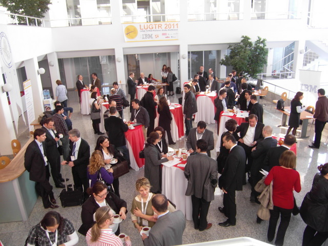

---
authors:
  - serdar

title: "LUGTR 2011 sonrası düşünceler..."

slug: lugtr-2011-sonrasi-dusunceler...

date: 2011-03-19T18:45:00+02:00

---

[Uzun bir yolculuk](2011-03-uzun-bir-yolculuk-kullanici-grubu-konferansi....md "uzun-bir-yolculuk-kullanici-grubu-konferansi....htm") sonrasında konferans bitti...Her şeyi kaydettik, ama henüz video'ları izleme fırsatım olmadı. Umarım iyidirler de paylaşabiliriz.
<!-- more -->
Başlangıçta açılış konuşmacılarımız Ed ve Uffe çok güzel sunumlar yaptılar. Ed Notes/Domino, LotusLive ve XPages'in geleceğine yönelik önemli noktaları açıklığa kavuşturdu. En önemli nokta, konuşmasında IBM'in uygulama geliştirme konusundaki kararlılığını yansıtması oldu sanırım. Uffe ise Lotus yazılımlarının 'Sosyal İş' dönüşümündeki rolünü anlattığı konuşmasında e-posta'nın yerini nasıl 'activity stream'lara bırakacağından bahsetti.

Özgür Uçkan ve Denis Şener, "[İş, hem de sosyal!](http://prezi.com/ylanimabujl0/is-hem-de-sosyal/)" konulu bir Prezi sunumu yaptılar. Önemli noktalardan bahsedildi bu sunumda. Özellikle MIS için 'dalgalı deniz' ve teknoloji için 'dalgalı okyanus' anolojileri kullanmaları çok hoşuma gitti. Temelde Özgür'ün ve Denis'in sunduğu nokta, Bilgi Sistemleri sektörünün kendi temel sorunlarını çözememişken üzerine yüklenen 'herşeyi sosyalleştirme' mekanizmasının yaratacağı karmaşa idi. Bence çok güzel noktalar yakalamışlar. Kaçırdığım kısmı tekrar izlemem gerekiyor.

Öğleden sonraki oturumlar krizsiz geçti (bir iki zamanlama hatasını saymazsak). Bunlar hakkında değerlendirme formlarını henüz okuma fırsatı bulamadım. Daha sonra ayrıca yazarım geri bildirimleri...

Kapanış oturumunda daha önce haber verdiğimiz mini yarışmamızı yaptık. Bir çok katılımcıyı memnun ettiğimizi tahmin ediyorum :) En güzel sürpriz, ödül olarak verdiğimiz netbook'ların arada notebook'a dönüşmüş olduğuydu ki bundan çok geç haberim oldu :) Sanırım kazananlara da sürpriz olmuştur.

Şu ana kadar konuştuklarımdan, bloglardan ve gelen e-mail'lardan çok güzel yorumlar aldım.

Tüm katılanlara ve destekleyenlere en derin teşekkürlerimi iletmek isterim.

Esra, Özcan, Gulizar, Pınar, Mine, Jale, Server ve diğer IBM Türkiye çalışanlarıyla birlikte CEE IBM ekibinden Manfred, Maciej, Delia, Wojciech ve unuttuklarım müthiş bir iş çıkardılar! Ayrıca özür dilerim, açılış konuşmamda yönetim ekibinden bahsetmeyi unuttum...

Ne yazık ki, mükemmel bir organizasyon olmadı. Gerçekten hayal kırıklığına uğradığım bir kaç şeyi paylaşmak istiyorum:

* Herkes tatmin oldu, ben olmadım. 190 kayıtlı ziyaretçinin yalnızca 120'si geldi. Bu sayı yeterli değil. Özellikle 350 üyemiz varken en az 200 kişinin orada olmasını beklerdim. Ayrıca insanlar anlamadığım bir sebeple erken ayrıldı. Kapanış oturumunda bu sayının sadece yarısı kalmıştı...
* Elbette, akademik köşe toplantısı tam bir hayal kırıklığı oldu. En az 10 akademisyenden ve 3-4 öğrenci kulübünden katılım bekliyorduk. Kimse katılmadı (evet sıfır kişi) ve toplantı iptal oldu.
* Teknik oturumların içeriği bence çok iyiydi fakat genel kapsam çok daha geniş olmalıydı. Bir kullanıcı grubu toplantısında yalnızca bir XPages oturumu ve tek bir sistem yönetimi başlığı oldukça yetersiz.

 

Sonuca baktığımızda güzel kazanımlarımız oldu yine de. Bir kaç Lotus profesyoneli, iş ortağı ve IBM'cinin twitter hesaplarını aktive ettiğini gördük. @LUGTR hesabının takipçi sayısı son bir ayda üç katına çıktı. Sponsorlar, konuşabildiklerim, memnun ayrıldılar. Önemli bir momentum sağladık perşembe günü ve bu durumun insanları katılmaya ve destek olmaya motive ettiğini görüyorum.

Belki de en önemlisi, hayatımda ilk defa, böyle bir etkinlikte Lotus yazılımları aleyhine neredeyse hiç bir şey duymadım :)

Son bir şey, [Ed Brill](http://www.edbrill.com "Ed Brill") ve Uffe Sorensen hakkında... Güzel bir akşam yemeği yeme şansım oldu onlarla. Onları Lotus topluluğu içinde bu kadar popüler yapan şeyin yalnızca işleriyle ilgili derin bilgilerinin ve ileri görüşlülüklerinin olmadığını gördüm. Ed ve Uffe'nin aynı zamanda ne kadar alçak gönüllü, kibar ve egosuz insanlar olduğunu farkettim.

Etkinlik bitti, ama biz devam ediyoruz. Önümüzdeki hafta kullanıcı grubu yönetim ekibi olarak bir toplantı ayarladık. Bundan sonra ne yapacağımızı etraflıca konuşacağız.

İlerisi için önerilerinizi bekliyorum. Bu konuda bir [forum başlığı](http://www.lotusturkiye.org/LotusQuickr/lugtr/Main.nsf/h_Toc/4df38292d748069d0525670800167212/?OpenDocument#{type=0&unidî7F62A94CB76956C22578570064B3BC&attNames=}) açtım...

###### \* Fotoğraf için Julian'a teşekkürler...
