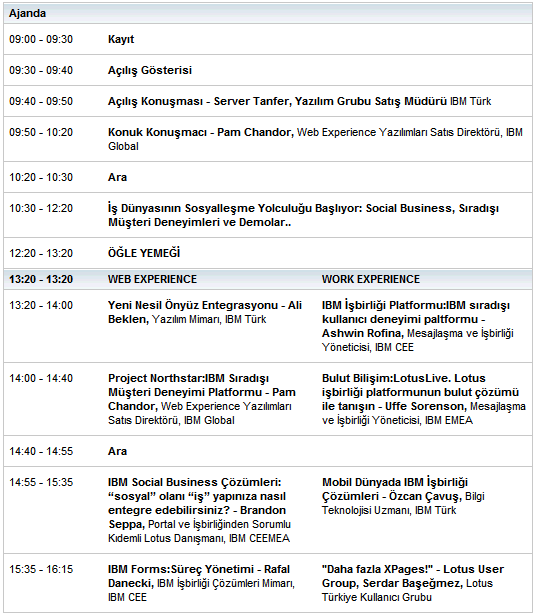

---
authors:
  - serdar

title: "IBM Social Business 2011: İş dünyasının sosyalleşme yolculuğu başlıyor!"

slug: ibm-social-business-2011-is-dunyasinin-sosyallesme-yolculugu-basliyor

date: 2011-04-12T17:21:03+02:00

---

Eski ismiyle Lotusphere Comes To You, yenilenmiş ve makyajlanmış haliyle **Social Business Roadshow** , 28 Nisan 2011 tarihinde Four Seasons Bosphorus'dan geçecek...
<!-- more -->
Etkinlik hakkında bilgi sahibi olmak ve gündemi incelemek için:

<http://www-01.ibm.com/software/tr/events/socialbusiness2011/agenda.html>

Ajandanın şu anki hali şöyle:

Bu yıl bol bol etkinlik oldu. Daha ikinci çeyreği ortalayamadan IBM Yazılımlarıyla ile ilgili dördüncü konferansı yaşıyoruz ve ekim ayındaki yazılım zirvesine kadar pek bir şey göremeyebiliriz. Bu organizasyon, Lotusphere 2011'de yaşanan ve halen yaşanmakta olan IBM-Lotus-Sosyal İş dönüşümünün Türkiye'deki iz düşümü olacak gibi görünüyor.

Yalnızca isim değişikliği değil, bu yıl formatta da bir çok değişiklik var. Öncelikle geçmiş senelerde paralel olarak düzenlenen iş ortağı oturumları, yerlerini 110 dakikalık ilginç bir maratona bırakıyorlar. Bu maraton konusunda sürprizi bozmayalım ama ürün-teknoloji-deneyim döngüsünü oturtmak için güzel bir yaklaşım üretilmiş. Daha önce sunum yapanların becerisine kalıyordu bu döngü. 30 dakikada satış mı yapılacak, teknoloji mi anlatılacak, çözüm mü tanıtılacak yoksa olası sorular mı yanıtlanacak?

Türkiye'deki Lotus ürün yönetiminin uzun süren sessizliğinin ardından bu türden bir yaklaşım değişikliğine ihtiyacı vardı.**Esra Avcı** , Lotus ürün müdürü, iş başı yaptığından beri 'farklı bir şeyler olacak' sözünü sonunda hayata geçiriyor :) Bu etkinlik, her fırsat bulduğumuzda bunu da yapın şunu da yapın diye başının etini yediğimiz IBM'in marka yönetme konusundaki en önemli sınavı olacak... LUGTR 2011 döneminde yakın çalışma şansı bulduğum yerel IBM ekibi hakkında şunu belirtmeliyim, daha önce görmediğim bir dinamizm, farkındalık ve kaynak havuzu var bu yıl Yapı Kredi Plazalarında...

Hemen belirtelim, bu organizasyon öncesinde Lotus ürün yönetimi ekip olarak da büyüdü. Eskiden bir buçuk kişilik ekip bugün dört kişi olarak çalışıyor. Tek distribütörlük kanal yapısına iki distribütör daha eklendiğini düşünürsek IBM Lotus-marka-satış-kanal dörtgeninin eskisine göre 3 kat daha fazla çalışana sahip olduğu çıkarımını rahatça yapabiliriz. Bu yıl rakamların çok iyi başladığını da duyuyoruz. Bir iş ortağı olarak bütün bunları çok olumlu görüyorum.

Etkinliğe biz de katılıyoruz. **Lotus Türkiye Kullanıcı Grubu** olarak teknik oturumlar serimiz, Social Business Roadshow kapsamında sunacağım "***Daha Fazla XPages!*** " sunumuyla başlamış oluyor. Sunumun içeriği kabaca farklı XPages deneyimlerine göz atmak olacak. Extension Library'ye, mobil uygulamalara ve entegrasyon konularına gireceğiz. 'Şunu da işleyin lütfen' önerilerine açık olduğumu belirtmeme gerek yok herhalde :)

Paralel oturumlar, bizim haricimizde IBM tarafından kapatıldı bu yıl. XPages oturumumuzla birlikte toplam 8 oturum var. Kısaca göz atalım isterseniz.

İki kategoriye ayırmışlar bu yıl oturumları. Geçen yıldan beri yazdığım gibi IBM'in gündeminde de paralel iki motto var. '**Exceptional Web Experience** ' ya da Project Northstar ve '**Exceptional Work Experience** ', yani Project Vulcan. Şifrenin altında yatan birinci ürün, yıllardır alanındaki liderliği bırakmayan Websphere Portal ürünü ve etrafında kurulan, sosyalleştirilerek web 2.0 ile zenginleştirilmiş yeni (!) platform. Bu kısım benim uzmanlığımın dışında, yardımcı olamayabilirim :)

Bu kategoride**Pam Chandlor** 'ın sunumu önemli. Aynı zamanda açılış konuşmasını yapacak olan Pam, Project Northstar'ı da anlatıyor olacak. Sunumlara bakarken tanıdık bir isim daha görüyoruz: **Ali Beklen** ... Daha önce Lotus ürünlerinin teknik satışından sorumlu olan Ali, kişisel olarak çok sevdiğim, aynı zamanda teknik ustalığına derinden güvendiğim birisidir. "*Yeni Nesil Önyüz Entegrasyonu* " sunumunu da not alıyoruz kenara :) **Brandon Seppa** , daha önce de gelmişti. Bu yıl da ağırlık Lotus (pardon, IBM) Connections etrafında sosyal iş konularında bir sunum bekliyor bizleri. Rafal'dan Lotus Forms ürününü dinliyor olacağız. Özellikle form tabanlı iş akış sistemlerine yönelik bir ürün arayışındaysanız, bu sunumu mutlaka izleyin. **Lotus Forms** 'u bu yıl çok konuşacağız.

Şifrenin ikinci parçası olan Project Vulcan. Bu yıl sonuna dek betası çıkacak olan Notes 9 versiyonundan bahsediyoruz. Ürünün ismine yönelik tartışmalar devam ediyor. Fakat ana eksenin mesajlaşmadan ağ iletişimine kaydığı ve XPages'in hiç olmadığı kadar önem kazandığı bir uygulamadan bahsediyoruz.

**Ashwin Rofina** 'dan bu konudaki son gelişmeleri alacağız. Sonrasında **Uffe Sorensen** , bulut bilişim etrafında konuşacak. Şu anda Lotus ürünleri teknik satışından sorumlu olan **Özcan Çavuş** , mobil çözümleri tanıtıyor olacak. Sonrasında da biz varız :)

Bu yıl da sürpriz hediyeler var. Bu yazıyı yazarken hediye belli değildi. Ama ben en güzel hediye önerisini yaptım!. Umarım bu yıl da iş ortaklarını devre dışı bırakmazlar :) Bu yıl kazanacağıma inanıyorum :)))
