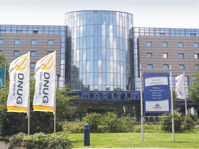

---
authors:
  - serdar

title: "İlk DNUG Konferansından sonra..."

slug: ilk-dnug-konferansindan-sonra...

date: 2011-05-22T22:00:00Z

---

Sonunda DNUG konferansı tamamlandı. Sıfırıncı günü de sayarsak üç günlük bir konferans oldu.

Daha önce söylediğim gibi, oturumların büyük bir çoğunluğu Almanca olunca benim için eğitici bir konferans deneyimi olmadı.
<!-- more -->
Bu uzun seyahatte diğer Lotus topluluklarını görmeyi ve kullanıcı grubu konferanslarını incelemeyi istiyordum. Bu açıdan baktığımızda DNUG harika bir örgütlenme. 17 yıldır yılda iki kez toplanıyorlar. Biz ücretsiz bir LUGTR 2011 konferansında 100 kişiyi biraraya getiremezken DNUG Almanya'nın her yerinden yüzlerce profesyoneli çok da ucuz olmayan bir konferansta toplamayı başarıyor. Onlarca sayfadan oluşan ajandaya (Google Translate ile) baktığımızda çok doyurucu bir içerik ve güçlü bir akademik destek olduğunu görüyoruz.

Alman Lotus topluluğunu görmek benim için ilginç oldu. Yarın UKLUG'a katılacağım ve katılımcı listesine baktığımda bir çok tanıdık yüz görüyorum. Çünkü bu kişilerin büyük çoğunluğu blogger'lar veya sürekli yorum yazanlar. Orada yabancılık çekmeyeceğimi düşünüyorum.

Öte yandan Alman topluluğu PlanetLotus.org çemberi dahilinde çok aktif değil. Bu onların sosyal olmamalarından kaynaklanmıyor. Bu organizasyona on yıllardır katılan insanlar var ve herkes birbirini tanıyor. Yakın ilişkiler, güzel sohbetler, iyi müzik ve bol bol bira var (kahveden ucuz!)...

Oturumlar konusunda şanslı değildim. Alman dili eklemeli yapısı itibariyle Türkçe'yle benzerlikler barındırsa da psikolojik olarak reddettim bu dili sanırım. En ufak bir kelime/cümle bile öğrenmiş değilim şu ana kadar. Gene de pek çok tanıdık yüzle karşılaştım ve yeni insanlarla tanıştım.

Konferanstan haberler verelim biraz. Sıfırıncı gün hakkında yazmış ve Social Business duyurularından bahsetmiştim. Social Business her tarafa yayılmıştı konferansta. Sametime 8.5.2 de gerek yeni özellikleriyle, gerekse Microsoft'un Skype'ı almasından sonra oluşan merak ve beklenti yumağının etkisiyle çokça konuşulan konulardan birisi oldu.

'Teknik açılış' kısmında Ed Brill, Kevin Cavenough ve Chris Crummey yeni sürümler ve stratejiler hakkında konuşuyordu. Katıldığım az sayıdaki diğer oturumlarla beraber önemli noktaları toparlarsak:

- Lotus Sametime 8.5.2 de Lotus markası taşımayacak ki bu çok şok edici bir haber değil. Yeni versiyon bir kaç ay içerisinde sürülecek gibi görülüyor.
- Lotus N/D 8.5.3 Eylül ayında çıkacak. 2012'de de 9 versiyonunu (adı belirsiz) bekliyoruz.
- Project Vulcan, Ed Brill'in deyimiyle 'Sosyal Mesajlaşma Deneyimi' sağlayacak. Bu harika bir etiket. E-mail paradigmasındaki büyük değişim bu kadar güzel paketlenebilirdi.
- Chris Crummey (bu arada bu adam harika sunum yapıyor!) yeni Sametime deneyimini ve iPad için geliştirtirilen Vulcan istemcisini gösterdi. Ayrıca Live Name'lerin havalarda uçuştuğu güzel bir gösteri izledik :)
- Martin Donnelly (XPages takımında yazılım mimarı ve Mastering XPages kitabının yazarlarından) XPages ile ilgili süper şeyler gösterdi. XPages'in yeni sürüme hazır olduğu müjdesini de aldık.
- Robert Ingram IBM'in mobilite stratejisini tanıttı. Bu bağlamda IBM ilk kez 'belki' Windows Mobile 7 desteğini 'düşünebileceğini' açıklamış oldu (gerçekten bu kadar belki vardı).
- Lotus Mobile Connect de Lotus ismini kaybedecek ve IBM Mobile Connect olacak gibi görünüyor.
- Doyurucu bazı teknik açıklamalar yapıldı ve bunlar sebebiyle IBM'in iPhone için bir Traveler istemcisi olmayacağı açıklandı. Fakat Rob, Sametime istemcisini çalıştıracak bir yol bulduklarının müjdesini verdi :)

XPages geliştirmeleri bir sonraki blog'umda :)
