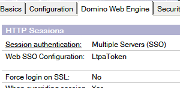

---
authors:
  - serdar

title: "Lotus Notes içinden web uygulamasına şifresiz erişim..."

slug: lotus-notes-icinden-web-uygulamasina-sifresiz-erisim...

date: 2011-05-12T18:14:20+02:00

---

Daha önce Türkçe'ye çevirmediğim bir yazı yazmıştım ([buradan erişebilirsiniz](http://lotusnotus.com/lotusnotus_en.nsf/dx/http-authentication-from-xpinc-got-help-found-bug-worked-around.htm)). Bu yazıda Notes istemci üzerinde çalışan bir XPage içerisinde kurguladığımız iFrame üzerinden yetkilendirme gerekmeden bir web uygulamasına erişim sağlama yönteminden bahsetmiştim. Çok spesifik bir soruna çözüm ararken ([Tim Tripcony](http://www.timtripcony.com/)'nin desteğiyle) karmaşık da olsa bir yöntem geliştirmiştim.

Şimdi bu çözümden yola çıkarak farklı bir yöntem geliştirdim. Bu yöntem, benim 5-10 yıldır ihtiyaç duyduğum bir şeydi, ilaç gibi geldi :)

Notes uygulamanızın içinden bir lotusscript koduyla belirli bir web uygulamasını açtığınızı düşünün. Normal şartlarda açılan web uygulaması kullanıcıdan isim/şifre isteyecek. Bunu atlatmanın yolunu buldum!
<!-- more -->
Bir çok şirket hibrid bir yapıya doğru gidiyor. XPages'in de gelişiyle yeni uygulamalar yavaş yavaş web platformuna taşınıyor. Bu durum kullanıcılar için sorun yaratıyor. Bugüne kadar Sametime veya iNotes erişimi haricinde ihtiyaç duymadıkları bir şifreyi kullanmak zorundalar. Ayrıca onlara zaten Lotus Notes kullanıyorken neden tekrar tekrar şifre girmeleri gerektiğini anlatmak zor. Bir çok şirkette Notes şifresiyle internet şifresinin senkronize olmaması da ayrı bir baş ağrısı...

LUGTR 2011 konferansına katıldıysanız şu anda ne düşündüğünüzü tahmin ediyorum. 8.5.x itibariyle SPNEGO kullanarak Active Directory ile SSO sağlayabiliyoruz değil mi? Evet bu da bir çözüm. Fakat tüm sunucularınızı upgrade etmeniz gerekiyor. Ek olarak SPNEGO, Internet Explorer ve belli Firefox versiyonlarında çalışıyor. Ayrıca bir çok şirket dağıtık topoloji üzerinde birden fazla AD alanı kullanıyor ki bu SPNEGO'nun kurulumunu epey zorlaştıran bir şey.

Peki bu tür bir aracın ne yararı olabilir? Bir çok şirket Lotus Notes'un açılış sayfası olarak portalimsi bir veritabanı kullanıyor. Kullanıcılar uygulamalara buradaki link'lerden erişiyorlar. Bu linkler arasına web uygulamalarını koyup erişimi kolaylaştırabiliriz. Bazı standart uygulamaları tek bir seferde değil de taksit taksit XPages'e geçiriyor olabiliriz. Örneğin uygulamanın yalnızca raporlama kısmını XPages'e geçiriyorsak bu gitgeller sırasında kullanıcının tekrar tekrar şifre girmesini engelleyebiliriz.

Çözümü açıklamadan önce Multi-server SSO ve LTPAToken mekanizmalarından bahsedelim biraz. Bunu ingilizce yazıda anlatmıştım, bir kez daha anlatalım :)

LtpaToken, kullanıcı ismi, alan adı, özel bir anahtar, yaratılma tarihi gibi bilgilerin şifrelenerek base64 methoduyla kodlamasıyla oluşturulan bir string. Birden fazla sunucunun katıldığı bir SSO (Single Sign On) konfigürasyonu oluşturduğumuzda bu 'token' kullanıcının web tarayıcısına bir cookie olarak yükleniyor. Kullanıcı bir sunucudan ikinci sunucuya gittiğinde oturumu devam edebiliyor bu sayede. Aynı token Websphere Portal gibi farklı uygulamalarla da entegre edilerek SSO alanı geliştirilebiliyor.

LtpaToken konfigürasyonunu sunucuda names.nsf veritabanında tanımlıyoruz. Belli bir alan adı (.google.com gibi makine ismi içermeyen bir şekilde), geçerli olduğu sunucular ve token anahtarlarını içeren bu konfigürasyonda anahtar nokta, SSO alanını kullanan tüm sunucuların aynı alan adı uzantısını kullanma zorunluluğu.

Diyelim ki iki sunucumuz var: sunucu1 ve sunucu2. Biz alan adı olarak '.developi.info' belirlediysek kullanıcıların bu sunuculara 'sunucu1.developi.info' ve 'sunucu2.developi.info' isimleriyle erişmesi gerekir. Doğrudan ip numarası ile eriştiklerinde kullanıcı adı ve şifre girebilirler ama asla giriş yapamazlar.

LtpaToken konfigürasyonu yaratıldığında anahtarların oluşturulması gerekir. Bu anahtarlar rastgele oluşturulabildiği gibi Portal gibi başka bir uygulamada oluşturulmuş halleriyle de kullanılabilir. Her durumda LtpaToken anahtarları benzersizdir ve çok değerlidir. Çünkü token'lar bu anahtarlarla şifrelenir. Dolayısıyla bu anahtarlar da katılan sunucular ve oluşturan sistem yöneticisinin ID'siyle şifrelenir. En sonunda LtpaToken ya sunucu dokümanında ya da Internet Site dokümanında tanımlanır. Bu konuda çok daha detaylı bilgiler wiki'lerde bulunuyor.



Şimdi, bir web uygulamasını açmak istiyorsak bize bir token gerekiyor. Bu token'ın giriş yapacak kullanıcı bilgilerini, uygun bir zaman dilimini ve düzgün oluşturulmuş gizli şifreyi içermesi gerekiyor. Bir kez token'ı yaratırsak bunu kullanıcının web tarayıcısına 'cookie' olarak yerleştirmek kalacak.

Bu iş için bir ara sayfa kullanacağız. Güvenlik nedeniyle token'ı burada yaratamayız. Bu yüzden token'ı parametre olarak veriyor olacağız bu sayfaya. İkinci parametremiz de cookie yerleştirildikten sonra kullanıcının hangi sayfaya gönderileceği.

Ara sayfayı kolaylık olsun diye XPage olarak yarattım. Farklı bir alternatif Lotusscript agent'ı yaratmak da olabilirdi. XPage bu iş için daha yavaş ama çalışması daha kolay.

```
<?xml version="1.0" encoding="UTF-8"?>
<xp:view xmlns:xp="http://www.ibm.com/xsp/core">

      <xp:this.beforePageLoad><![CDATA[#{javascript:try {

response=facesContext.getExternalContext().getResponse();
token=paramValues.get("token").toString();
rUrl=paramValues.get("url").toString();

response.setHeader("Set-Cookie", "LtpaToken=" + token + "; domain=.developi.info; path=/");
facesContext.getExternalContext().redirect(rUrl)

} catch(e) {
      _dump(e);
}
}]]></xp:this.beforePageLoad>

</xp:view>
```


Burada cookie yaratırken kullandığımız alan adına dikkat. Bu alan adının LtpaToken konfigürasyonunda tanımlananla aynı olması gerekiyor. Bunu dinamik olarak da çekebilirdik ama bu biraz pahalı bir yöntem olurdu.

Şimdi bizim Notes uygulamamız kullanıcıyı sunucu üzerindeki bir web uygulamasına gönderecek. Ben bu iş için bir form ve bir Java agent'ı yarattım. Önce agent'a bakalım.

Token yaratmak için 'session.getSessionToken()' metodunu kullanacağız. Maalesef bu metod Lotusscript hiyerarşisinde tanımlanmamış. Dolayısıyla Java agent'ı kullanmamız gerekiyor:

```
public void NotesMain() {

      try {
              Session session = getSession();
              AgentContext agentContext = session.getAgentContext();
       
              Database db=session.getCurrentDatabase();

              Document doc=agentContext.getDocumentContext();
       
              String token=session.getSessionToken(db.getServer());
       
              try {
                      String token=session.getSessionToken(db.getServer());
                      doc.replaceItemValue("token", token);
              } catch(Exception e) {
                      e.printStackTrace();
                      doc.replaceItemValue("ErrorLog", e.toString());
              }          
       
      } catch(Exception e) {
              e.printStackTrace();
      }
}
```


Token'ı yarattıktan sonra geri göndermemiz gerekiyor. Bu iş için geçici bir Notes dokümanı kullanıyoruz. Eğer bir sorun olursa aynı yöntemle hata mesajı döndüreceğiz.

Şimdi bunu nasıl kullanırız, ona bakalım:

```
       Dim session As New NotesSession
      Dim ws As New NotesUIWorkspace        
      Dim dbcurrent As NotesDatabase
      Dim agent As NotesAgent
      Dim doc As NotesDocument
     
      Set dbcurrent=session.currentDatabase
      Set agent=dbcurrent.getAgent("TestAuth")
      Set doc=New NotesDocument(dbcurrent)
     
      Call agent.RunWithDocumentContext(doc)
     
      webServer="https://mobile1.developi.info"
      redirector="/test/redirect.nsf/redirect.xsp"
      target="/names.nsf"
     
      targetUrl=webServer+redirector+"?token="+doc.token(0)+"&url="+target
     
      If doc.ErrorLog(0)="" Then
              Call ws.urlopen(targetUrl)                
      Else
              Msgbox doc.ErrorLog(0)        
      End If
```


Burada '**/test/redirect.nsf/redirect.xsp** ' yukarıda belirttiğim ve yönlendirme için kullandığımız xPage adresi. '**TestAuth** ' ise yarattığımız Java agent'ının ismi. Bu kod bir form içerisinde button'a bağlanabilir, değişikliklerle daha kullanışlı bir hale getirilebilir.

Şimdi, bitirmeden önce kötü haberi verelim. Bu kod düzgün çalışmayacak :)

Bir kaç uyarı:

Öncelikle, söylememe gerek yok ama, düzgün çalışan multi-server SSO kurulumuna ihtiyacınız var. 'Single-server session authentication' LtpaToken içermez. Ayrıca yukarıdaki kod 8.5.2 versiyonunda çalışır, çünkü '**RunWithDocumentContext** ' fonksiyonu bu versiyonda çıktı. Bu fonksiyon bir kodun içerisinden çağırdığınız agent'a 'in-memory' doküman gönderebilmenizi sağlar. Normalde, agent'lara bir id ile doküman gönderebilirsiniz fakat gönderdiğiniz dokümanı her iki tarafta da 'save' etmeniz gerekir. Hatta agent bittikten sonra geri dönen dokümanı tekrar çağırmak, işimiz bittiğinde de silmek gerekir. Uğraştırıcı bir şey :)

İki de güzel bug da sırada bekliyor. Bug-report'ları daha bugün hazırlayıp gönderdim ama yakın zamanda düzeleceklerini zannetmiyorum fakat '**getSessionToken** ' metoduyla ilgili ciddi problemler var.

1. Eğer Internet Site dökümanları kullanıyorsanız getSessionToken() bunlara bakmıyor! Ben geçici bir çözüm buldum. '**Web SSO Konfigürasyon** ' dokümanını kopyala/yapıştır yapın ve ikinci dokümandaki 'Organization' alanını temizleyin. Delice görünüyor ama işe yarıyor! Sıfırdan aynı isme sahip ikinci bir tane yaratmak işe yaramaz çünkü aynı anahtarları içermeliler.

2. Bu sorun daha da komik. Eğer 'Web SSO konfigürasyonu' dökümanınızın ismi '**LtpaToken** ' değilse getSessionToken() fonksiyonu çalışmıyor! Evet doğru duydunuz. Başka bir isim kullansanız da 'LtpaToken' ismiyle arama yapıyor bu garip fonksiyon :)

Eğer bu iki hatayı dikkate almazsanız java agent "***Single Sign-On configuration is invalid*** " şeklinde bir hata mesajı verecektir...

Bir söz de performans konusunda. Bu java agent, Notes istemcisi için biraz pahalı. Dolayısıyla kısa bir periyod içerisinde bir kaç kez kullanacaksanız, token'ı geçici bir alanda depolamanızı tavsiye ederim. Kullanıcıları durduk yere sinirlendirmeyin :)

Son sözüm, testlerim sırasında birkaç kez '**Your session has expired** ' mesajıyla karşılaştım. Çok sık olmadığı için nedenini araştıramadım ama bu, yaratılan token'la alakalı olabilir. Bu token '+' karakteri içerirse URL'den hatalı bir şekilde geçebilir. Doğru şekilde 'encode' edildiğine emin olmalısınız.

Sizi bilmem ama bu benim için önemli bir icat oldu. Paylaşmak için heyecan duydum. Bu yazının İngilizcesi çok ciddi 'hit' aldı, o yüzden de Türkçe'ye çevirmek istedim. Umarım size de faydası olur.
