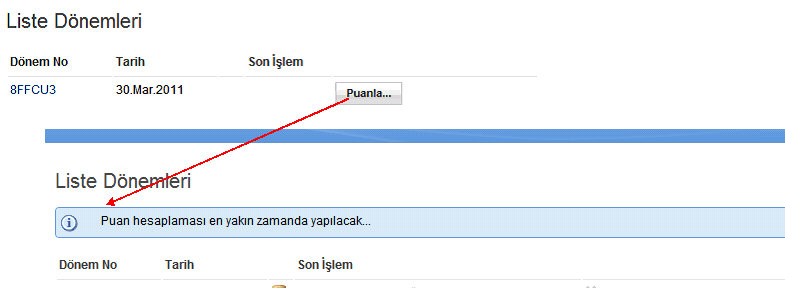

---
authors:
  - serdar

title: "XPages İpucu: SSJS mesajlarını göstermek için basit bir kontrol"

slug: xpages-ipucu-ssjs-mesajlarini-gostermek-icin-basit-bir-kontrol

date: 2011-05-02T09:23:57+02:00

---

Buna benzer ipuçları vardır, ama geçen hafta yeni bir XPages geliştiricisinden gelen soru üzerine bunu paylaşmak istedim.

Server-side javascript ile yaptığınız bir işlem sonucu başarılı/başarısız gibi bir mesaj dönmek istediğinizde bunu yapamadığınızı farkedeceksiniz çünkü SSJS üzerinde messagebox gibi bir komut olmaz/olamaz.
<!-- more -->
Ben bu iş için basit bir custom control tasarladım.

```
<?xml version="1.0" encoding="UTF-8"?>
<xp:view xmlns:xp="http://www.ibm.com/xsp/core">

       <xp:div styleClass="lotusMessage lotusInfo" role="alert"
               rendered="#{javascript:viewScope.MessageText!=null || sessionScope.MessageText!=null }">
               <xp:image id="image3">
                       <xp:this.url><![CDATA[#{javascript:severity=viewScope.MessageType || sessionScope.MessageType || "";
                                                               viewScope.remove("MessageType");
                                                               sessionScope.remove("MessageType");

                                                               severityseverity==""?"Info":severity;

                                                               return "/icon"+severity+"16.png";}]]></xp:this.url>
               </xp:image>
               <xp:span>
                       <xp:text escape="true" id="computedField4">
                               <xp:this.value><![CDATA[#{javascript:message=viewScope.MessageText || sessionScope.MessageText;
                                                               viewScope.remove("MessageText");
                                                               sessionScope.remove("MessageText");

                                                               return message;}]]></xp:this.value>
                       </xp:text>
               </xp:span>
       </xp:div>
</xp:view>
```

<br />

<br />

viewScope ya da sessionScope'a yerleştirdiğimiz MessageText ve MessageType parametrelerini ayarladığımızda bu mesaj görüntüleniyor. SSJS tarafında nasıl kullanıyoruz?

```
function birFonksiyon() {

       // Güzel şeyler yapalım...

       if(successful) {
               viewScope.MessageType="Info";
               viewScope.MessageText="İşlem başarılı...";
       } else {
               viewScope.MessageType="Error";
               viewScope.MessageText="Hatalar oluştu...";
       }
}
```

<br />

<br />

Sayfa tekrar yüklendiğinde (full/partial refresh), viewScope veya sessionScope parametrelerini kontrol ediyoruz, mesaj varsa gösteriyoruz ve scope parametresini temizleyerek mesajın ikinci kez gösterilmesinin önüne geçiyoruz. Scope değişkeni bu aşamada değil de, eklenecek bir 'kapat' tuşuna basıldığında temizlenebilir. Kontrol farklı şekillerde geliştirilebilir. MessageType değerleri ise (Info, Warning, Error...) ilgili imaj dosyalarına göre belirleniyor.

Burada da çalışan bir örnek verelim. Button'a bastığımızda arka planda bir işlem yapıyor ve kullanıcıya mesaj dönüyoruz.


