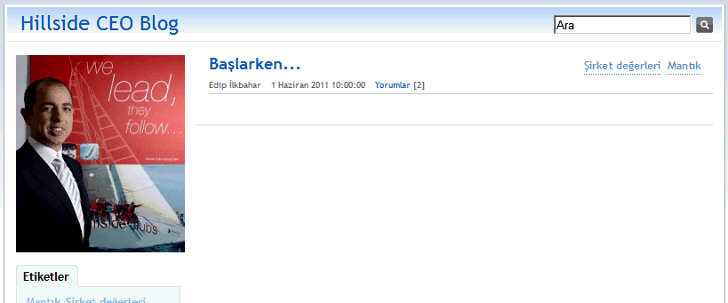

---
authors:
  - serdar

title: "DominoBlog şablonuyla CEO Blog uygulaması"

slug: dominoblog-sablonuyla-ceo-blog-uygulamasi

date: 2011-06-03T09:22:00+02:00

---

Birkaç haftadır çok zevkli bir projeyle uğraşıyoruz...
<!-- more -->
Müşterim [Hillside Leisure](http://www.hillside.com.tr/) herkesçe bilinen bir marka. Alarko Holding'e bağlı Turizm Grubu, 'İyi hissetme' işini iki muhteşem otel, 3 spor tesisi, 4 sinema ve büyük bir SPA zinciriyle yürütüyorlar. Hillside, öncü ve eşsiz bir marka. Kurumsal kültürün içine iyice yedirilmiş servis kalitesi yaklaşımıyla inanılmaz işler yapıyorlar. Ne demek istediğimi anlamak için [Hillside Beach Club](http://www.hillsidebeachclub.com/) tatil köyünde biraz vakit geçirmelisiniz...

Kurumsal kültür denilen 'şey', tohumla yetişmez. Yönetilmesi ve ölçülmesi zor bir kavramdır. Özellikle şehirlere yayılmış yüzlerce çalışanınız varsa daha da zordur. Liderlik bu noktada vazgeçilmez hale gelir. Hillside da bu alanda tüm 'dağıtık' kurumların problemiyle karşılaştı. Kurumsal kültürün gerektirdiği alt metnin yayılması. Mesajı kim, nasıl yayacak? Kapalı devre televizyon sistemi mi? Yok artık :)

Burada biz devreye girdik ve Hillside grubu içerisinde 'CEO Blog' doğdu.

Lotus Domino bu alanda müthiş. Sadece bir gün içerisinde DominoBlog şablonunu kullanarak yeni bir blog yarattık.

Bu bir başlangıç. Kabullenme ve katılımın boyutlarına bakacağız. Değer yaratıyorsa belki bir sonraki adım blog'u üst yönetime açmak hatta tüm çalışanlara genişletmek söz konusu olabilir.

Hillside'la ilişkim 1999-2002 arası çalışan olarak ve 2003'den bu yana müşteri olarak sürüyor. Bu süre içinde 40'ın üzerinde uygulama geliştirdim sanırım. Dürüstçe söylemem gerekirse en heyecan verici olanlardan birisiydi blog. Böyle bir uygulama, şirketlerin Bilgi Sistemlerinde bir sonraki faza geçmesini temsil ediyor benim için :)
