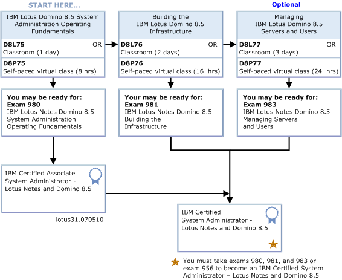

---
authors:
  - serdar

title: "Lotus Sertifikasyonu: Neden ve Nasıl?"

slug: lotus-sertifikasyonu-neden-ve-nasil

date: 2011-06-03T18:45:00+02:00

---

Sertifikasyon ilginç bir konu olmaya başladı. Ben de bu konuyu mercek altına almak istiyorum.

Dört ayrı gözlükle bakacağım bu olaya. Sertifika sınavlarına giren biri olarak, işveren olarak, Lotus yazılımlarıyla ilgili bir iş ortağı olarak ve Lotus Kullanıcı Grubu kimliğimle...
<!-- more -->
Önce IBM yazılımlarının (Lotus özelinde) sertifikasyon sistemi hakkında kısa bir özet geçelim.

Sertifikasyon üç parçadan oluşuyor.

- Eğitim
- Sınav
- Sertifika

Eğitimler genellikle sınavlarla eşleşiyor. Her sınavın öncesinde almanızı önerdikleri bir eğitim oluyor. Bu eğitimler sınıf eğitimi ya da sanal olabiliyor. Sanal eğitimler de kendi kendine (self-paced) veya sanal sınıf (virtual classroom) olarak sunulabiliyor. Türkiye'de (benim bildiğim kadarıyla) [Sibnet](http://www.sibnet.com.tr/) dışında yetkili eğitim merkezi yok. Ben de çoğu eğitimimi Kenan Yılmaz'dan aldım. Sibnet bu işe yıllardır odaklanması nedeniyle bu konuda yetkin. Fakat Türkiye'de bazı eğitimler **talebin yetersiz olması nedeniyle** çok nadir açılıyor veya açılamıyor.

Sınıf eğitimleri (sanal olanlar da) oldukça yüksek maliyetli. Kendi kendine eğitimlerde ise IBM'in Virtual Innovation Center'lar kanalıyla açtığı ücretsiz eğitimler olsa da bunlar çok temel konulardan ileri gidemiyor. Bu konuda bir alternatif de TLCC, XPages101.net gibi özel eğitimler sunan şirketler. Maliyetleri yüksek olsa da özellikle Kullanıcı Grubu aktiviteleri ya da içinde bulunduğumuz "[XPages öğrenme ayı](2011-05-haziran-ayi-xpages-ogrenme-ayi....md)" gibi özel fırsatlarda indirimler yakalama şansınız var. Bu iki kuruluş da [Lotus Türkiye Kullanıcı Grubu](http://www.lotusturkiye.org "Lotus Türkiye Kullanıcı Grubu") üyelerine indirim sunuyor, hatırlatalım...

Sınavlar ise IBM'in anlaşma yaptığı Prometric şirketi tarafından veriliyor. Genellikle 70-200 USD arası fiyatlarda oldukça yüksek maliyetler sözkonusu...

Sertifika ise bir patika (certification path) sonucu almaya hak kazandığınız belge/ünvan anlamına geliyor. Sertifikasyon patikası bir ya da daha fazla sınav içeriyor. Gereken sınavları geçtiğinizde sertifika almış oluyorsunuz ve o ünvanı kullanma hakkınız oluyor.

Bu resimde Sistem Yöneticisi sertifikasyon patikaları görülüyor. Gerekli eğitimi aldıktan sonra önce 980 no'lu sınavı alıyorsunuz. Bu sınav sizi "IBM Certified Associate System Administrator" yapıyor. Daha sonra diğer eğitimleri alıp 981 ve 983 no'lu sınavları da geçerseniz "IBM Certified System Administrator" oluyorsunuz. Yıldızlı kısım 956 no'lu sınavdan bahsediyor. Bunun anlamı şu: Eğer bu patikayı Lotus Notes/Domino 8.0 versiyonu için tamamladıysanız yalnızca "Lotus Notes Domino 8.5 System Administration Update" sınavını alarak kendinizi 8.5 versiyonuna güncellemiş oluyorsunuz.

Tüm bu patikaların tam listesine [buradan](http://www-304.ibm.com/jct03001c/services/learning/ites.wss/us/en?pageType=page&c=G397738M77321Z06) erişebilirsiniz.

Sıkça sorulan sorulara geçelim :)

#### Eğitim şart mı?

 

Hayır. Eğitim almak şart değil. Hemen prometric sitesine gidip bir sınava kaydolabilir, ve ilk fırsatta sınava girebilirsiniz. Fakat öncesinde eğitim almanız '**öneriliyor** '.

Çeşitli sınavlara girmiş biri olarak şunu söylemem lazım. İlk sınavlarımda hep eğitim aldım. Çünkü, açıkçası, sınavlarda çıkan sorular gerçek hayatla çok bağlantılı değil. İlk Administration sınavıma girdiğimde 3 yıllık tecrubem vardı ama sınavı eğitimde öğrendiklerimle geçtim. Eğer, örneğin Lotus Workflow gibi çok spesifik bir ürünle ilgili sınava girecekseniz eğitim almanız mutlaka gerekiyor.

Zaman içerisinde sınav yapılarını öğrendikten sonra eğitime çok gereksinim duymuyorum. Sınav öncesinde genel çerçeveye bir gözatıp çıkabilecek soruları tahmin ediyorum. Gene de geçen yıl Quickr sınavından kaldığımı söylemeliyim :) İkinci kez denedim ve geçtim...

#### Önceki sınavlarda neler çıkmıştı?

 

Sınavdan önce kabul ettiğiniz Prometric sınav şartlarına göre **sınav soruları hakkında konuşmanız yasak** . Elbette Internet üzerinde eski soruları parayla satan 'hazırlık testleri' görebilirsiniz, bu çok doğal. Hatta CertFX gibi bazı siteler sınavı geçemezseniz para iadesi gibi garantiler veriyorlar.

Sınavlar genellikle geniş olmayan bir havuzdan sorular içeriyor. 50 soruluk bir sınavın kabaca 100-150 soruluk bir havuzu var. Sanırım bu soruların belli değerlemeleri var ve buna göre seçiliyorlar. Örneğin bir sınava daha önce girmiş birisinden soruları alırsanız yüksek bir oranla soruları biliyorsunuz. Fakat eğer aynı sınava siz girdiyseniz ikinci seferde epey farklı sorularla karşılaşıyorsunuz.

#### Sınavlar çok pahalı... Ne yapabiliriz?

 

Evet, maalesef sınavlar çok yüksek fiyatlarla satılıyor. Eğer Sistem Yöneticisi sertifikası istiyorsanız 600 USD civarında bir sınav maliyeti söz konusu.

Eğer bir iş ortağında çalışıyorsanız ve işvereniniz '**Value Package** ' kullanıyorsa '**You pass we pay** ' programı çerçevesinde belli sertifikasyon patikalarını (sınavları geçmeniz şartıyla) ücretsiz olarak tamamlayabilirsiniz. Bunun dışında **Kullanıcı Grubu aktivitelerinde** ücretsiz/indirimli sınav kuponları oluyor (LUGTR 2011'de dağıtmıştık birkaç tane)...

#### Sertifika şart mı?

 

Ben 12 yıldır çok önemli Domino altyapılarını yönetiyorum. Büyük versiyon geçişleri ve kurulumlar yaptım. Ama sertifikasyon düzeyim 'Associate System Administrator' seviyesinde. Uygulama geliştirmede ise sertifikam yok. Ama şunu da söyleyeyim, hayatımda hiç bir zaman büyük bir çok uluslu şirkete Lotus Domino Sistem yöneticisi olarak da başvurmadım. Pek çoğunun bu sertifikaya önem verdiğini düşünüyorum. Yurtdışında durum daha farklı. Pek çok geçici ve kalıcı iş ilanında sertifikadan bahsedildiğini görebiliyoruz.

Son yıllarda ortaya çıkan bir gelişme de IBM'in kapalı dağıtım stratejisine girişmesi. Bu doğrultuda belli ürün grupları yalnızca yetkin iş ortakları tarafından satılabiliyor. Yetkin iş ortağı demek sertifikasyon demek. Buna göre iş ortağında sertifika almış uzmanların çalışması gerekiyor. Başlangıç aşamasında olmaktan mı kaynaklanıyor bilmiyorum ama şartlar çok da ağır değil şu anda. Örneğin teknik satış sertifikalarıyla teknik sertifikaların ağırlığı aynı tutulmuş, dolayısıyla çoğu iş ortağı zorlanmadan yetkinlik aldı. Fakat uzun vadede sertifikalı elemanın değerini 1-2 tık arttıracak olması muhtemeldir bu durumun.

İşveren olarak ben alacağım elemanın sertifikalı olmasını beklemem, ama sertifika müstakbel çalışanın bir miktar daha öne çıkmasını sağlayacaktır. Öte yandan ben servis verme tabanında iş yapıyorum. Bir ürün geliştiriyor olsaydım ekibimin sertifikalı olmasını isterdim.

Kullanıcı grubu perspektifinden bakarsak, sertifikasyon çok önemli. Özellikle yeni üniversite mezunlarının sertifikasyon zincirine dahil edilmesi uzun vadede önemli bir amaç olmalı bizim için. Bu sayede 'Lotus uzmanı' olmanın değerinin arttırılması hedeflenmeli. Ayrıca **Lotus uzmanı CV havuzunun pazarda fakirleşiyor olması** Lotus ürünleri için çok büyük bir tehdit. Yeni mezunları bu uzmanlığa dahil etmek, onların bu havuza katılmasını sağlayacak ve pazarı daha da canlandıracaktır.

#### Nasıl yapmalı?

 

Nacizane fikrimi sorarsanız sertifika alın derim. Bu konuda özellikle '**bilgiler tazeyken** ' hareket etmek çok mantıklı. Şirketinizin bütçe zamanı mutlaka eğitim bütçesi ayrılmasını isteyin. Eğitimleri alın, kaynamasın. Sonrasında, henüz bilgileriniz tazeyken sınavı alın. Şirketiniz ödemiyor olsa da sınavları gerekirse cebinizden ödeyin. **Bu sertifikalar CV'nize yaptığınız yatırımdır** .

Eğitim almanız mümkün olmuyorsa da 'bilgiler tazeyken' kuralı yine geçerli. Örneğin Sametime kurulumu yaptınız ve 1.5-2 ayınızı Sametime üzerinde harcadınız. Hemen gidip sınavına girin. Çok hızlı bir şekilde unutuyorsunuz bildiklerinizi.

#### Genel olarak IBM Yazılım sertifikasyonu iyi çalışıyor mu?

 

Bu ilginç bir tartışma konusu. Bir kaç açıdan ele almak gerekir.

Öncelikle sınavların gerçek uzmanlığı ölçüp ölçmemesi bir problem. Kişisel fikrim ölçümün yeterli olmadığı yönünde. Uzmanlık düzeyini yüz olarak belirlerseniz sertifika 50-60'lar civarına denk gelir. Geri kalanı deneyim ve 'incelikleri bilme' olarak tanımlanabilir. Burada hassas bir denge var. Eğer bireylerin sisteme girişini amaçlayan bir sertifikasyon sisteminiz olacaksa deneyim ve incelikler boyutunu çok ağırlaştıramazsınız. O zaman insanlar uzmanlığa sertifika sistemine dahil olmadan giriş yaparlar. Sonrasında, işleri yolunda giden bir uzmanı sisteme dahil etmek için farklı zorunluluklar veya havuçlar oluşturmanız gerekecektir. Dolayısıyla ideal bir sınav sisteminin 'kitap' bilgisini ön planda tutması gerekir.

Girdiğim sertifika sınavlarına göre değerlerlendirme yaparsam, sınav kalitelerinin düşük olduğunu söylerim. Ama sorun yukarıda açıkladığım dengeyle ilgili değil. Kitaba fazla dalmanın önemli bir sorun olduğunu söyleyebilirim. Eğer birisi sınav sorusu olarak SQL Server'ı ODBC'ye bağlayan DLL dosyasının ismini soruyorsa sınavı hazırlayanın ÖSYM'de çalıştığını düşünürüz.

İkinci problem yaygınlık. Burada hassas bir denge var. IBM sertifikasyonu çok yaygın değil. IBM'in **Partner Locator** aracını kullanarak hangi çözüm ortağının ne tür sertifikalara sahip olduğunu görebilirsiniz. Çözüm ortaklarının web sitelerini incelerseniz, çoğunun bu sertifikasyondan web sitesinde bahsetmediğini görebilirsiniz. Buradan çıkan iki sonuç var. Çözüm ortağı da müşteri de bunu çok önemsemiyor.

Aşırı yaygın olmak da geçmişte yaşadığımız Microsoft olayından bildiğimiz kadarıyla çok mantıklı değil. Bir dönem, hatırlarsınız, köşedeki ehliyet sınavı merkezi bile Microsoft sertifikası vermeye başlamıştı. İlk bakışta bunun ürün yaygınlığına hem algısal hem de reel bir katkısı olduğunu düşünebilirsiniz fakat bugün **Microsoft sertifikasının değeri önemli ölçüde azalmıştır** . Öte yanda Oracle ya da Java sertifikasyonunu incelerseniz bunlar halen çok prestijlidirler.

Yaygınlığın bir bacağı da kolaylık. Sertifika almak mevcut durumda çok zor ve kurumsal tabana bağlı. Yani bireyler eğitim+sınav için binlerce dolar harcayamayacak durumda. Öte yandan sistemin çok kolay olmasını da istemezdim ama **zorluğun sınavın maliyetinden değil içeriğinden kaynaklanmasını** tercih ederdim.

Gerçi dönüp dolaşıp aynı yere geliyoruz. Bu maliyetler Türkiye şartlarında pahalı aslında. Sertifikasyon sisteminin belli ölçülerde yerelleştirilmesi gerekiyor. Bu yapılmadığı sürece Türkiye'de etkin bir sistem kurulamaz.
