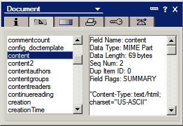
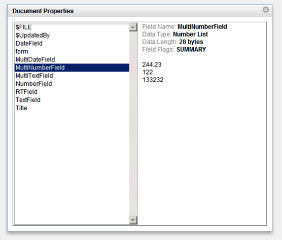

---
authors:
  - serdar

title: "OpenNTF yarışması için tasarladığım Custom Control"

slug: openntf-yarismasi-icin-tasarladigim-custom-control

date: 2011-06-22T08:26:24+02:00

---

We4IT şirketinin sponsor olduğu [OpenNTF Yarışması](http://contest.openntf.org/) için tasarladığım Custom Control'ü sonunda yükledim...

Bu yazıda [xProperties Custon Control](http://www.openntf.org/internal/home.nsf/project.xsp?action=openDocument&name=xProperties%20Custom%20Control) projesi hakkında kısa bir özet geçeceğim.
<!-- more -->
xProperties, Notes istemcisindeki geleneksel doküman alan listesini taklit eden bir custom control. Bunu seçmemin nedeni biraz uğraştırıcı görünmesiydi.

Aslında bu özelliği tamamiyle taklit etmek mümkün değil. Çünkü dokümanla ilgili bilgiler C API düzeyinde hazırlanıyor. Bir çok özellik ve bileşen Notes/Domino'nun klasik geliştirme API'si tarafından erişilebilir değil. SSJS ile daha bile kısıtlı olduğumuz durumlar var. Dolayısıyla bazı eksiklikler var, ama kabaca şöyle görünüyor:

Bu kontrolü standard bir XPages sayfasına ekleyebilir, hata ayıklama amacıyla kullanabilirsiniz. View'larda da kullanılmak üzere bir parametre ekledim. Biraz retro görünse de işe yarayacağını umarım.

Versiyon olarak 0.91 görünüyor, 1.0 değil.

Bunun nedeni epey geliştirmeye açık noktalar olması:

- Döküman Bilgileri (Unique ID, Note ID, son değişiklik/yaratılma zamanı vb.)
- Formula test,
- Reader/Author değişikliği,
- Karşılaştırma

Bazı zayıf noktalar da var, hepsini dokümantasyonda belirttim. Yorum ve önerilere açığım, her zamanki gibi...
