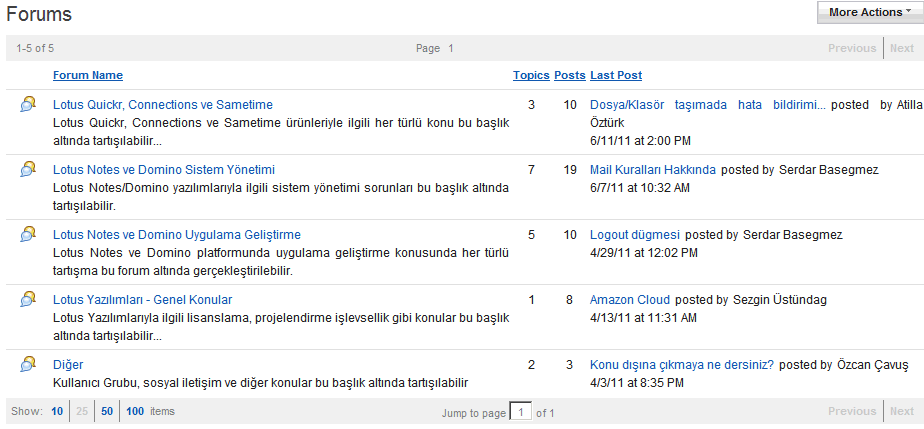

---
authors:
  - serdar

title: "Lotus Kullanıcı Grubu ne işe yarar?"

slug: lotus-kullanici-grubu-ne-ise-yarar

date: 2011-07-30T10:52:53+02:00

---

Lotus Türkiye Kullanıcı Grubu'nu 2008'de kurduk. 2010'da yönetim ekibi oluşturduk ve çoğunuzun bildiği gibi ilk Lotus kullanıcı grubu etkinliği olan LUG 2011 konferansını mart ayında düzenledik.

Bu yılın başında sponsorlarımız sayesinde güçlü bir sunucu üzerinde Quickr 8.5.1 ile çalışan bir web sitesi oluşturduk. Aşağıdaki ekran görüntüsü, web sitemizin forum kısmına ait:
<!-- more -->

Son mesajı haziran ayında almışız. Yönetim ekibi dışında yalnızca üç kişi katılım göstermiş.

İnsanların yorulduğu, fikirlerinin ve motivasyonlarının tükendiği anlar vardır ya, işte o anlardan birindeyiz.
