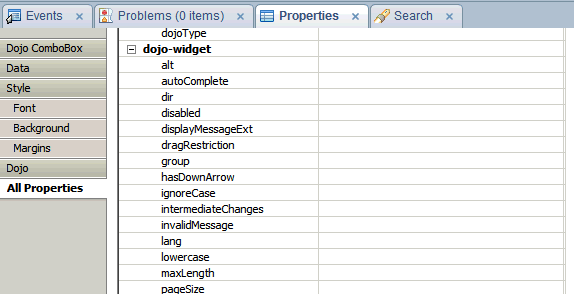
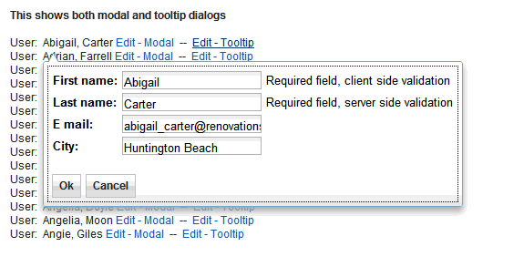

---
authors:
  - serdar

title: "Extension Library: Kullanmak ya da kullanmamak..."

slug: extension-library-kullanmak-ya-da-kullanmamak...

date: 2011-08-02T15:22:00+02:00

---

Türkçe kısmımıza verdiğimiz uzun arayı affettirmeye çalışıyorum :)

Extension library kullanalım mı kullanmayalım mı sorununu sorgulayalım... Öncelikle Extension Library nedir diye soranlar olacaktır.
<!-- more -->
XPages ismi hakkında (ya da X'in ne anlama geldiği hakkında) bir çok spekülasyon var. XML tabanlı olduğundan teorisinin yanında 'eXtensible' Pages anlamına geldiğine dair iki iddia var. Fakat bu 'eXtensible' eklentisinden 8.5.2 sonrası bahsedebiliyoruz.

Lotus Notes/Domino 8.5.2 versiyonu itibariyle XPages için bir 'Extensibility API' oluşturuldu. Bu geliştirme, temelde Java ve XML konfigürasyonlarını kullanarak XPages için kontrol geliştirme gibi özetlenebilir. Bu kadarla sınırlı değiliz ama onlara şimdi girmeyelim :)

İşte Extension Library, bu API kullanılarak yaratılan onlarca yeni kontrolden oluşuyor. Fakat dikkat ettiyseniz Extension Library, ürünle birlikte gelmiyor, OpenNTF kanalıyla dağıtılıyor.

Burada parantez açıp OpenNTF hakkında biraz bilgi aktaralım.

OpenNTF, 2002 yılında Lotus topluluğundan Bruce Elgort, Nathan T.Freeman gibi isimlerin önderliğinde kurulan açık kaynak kodlu uygulama geliştirme platformu. Zaman içinde Lotus topluluğu tarafından geliştirilen yüzlerce uygulamaya ev sahipliği yapan OpenNTF, birkaç yıl önce yeniden organize edildi. Bu yeni organizasyonun sebebi IBM'in daha resmi ve kurumsal destek verme isteği. Aslında yapılan düzenleme farklı ülkelerden farklı kullanıcılar tarafından yapılan katkıların ve tüketimlerin yasal platformda problem yaratmaması amacını taşıyordu. IBM, kendi uygulamalarını doğrudan bu platforma katmak istiyordu fakat OpenNTF'in lisanslama modeli ve fikri haklar denetimi eksikti. Bunlar tamamlandıktan sonra IBM ilk etapta [8 veritabanını OpenNTF'e açtı](2010-02-openntf-lotus-notesdomino-icin-acik-kaynak-yazilimlar.md "openntf-lotus-notesdomino-icin-acik-kaynak-yazilimlar.htm"). Bu da yetmedi, hafta başında [duyurulduğu](http://www.openntf.org/blogs/openntf.nsf/d6plinks/BELT-8KB5JJ) gibi OpenNTF, artık bir şirket olarak tekrar organize edildi. Şirketleşme, OpenNTF'in açık kaynak kodlu platformlarda Eclipse, SourceForge gibi hukuki kimliğe sahip bir 'kar amacı gütmeyen' kuruluş olarak kayıt edilmesini sağlıyor.

Extension Library için de OpenNTF'in kullanılması tesadüf değil. Hem IBM'den, hem de IBM Design partner'larıyla sohbet ettiğimde, XPages ekibinin uygulama katmanındaki stratejisi extension'ları desteklemek yönünde. Yani XPages'in, örneğin JQuery desteklemesindense JQuery kullanan kontrollerle zenginleştirilmesi tercih ediliyor. XSP sunucu, biraz daha alt katmanda kalma eğiliminde.

Sonuç olarak sistem şöyle işliyor. IBM'den bir ekip Extension Library'yi geliştiriyor. Seçilmiş design partner'lardan oluşan geliştiriciler bu ekibe katılıyor. Üretilen kütüphanenin kaynakları açık ama yalnızca yetkilendirilmiş geliştiriciler değişiklik yapabiliyor. Haftada bir yeni bir versiyon üretiliyor bu sayede. Dağıtım da OpenNTF üzerinden yapılıyor. Zaman zaman yapılan anketlerden farkediyoruz ki bazı çok temel parçaların Lotus Domino içine alınması da gündemde.

Extension Library, kütüphane düzeyinde resmi destek dahilinde değil. Fakat karşılaşılan sorun API düzeyindeyse destek talepleri karşılanıyor. Konuştuğum birkaç geliştirici, gelen bug report'ların düzeltilmesi en fazla bir hafta alıyor demişti.

Hemen akla gelen sorulardan birisi, extension'larla custom control'ler arasında ne fark olduğu. Epey var.

Custom control, temelde bir XPages aslında. Yalnızca kendi başına değil, başka bir XPage'in altında çalışıyor. Sayfaların render edilme aşamalarında üretilen JSF ağacının bir parçası haline geliyor. Dolayısıyla XPage'lerle aynı kural ve kısıtlamalara sahipler. Oysa extension ile üretilen kontroller render aşamasının dışında yaşıyorlar. Onlar servlet dünyasına aitler ve çok alt düzey işler yapabiliyorlar. Örneğin sayfa döngülerinde kendi JSF yapılarını değiştirebiliyorlar. Kendi bean'lerini üretip kullanabiliyor, ana sayfayla ve diğer kontrollerle her türlü ilişkiye girebiliyorlar. En önemlisi, extension kontrollerinin Designer ile entegre çalışması, kendi parametre tiplerini, hatta editörlerini yaratabiliyor olmaları.

Extension library yaratmanın faydalarına en güzel örneklerden birisi GBS tarafından geliştirilen Transformer ürünü. Bilmeyenler için söyleyelim, Transformer geleneksel Domino uygulamalarını XPages uygulamasına çeviren bir yazılım. Bunu yaparken XPages tarafından desteklenmeyen birçok modül için extension'lar yaratılmış. Bu kontroller, aldıkları parametrelere göre dialog, actionbar, outline gibi klasik bileşenleri XPages üzerinde taklit ediyorlar.

Geçtiğimiz hafta OpenNTF'den yapılan bir [duyuru](http://www.openntf.org/blogs/openntf.nsf/d6plinks/NHEF-8JYMXE) da Extension Library konusunda son noktayı koydu. Prototip düzeyinde yeni kontrol, 8.5.3 beta versiyonu üzerinde çalışıyor ve ilişkisel veritabanı entegrasyonu sağlıyor!

Extension Library için ne gerekiyor?

Kullanılacak uygulamaların çalıştığı sunucunun Lotus Domino 8.5.2 olması ve extension library'nin bu sunucuya yüklenmesi yeterli. Uygulama geliştiricilerin de kendi Designer'larına extension library kurmaları gerekiyor doğal olarak. Bunun dışında normal kullanıcılara yükleme yapmaya gerek yok (eğer Notes client üzerinde XPages kullanmayacaklarsa).

Peki Extension Library'yi (kolaylık olsun, extlib diyelim buna) neden kullanmalı?

**1.Kolaylık**
Aslında extlib üzerinde gelen bir çok özellik yeni değil. Dojo kontrolleri buna güzel bir örnek. Dojo combobox kontrolü, normal combobox'dan daha şık, fonksiyonel ve kullanışlı bir obje. Standard bir combobox objesine dojo sınıfı tanımlayarak extlib olmadan da bu kontrolü kullanabiliriz. Fakat dojo özelliklerini tek tek tanımlamamız gerekiyor. Extlib, bizi bu zahmetten kurtarıyor.



Başka bir örnek de ApplicationLayout objesi. Normalde OneUI gibi bir tema kullanmak istediğimizde bir sürü custom control yaratmak durumundayız. Hele sayfalarımızda iki kolon ve üç kolon, footer'lı ve footer'sız gibi farklı şablonlar kullanacaksak yandık. Bunları yönetmek kabusa dönebiliyor. ApplicationLayout uygulaması ise tamamen parametrelerle OneUI şablonu oluşturuyor. Parametreler hesaplanabildikleri için de sayfaya göre farklı görünümler kullanabiliyoruz.

**2.Görsel zenginlik**
Yine dojo objeleriyle yaratılan bazı görsel geliştirmeler extlib ile geliştirilen uygulamalarda iyi sonuçlar veriyor. Akordiyon, tree gibi outline objeleri veya actionbar'lar normal XPages uygulamalarında yapabildiğimiz şeyler fakat işin içine SSJS kodları veya partial refresh'leri soktuğumuzda iş epey karışıyor. Extlib bunları düşünmekten kurtarıyor geliştiriciyi.

**3.REST, RPC, iNotes ve takvim bağlantıları**
Web servisi tarzı uygulamalar yerini daha basit ve anlaşılır bir yapı sunan REST mimarisine bırakıyor. Extlib, REST'in yanında takvim gibi çeşitli iNotes verilerine ulaşmak amacıyla çok kullanışlı objeler sunuyor.

RPC benim en favori kontrolüm bu arada. Bildiğiniz gibi client-side ve server-side arasında çok kısıtlı bir iletişim var XPages'de. Client-side javascript ile herhangi bir objeyi partial refresh yapmak mümkün. Örneğin bir combobox ile ülke seçiyoruz ve ikinci combobox ile o ülkeye ait şehirlerden birisinin seçilmesini istiyoruz. Şehir seçildiğinde de başka bir panelde o şehirle ilgili bilgiler gösteriyoruz. Partial refresh'lerle bu gayet kolay.

Bazı durumlarda partial refresh'ler bize yetmiyor ya da uygulamamızı epey zorlaştırıyor. Örneğin belirli bir client-side durumunun sunucu tarafında bir aksiyon tetiklemesini istiyoruz. Hatta o aksiyon sonucunun da bize gerekli olduğunu düşünelim. Klasik yaklaşımda bunu yapmak mümkün ama çok karışık. Benim bu tip durumlarda kullandığım yöntem gizli bir button oluşturmak, o button'u javascript ile tetiklemek, server-side kod çalıştıktan sonra belli bir panel içerisinde gizli bir 'input' objesine sonuç yazdırmak falan filan... İşler bu noktada iyice karışabiliyor. Bu yapı aslında klasik bir AJAX kullanımı fakat AJAX ile çağrılacak bir sunucu kaynaklı metod yok.

RPC objesinde ise extlib bize bir javascript objesi yaratıyor. Bu obje, önceden belirlenmiş metodları parametreleriyle çağırmamızı sağlıyor:

```
<xe:jsonRpcService id="jsonRpcService1" serviceName="userinfo">
       <xe:this.methods>
               <xe:remoteMethod name="getUserName">
                       <xe:this.script><![CDATA[return @UserName()]]></xe:this.script>
               </xe:remoteMethod>
               <xe:remoteMethod name="add" script="return arg1 + arg2">
                       <xe:this.arguments>
                               <xe:remoteMethodArg name="arg1"></xe:remoteMethodArg>
                               <xe:remoteMethodArg name="arg2"></xe:remoteMethodArg>
                       </xe:this.arguments>
               </xe:remoteMethod>
       </xe:this.methods>
</xe:jsonRpcService>
```


Bu örnekte iki metod yaratılmış. 'getUserName' metodu kullanıcı ismini döndürüyor, 'add' metodu, verilen iki parametrenin toplamını. Client-side javascript'te ise bu objeler şu şekilde çağrılıyor:

```
var deferred = userinfo.getUserName()
deferred.addCallback(function(result) {
       alert(result)
});

var deferred = userinfo.add(3,4)
deferred.addCallback(function(result) {
       alert(result)
});
```


**4.Tanıdık kontroller**
Web uygulamalarında hem kullanımı, hem de geliştirmeyi zorlaştıran unsurlardan birisi de klasik uygulamalarda varolan bazı kontrollerin web tarafında olmamasıdır. Extlib, burada çok önemli kolaylıklar sağlıyor.

Örneğin kategorize edilmiş view'lar... Web tarafında kategorize edilmiş view'lar kullandığımızda hepimiz aynı anda iki kategorinin genişletilememesinden şikayetçiyizdir. Extlib bu sorunumuzu kendi view kontrolüyle çözer. Web uygulamalarında sahip olmadığımız ama çok aradığımız picklist, picklistcollection, name picker gibi kontroller extlib ile gelmektedir. En sevdiğim özelliklerden birisi de "In Context Dialog" kontrolleri...



**5.Mobil uygulamalar**
Extlib, mobil uygulama geliştirmeyi kolaylaştıracak bazı kontrollere sahiptir. Bu kısım biraz daha geliştirmeye açık fakat [OpenNTF Mobile Controls](http://mobilecontrols.openntf.org/) projesini de eklediğinizde çok fantastik şeyler yapılabiliyor. Ayrı bir blog konusu :)

**6.Sametime ve Connections bağlantıları**
Extlib, Sametime ve Connections özelliklerinı kullanmak, activity stream'lere bağlanmak gibi operasyonları gerçekleştiren kontroller sunmaktadır. Connections bağlantıları hakkında [şu projeyi](http://www.openntf.org/internal/home.nsf/project.xsp?action=openDocument&name=XPages%20For%20Connections) inceleyebilirsiniz.

Extension Library, eylül ayında beklediğimiz 8.5.3 ile çok daha zenginleşecek. Tekrar döneceğiz bu konuya...

Bu arada, kullanıcı grubu olarak extlib koduna bazı katkılar yapmak gündemimizde. Bu konuda OpenNTF ile görüşüyoruz ve destek olmak isteyenleri bekliyoruz.
