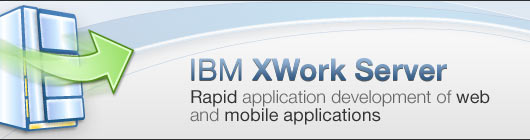

---
authors:
  - serdar

title: "Yeni ürün duyurusu: IBM XWork Server"

slug: yeni-urun-duyurusu-ibm-xwork-server

date: 2011-10-03T10:45:00+02:00

---

Şu dakikaya kadar duymadıysanız ilk olarak benden duyduğunuza sevindim :)

Geçen hafta [fragman](2011-09-lotus-notesdomino-8.5.3-geliyor...-hazir-misiniz.md "lotus-notesdomino-8.5.3-geliyor...-hazir-misiniz.htm") olarak bahsettiğimiz yeni ürün bugün itibariyle duyuruldu. Aslında yarın bekliyorduk ama Ed sabırsız davranarak twitter ve [blogundan](http://www.edbrill.com/ebrill/edbrill.nsf/dx/introducing-ibm-xwork-server) geçti konuyu...

IBM XWork Server, IBM Lotus ekibinin sosyal iş uygulamaları için ürettiği yeni bir uygulama sunucusu. Ürün, Lotus Domino 8.5.3 sunucusunun farklı bir marka ve lisanslama modeliyle pazara sunulmasını içeriyor. Geçtiğimiz yıl Lotus topluluğu tarafından çok fazla dile getirilen bir ihtiyacı karşılamak amacıyla üretildi. Özet olarak IBM XWork Server şöyle;
<!-- more -->

* Altyapıda Lotus Domino 8.5.3 sunucu çalışıyor. Yeni bir Domino domain'i olarak kullanılabileceği gibi, mevcut domain'inize dahil edebiliyorsunuz. Bunun anlamı, Domino'nun sunmuş olduğu NOSQL depolama olanağını, güvenlik ve dizin hizmetlerini, mesajlaşma servislerini ve açık sistem yapısını bu sunucu üzerinde kullanabiliyorsunuz.
* Sunucunun lisansı 2.000 USD / kurulum / yıl olarak açıklandı. Her kurulum, maksimum dört 'nsf' veritabanından oluşan dört uygulama içerebiliyor. Herhangi bir PVU ya da CAL (istemci erişim lisansı) yok. Ayrıca anonim kullanıcılar da sunucuda yeralan uygulamalardan yararlanabiliyor. Eğer dört uygulama yerine sekiz uygulama çalıştırmak isterseniz iki kurulum lisansı ödeyerek (4.000USD) tek sunucu üzerinde IBM XWork Server kullanabiliyorsunuz. Burada saydığımız NSF'lere sistemsel nedenlerle sahip olduğumuz veritabanları (names.nsf, admin4.nsf, log.nsf gibi) dahil değil, yalnızca uygulamanıza ait olan veritabanları sayılıyor.
* İki tane XWork sunucusu arasında replikasyon yapabiliyor veya clustering kurabiliyorsunuz. Normal lisansına sahip olduğunuz bir domino sunucusuyla ise yalnızca adres defteri replikasyonu kullanabiliyorsunuz. Fakat uygulamalarınız, normal lisanslanmış bir Domino sunucusundaki veritabanına replica oluşturmadan erişebiliyor.
* Utility server lisanslaması gibi XWork üzerinde de kullanıcı mesaj veritabanı tutulamıyor. Fakat 'mail-in' veritabanları yaratabiliyor ve mesajlaşma fonksiyonunu uygulamalarınıza dahil edebiliyorsunuz.
* XPages'in yeni versiyonlarında REST ya da SQL verileri uygulamalarımıza dahil edebiliyoruz. Bu bağalantılar XWork üzerinde herhangi bir şekilde kısıtlanmıyor.
* Eğer uygulamalarınıza Notes Client üzerinden erişmek isterseniz her istemci için bir CAL lisansı almanız gerekiyor.

Peki ne işe yarar bu XWork...

Bu lisansın tek bir amacı yok. Doldurduğu eksiklerin en önemlisi XPages kullanarak uygulama geliştirmek isteyen büyük şirketler. Bugüne kadar 1000 kullanıcının üstünde böyle bir ihtiyacı Domino Utility Server ile çözüyorduk. Fakat bu lisansın maliyeti epey yüksekti. 1000 kullanıcının altında sunduğumuz Utility Express sunucunun bile maliyetiyle karşılaştırdığımızda uygulama başına yıllık 500 USD civarındaki lisans maliyeti oldukça rekabetçi.

Yazılım geliştirici şirketler (ISV) için ise farklı opsiyonlar kazandırıyor XWork. Özellikle Cloud üzerinde uygulama kiralamak isteyen veya hazır uygulama satan geliştiriciler için XWork Server güzel bir lisans modeli oluşturacak. Bu alanda Utility Server ve Utility Express sunucular PVU bazlı olduğundan fiyatlama konusunda sorun yaratıyordu. Diyelim ki paket uygulamanızı müşterinize sattınız ve bu fiyatın içerisine belirli bir lisans maliyeti eklediniz. Bir süre sonra sunucunun işlemcisini yükseltmek istediğinizde lisans maliyeti değişiyor ve müşterinize karşı zor durumda kalıyordunuz.

Bu model konusunda getirilebilecek iki eleştirim var. Uygulamalara getirilen dört veritabanı sınırı: geliştiricinin uygulama mimarisine lisans boyutunda bir kısıtlama getirmek çok adil değil. Mevcut uygulamaların bu lisans modeline taşınması sırasında problem yaratabileceğini düşünüyorum bu modelin. İkinci eleştirim ise hosting konusu. Bu fikir ilk dile getirildiğinde ihtiyaçlardan birisi de XPages hosting sunulup sunulamayacağı idi. Bu modeldeki veritabanı sınırı nedeniyle böyle birşey mümkün olamayacak. Bu kısım IBM'in çok da önceliği değil bizim anladığımız kadarıyla.

Yine de bu eleştirilerim toplam görüntünün çok azını kapsıyor. Kalan kısım için konuşursak bence çok gelecek vadeden bir model olduğunu düşünüyorum. [Ed Brill](http://www.edbrill.com "Ed Brill") ve ekibi, bu ürünle yalnızca pazardaki bir boşluğu doldurmadılar. Bu lansman, daha önce [yazdığım](2011-01-notesdomino-uygulama-gelistirme-urun-yonetimi-ve-ed-brill.md "notesdomino-uygulama-gelistirme-urun-yonetimi-ve-ed-brill.htm") ve Ed'in anlattığı gibi, IBM'in XPages ve yazılım geliştirme konusunda bir pazar algısına sahip olduğunu gösteriyor.

Şimdilik detaylar bu kadar. Daha fazlasını yarından itibaren [bu adreste](http://ibm.co/nSvZOG) inceleyebilirsiniz... Ayrıca 11 Ekim'de yazılım zirvesindeki XPages sunumumda bu konuyu da ele alacağız. Bütün bu yenilikleri bir de Ed Brill'den dinlemek istiyorum diyen varsa Bruce Elgort ve Julian Robichaux tarafından hazırlanan [Taking Notes](http://www.takingnotespodcast.com/) podcast'inin yarın yayınlanacak bölümünü dinlemenizi tavsiye ederim...
