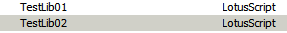
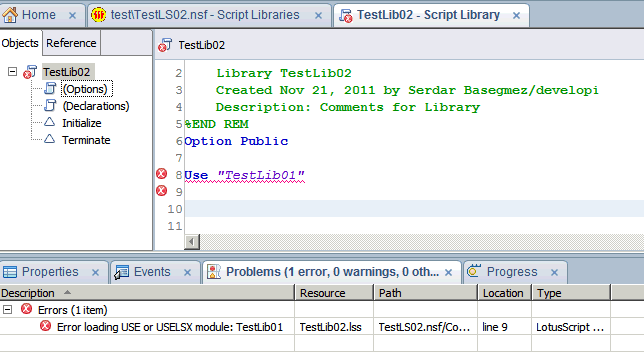
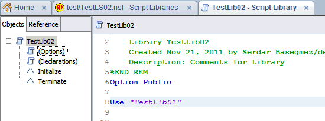
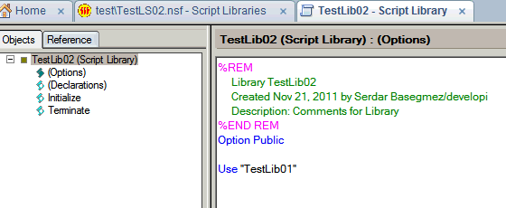

---
authors:
  - serdar

title: "Gene Java, Gene Türkçe: \"Error loading USE or USELSX module\""

slug: gene-java-gene-turkce-error-loading-use-or-uselsx-module

date: 2011-11-21T13:24:43+02:00

---

Bir haftadır eski veritabanlarından birisinde hortlayan "Error loading USE or USELSX module" hatasıyla uğraşıyorum. Sebebi bulduğum zaman, ülkem Lotus geliştiricisine önemli bir hizmette daha bulunacak olmanın heyecanıyla bloguma sarıldım :)
<!-- more -->
Bu hata klasik, genelde agent'lar çalışırken hortlar. Benim durumumda ise agent'larım ve script library'lerim derlenip kaydedilemiyordu bu hata yüzünden.

Saatlerce uğraştıktan sonra ilk test etmem gereken şeyi test etmediğimi farkettim. Beni yakından tanıyanlar neden bahsettiğimi bilir...

**Eğer bir yerde Java varsa, hele Türkiye'de yaşıyorsanız; ilk kontrol etmeniz gereken şey "i" karakteridir :)**

Sonuçta problemi buldum. Tekrar edebiliyorum, dolayısıyla hemen destek kaydımı açtım. Tekrar etmek adına tüm adımları aktarmayacağım ama problemi ekran görüntüleriyle göstereceğim.

Öncelikle bu durum yeni Lotusscript editörüyle ilgili ve işletim sisteminizin bölgesel ayarları Türkçe ise ortaya çıkıyor.

Şimdi, iki tane script library yaratalım:

TestLib02 kütüphanesini açalım, bunu TestLib01'e bağlayalım...

Komik değil mi?

Farzedin bu uygulamayı daha önce yarattınız ve çalışıyor (bir kez derlendi mi çalışır zaten). Ama artık yeni designer ile herhangi bir güncelleme yapamıyorsunuz. Çünkü, hata nedeniyle derlenmiyor.

İki basit çözümcük var:

1. Büyük harf kullanın:

2. Yeni Lotusscript editörünü kullanmayın (File\\Preferences\\Domino Designer\\Lotusscript Editor - 'Use Eclipse-based editor' tikini kaldırın)... Bu durum eski editörde olmuyor. Bir kez derleyip başarıyla kaydettiğinizde tekrar yeni editöre dönebilirsiniz.

Bu problemin 'alt metnine' bakarsak;

Öncelikle her platformda duyduğum, Türk müşterilerin "Lotus Workflow 8.5.x ile çalışmıyor" sorunu muhtemelen bu problemle ilgili.

Daha fazlası, önemli bir ders çıkartmak. Eğer yeni Designer'la ilgili bir probleminiz varsa ve işin içinde 'case insensitivity', yani büyük küçük harf farketmez durumu varsa sorumlu "i" karakteridir. Bu karakter Java tarafından büyük harfe dönüştürüldüğünde "İ" olarak çevrildiğinden her platformda karşımıza çıkıyor.

Benzer problemlerinizi beklerim :)
