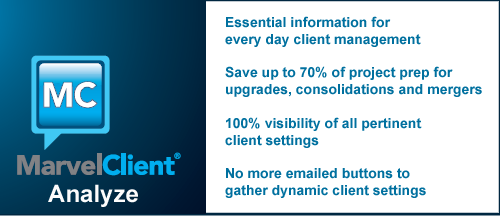

---
authors:
  - serdar

title: "MarvelClient Analyze uygulamasında ücretsiz versiyon..."

slug: marvelclient-analyze-uygulamasinda-ucretsiz-versiyon...

date: 2011-12-20T19:02:57+02:00

---

Bir süredir gelen kutumda bekleyen bu mesajı sizlerle paylaşmak istedim.
<!-- more -->
Panagenda, dünya çapında iş yapan önemli IBM Lotus çözüm ortaklarından birisi. Özellikle sistem yönetimi alanında çok güzel uygulamaları var. Bunlardan birisi olan MarvelClient'ı şu anda bir müşterimde teste almışken MarvelClient Analyze modülü için ücretsiz lisans sunulduğunu öğrendik...

Öncelikle biraz MC'den bahsedelim.

[MarvelClient](http://www.panagenda.com/index.php/products/marvelclient), bir 'istemci yönetim' uygulaması. Mimari, merkezi Domino sunucularına yüklenen iki NSF veritabanından ve küçük bir DLL dosyasından oluşuyor. Bu DLL dosyasını istemcilere yükleyip (bunun için bir agent, merkezi bir dağıtım uygulaması ya da login script'i kullanılabilir) istemcilerin her açılışta belli işlemleri yapmaları sağlanabiliyor.

MC istemcisi merkezi sunucuya bir sürü bilgiyi (belirli analiz değerleriyle birlikte bookmark'lar, notes.ini, rich client konfigürasyonlarını, vs.) XML formatında ve sıkıştırılmış halde gönderiyor. Merkezi sunucudan da konfigürasyon bilgilerini alıyor.

Analyze modülü tek başına kullanıldığında workspace ve bookmark ikonları, açılış kapanış hızı, notes.ini parametreleri, ağ ve işletim sistemi konfigürasyonu, lokasyon ve bağlantı (connection) dokümanları gibi pekçok bilgiyi merkezi bir noktadan analiz edebiliyor; sorunlu istemcileri saptayabiliyoruz.

Diğer modüllerde ise konfigürasyonları belli kurallara göre zorla uygulamak mümkün. Örneğin belirli bir veritabanının yalnızca uygulama sunucunuzdan açılmasını zorlamak, otomatik connection dokümanı yaratmak, daha geniş roaming imkanları sunmak, gereksiz ECL girdisi, yerel replika, lokasyon dokümanı gibi öğeleri otomatik silmek vs. onlarca kural önceden tanımlanmış geliyor.

Bu kısımda çok ilginç uygulamalar gördüm:

- Örneğin kullanıcı bir veritabanının workspace ikonunu uçurdu, veya bookmark'daki mesaj kutusu ikonunu sildi. İstemci yeniden başlatıldığında herşey yerli yerine dönebilir.
- Tüm kullanıcıların imzalarını HTML dosya olarak oluşturdunuz. Kullanıcı bu ayarla oynasa bile her seferinde imza ayarlarını düzeltebiliriz.
- Veritabanı taşındığında tüm sunucu referansları düzeltilebilir.
- Tüm 'yerel' replika ikonları replika destesinin üstüne taşınabilir (böylece kullanıcı uzak lokasyondaysa sunucu üzerindeki replikayı kullanmaya çalışmaz).
- Tüm yerel veritabanları (ya da belli birisi) önplanda ya da arkaplanda compact ettirilebilir...

Yapılabilecekler epey çeşitli.

Uygulamanın Analyze kısmını ücretsiz olarak kullanmak için en yakın Panagenda iş ortağına başvurabilirsiniz. Türkiye'dekiler için biraz zor tabi; çünkü yerel bir partner'ları yok. Ücretsiz lisans almak isterseniz beni haberdar edin; sizi yönlendiririm.

Uygulamayı incelemek için [Panagenda](http://www.panagenda.com/) sitesini ziyaret edebilir; küçük bir demo izlemek için bu [linki](http://notescode.net/2011/10/notes-client-analyzer-marvel-client-analyze/) takip edebilirsiniz...

MarvelClient uygulamasını test ettiyseniz ya da daha önce kullandıysanız düşüncelerinizi merak ediyorum, yorum yazmaktan çekinmeyin :)
