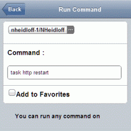

---
authors:
  - serdar

title: "OpenNTF yarışmasından Türkiye'ye bir ödül..."

slug: openntf-yarismasindan-turkiyeye-bir-odul...

date: 2011-12-08T19:35:14+02:00

---

OpenNTF'in ikinci yarışması az önce sonuçlandı.

Kazananlardan birisi Lotus Türkiye Kullanıcı Grubu'nun diğer başkanı Ferhat Bulut.
<!-- more -->
Ferhat, Akbank'ta Lotus Domino Uygulama Geliştirme üzerine çalışıyor. [BestCoder.net](http://www.bestcoder.net/) blogunun yazarı ve kendisini blackberry üzerinde uygulama geliştirme sunumlarından tanıyor olabilirsiniz :)

Ferhat, daha önce Blackberry için geliştirdiği Mobile Admin uygulamasını XPages'de tekrar yazdı ve projesini mobil arayüzleriyle birlikte OpenNTF'e sundu. Projenin detaylarına ulaşmak ve uygulamayı indirmek için [proje sayfasına](http://www.openntf.org/internal/home.nsf/project.xsp?action=openDocument&name=Mobile%20Admin) ulaşabilirsiniz.

Yarışmaya katılan tüm projeleri [buradan](http://xpages.info/XPagesHome.nsf/Contest.xsp), kazanan diğer projeleri de [buradan](http://www.openntf.org/blogs/openntf.nsf/d6plinks/BELT-8PCN8Z) görebilirsiniz.

Tekrar tebrikler Ferhat!
