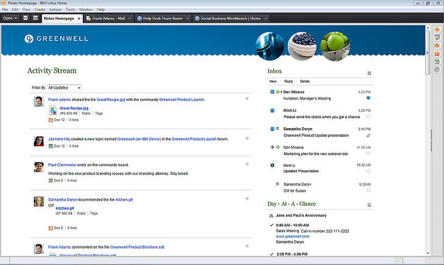
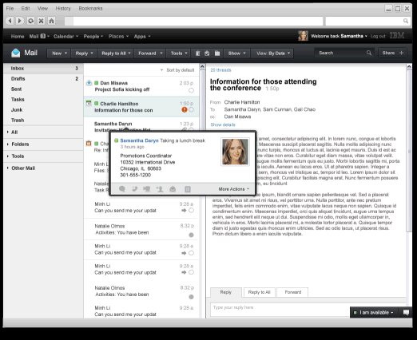
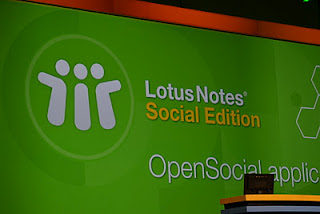
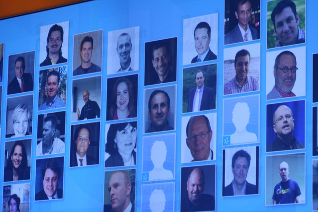
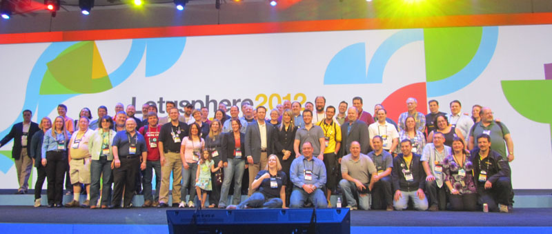

---
authors:
  - serdar

title: "Lotusphere 2012: Renkler, Markalar ve 'Şimdi'..."

slug: lotusphere-2012-renkler-markalar-ve-simdi...

date: 2012-01-27T15:30:00+02:00

---

Geleneksel **Lotusphere** zamanı geldi ve geçti. Ama bu kez uzaktan videoları açmaya çalışıp blog ve tweet'lerden neler döndüğünü anlama gayretinde değildim. Lotusphere 2012'i Orlando'da ön sıradan takip etme fırsatı yakaladım.
<!-- more -->
Geçtiğimiz yıl gitmeyi çok istemiştim fakat Lotusphere'in maddi yükü gözümde çok büyümüştü. Açıkçası 2000 dolara yakın konferans bileti, Amerika seyahati, konaklama ve diğer masraflar, Türkiye'den Lotusphere'e katılmayı oldukça zorlaştırıyor. Bu yıl herşeyi göze alıp Orlando'ya gitmiş oldum. Her yıl 'bu konferansa Türkiye'den katılan olmaz' düşüncesindeyken orada yalnız değildim. OpenNTF yarışmasında finalist olduğu için ödül olarak Lotusphere'e ücretsiz bilet kazanan Ferhat (nam-ı diğer [bestcoder](http://bestcoder.net/)) ile birlikte **toplam yedi kişi** vardı Türkiye'den.

Konferansı dört ayrı başlıkta değerlendirmek gerekiyor;

**Yeni duyurular:**

Geçen yılların aksine bu yıl duyurulacak şeyler çok sürpriz değildi (en azından benim için). Herkesin merakla beklediği 'Notes Next'in ismi açılışta (OGS: Opening General Session) çok cılız bir şekilde gerçekleşti. Benim için tek sürpriz bu isim oldu: "**IBM Lotus Notes / Domino Social Edition** ".

Çok karmaşık bir isim beklemiyordum, ama açıkçası Lotus markasının bu ürün için korunduğunu görmek beni şaşırttı. Konunun geçmişini bilmeyenler için hatırlatayım; Geçen yıldan bu yana Notes/Domino uygulamalarında Lotus markası bilinçli olarak kullanılmıyor. 8.5 ile 9.0 arasında bir versiyon çıkacağı söyleniyor, bu da Notes Next olarak adlandırılıyordu. Connections gibi bir çok üründen "Lotus" markası çıkartıldığı için de yeni üründe Lotus isminin yeralması beklenmiyordu. Gerçi karmaşık mesajlar gelmeye devam ediyor, ilerleyen günlerde bu konu biraz daha netleşir.

Lotus N/D Social Edition, 8.5.4 üzerine bir eklenti olarak gelecek. Yani **Social Edition 8.5.4 ile 9 arasında bir yerde** diyebiliriz ([Ayrıntılar](http://www.edbrill.com/ebrill/edbrill.nsf/dx/lotusphere-2012-lotus-notesdomino-social-edition)). Bunun çok mantıklı bir sebebi var. IBM, bu yetenekleri müşterilerine enjekte etmek için bir major versiyon geçişi yaratmak istemiyor. Bu yüzden ürünün çekirdeğine dokunmadan yüzeysel bir takım geliştirmelerle yeni bir sürüme sahip olacağımızı söyleyebiliriz. Social Edition'ın önyüzü kabaca şöyle birşey olacaksa da Activity Stream'leri görmek için Connections sunucusuna ihtiyacımız var. Bu da yeni bir lisans modeli, fiyat ve paketleme içerecek. IBM bu konuda net bir açıklama yapmıyor. Buradan çıkardığımız sonuç: Çok şey değişebilir :)

*##### Social Edition için beklenen arayüz...*

**IBM Connections 4.0** duyurusu, beraberinde **Activity Streams** , **Embedded Experience** ve **Social Mail** gibi eklentilerle yapıldı. Bunları daha önceden NDA kapsamında görmüştük, bu yüzden sürpriz olmadı. Activity Streams ve Embedded Experience konusunu ayrı bir yazıda inceliyor olacağız. Social Mail önemli bir atılım oldu. Connections 4 içerisinde gelecek bir eklenti (ki ileride Portal gibi diğer ürünlere de eklenecek) arka planda **Domino veya Exchange sistemini** destekleyen hafif bir mesajlaşma istemcisi sağlıyor. Diğer teknolojilerin de katılımıyla Connections 4, tek bir ekranda herşeye ulaşmayı ve sosyal yazılım deneyimini tekil ve tutarlı bir hale getirmeyi amaçlıyor (bu cümleyi yazdığım için çok şaşırıyorum)...

OGS sırasında '**plugin** ' gösterildiğinde alkış tufanı koptu, buna değinmezsek olmaz. '**Plugin** ', bir süredir etrafta dolaşan bir konu ve aslında IBM dışından çok az kişinin gördüğü, görenlerin aralarında "*Plugin'i gördün mü?* " diye dedikodu yaptıkları bir efsane idi. Bundan üç ay kadar önce gizlilik kapsamında gördüğüm bu eklentinin gerçek ismi **Notes Application Player Plug-in** . Temelde bir tarayıcı eklentisi olacak bu ürünün Social Edition ile çıkması bekleniyor. 100MB'ın altında yer kaplayan Player, Notes Basic Client işlevlerine sahip olacak (en azından %80 civarında). Bu eklenti sayesinde Notes yüklü olmayan bilgisayarlarda web tarayıcısından Notes veritabanlarına erişim imkanımız olacak. Bir çok konu henüz net olmasa da yakından inceleme fırsatı bulduğum demo, Notes veritabanlarını web üzerinden kullanabilme anlamında epey başarılı. Elbette bazı kısıtlamalar var. Basic client düzeyinde çalışacağı için, kompozit uygulamalar ve XPiNC desteğinden yoksun. Büyük ihtimalle C-API erişimi, ActiveX ve OCX kullanımı konularında kısıtlamalar olacak (Örnek vermek gerekirse, Mail veritabanının tamamen çalışmayabileceği söylendi). Şu anda yalnızca Mozilla üzerinde çalışan eklenti için en az bir tarayıcı daha desteklenecek (Chrome veya Internet Explorer). Bu eklentiyi çalışır kılan teknoloji yalnızca Windows'da olduğu için Mac ve Linux desteği yok.

OGS sırasında duyurulmasa da ilk duyduğumda kulaklarıma inanamadığım için defalarca onaylattığım bir gelişme beni epey heyecanlandırdı. **IBM Mobile Platform** adı altında geliştirilen yeni bir ürün (?), **PhoneGap** ve IBM yazılım teknolojilerini birleştirecek ve hibrid mobil uygulamalar geliştirmemizi sağlayacak. Bu ürün, şu anda beta koduyla Android platformu için mevcut. Arkaplanda Websphere'in ücretsiz developer versiyonu kullanılıyor fakat çok yakında Lotus Domino web sunucusu üzerinde de çalıştırılabilmesi gündemde. Bilmeyenler için, Phonegap tipi uygulamalar Javascript, CSS ve HTML5 gibi teknolojiler sayesinde mobil platformlarda çevrimdışı çalışan ve cihazların platform fonksiyonlarına (lokasyon, ux, kamera, vs.) erişebilen uygulamalar geliştirmemizi sağlıyor. Bu ürünle ilgili daha detaylı bilgiye ulaştığım zaman yazıyor olacağım.

Diğer küçük duyurulara gelirsek; Traveler konusunda iki gelişme var. Bilenler için; IBM daha önce Windows Phone desteği sunmayacağını net olarak açıklamıştı. Geçen zaman içerisinde yapılan pazar araştırmaları (CMO Study gibi) kurumların Windows Phone konusunda tahmin edilenin ötesinde bir ilgi duyduklarını ortaya çıkardı. Bu durum, strateji değişikliğine neden olmuş olacak ki bu yıl içerisinde **Traveler için Windows Phone desteği** (spesifik olarak Nokia ve HTC'ler için) geliyor. Net olarak açıklanmasa da bu desteğin ActiveSync protokolü dahilinde olacağını tahmin ediyorum, çünkü zaman çok kısıtlı ve bu sürede 'native' bir istemci yazılması olanak dahilinde görünmüyor.

İkinci konu Türkiye'de yalnızca 3-4 şirketi ilgilendiriyordur... Traveler, mevcut yapısı itibariyle cluster yapılarını desteklemiyor. Bunu aşacak bir '**High availability** ' mimarisi üzerinde çalışılıyor ve bu güncelleme, önümüzdeki çeyreğe yetişecek gibi bir görüntü var. Mobil konularla ilgili Ed Brill'in [son yazısı](http://www.edbrill.com/ebrill/edbrill.nsf/dx/lotusphere-2012-mobility) okunabilir...

Diğer konuların üzerinden geçersek;

* Şu anda betada olan (Code Drop 2) 8.5.4, çok büyük değişiklikler içermeyecek. Önümüzdeki dönemde Upgrade Pack 2'yi bekliyor olacağız.
* Social Edition ile birlikte OneUI temasının yeni versiyonu çıkıyor. Bu tema aynı zamanda eskimiş iNotes arayüzünü de yeniliyor ve tüm IBM ürünleriyle paralel bir kullanıcı arabirimine kavuşuyoruz. (iNotes'un yeni yüzü hemen aşağıda)
* Designer Client üzerinde bir dizi değişiklik planlanıyor. IBM'in binlerce saatlik çabasına benim de 1-2 saatlik bir katkım olmuştur (umarım!)...
* SAML desteği ve (şimdilik OpenNTF'den yayınlanacak olan) OAUTH sunucusu, dış sistemlerle entegrasyon konusunda Domino Social Edition'ın elini güçlendirecek.
* Lotus Quickr ile ilgili çok bir bilgi yok fakat 8.6 versiyonunun haziran sonrası çıkacağı duyuruldu. Aynı dönemde bir de mobil istemci bekliyoruz.
* LotusLive ürün grubunun ismi değişti. IBM'in bir süredir diğer bulut bilişim ürünleri için oluşturduğu şemsiye, artık LotusLive'ı da kapsıyor. Bundan böyle LotusLive, **SmartCloud** olarak anılacak...
* Benzer şekilde; daha önce beta olarak sunulan LotusLive Symphony (gerçek zamanlı Symphony) de IBM Docs olarak hayatına devam edecek. Ürün müdürünün söylediği gibi IBM tarihinin en kısa ismine sahip bu yazılımın ileride On-premise (şirket sunucularında çalışabilecek) versiyonu da çıkacak.
* Sametime için Polycom gibi iş ortakları tarafından geliştirilen mobil çözümlerin etkileyici demolarını gördük.

 

*##### iNotes'un planlanan arayüzü...*

**Strateji**

Geçen yıl ortaya atılan fakat pek çok analist tarafından içi boş olarak nitelendirilen Social Business teması, bu yıl daha net bir söylemle dile getirildi. Her 3 oturumdan birisi (teknik olanlar bile) social kavramı etrafında döndü. IBM Connections üzerine onlarca müşteri hikayesi sunuldu. Öte yandan birçok katılımcının şikayet ettiği ortak konu, Notes/Domino, Sametime ve Quickr gibi ürünlerin OGS'de yeterince yeralmaması oldu (gerçekten saat tutanlar var).

Bu pek de sürpriz değildi. Fakat marka kısmına özellikle değinmek gerekiyor. Ben Lotus markasının tamamen kaldırıldığı gibi bir duyuru bekliyordum açıkçası. Notes/Domino için bu olmadı. LotusLive'ın SmartCloud olarak değiştirilmesi ve IBM Docs markası tartışmalı kararlar gibi görünse de bu konuda pek eleştirim yok artık. IBM'den başarılı bir marka stratejisi beklemek hayal, çünkü bu şirketin geleneğinde bu tip bir pazarlama pratiği yok. Microsoft'un aksine, IBM markalarıyla değil, başka yöntemlerle başarıya ulaştı bugüne kadar. Websphere Portal bunun en güzel örneğidir.

Benim ilgimi çeken renkler oldu... Kayıt esnasında aldığımız sırt çantalarının yıllardır alışılmış sarı renge sahip olmamasıyla yayılan geyikler, OGS'de birkaç saniyeliğine yeşil renk üzerinde "Lotus Notes Social Edition" yazısını görmemle beni endişeye sevketti. Şaka bir yana, IBM tüm organizasyon genelinde kullandığı görseller ve logo'larda alışılmışın dışında bir 'rengarenk' olma çabası içindeydi sanki. Alışılmış olan, her ürün grubunun farklı renklere sahip olduğu slaytlar görmekti. Lotus her zaman o güzel turuncu renkte çıkardı. Bu farklılık benim gözüme epey battı. Geçen yıl UKLUG esnasında IBM'ciler bu baklayı çıkarmışlardı ağızlarından: "6-7 marka yönetmektense IBM markasına yönelmek istiyoruz..."

*##### Yeşil zeminde duyuru yapmak???*

IBM hızlı davranmak zorunda olduğunu biliyordu. "NOW" (Şimdi) sloganı da bunu ifade ediyordu. 2013-14 civarında Sharepoint, şu anda sahip olduğu birçok kamburdan kurtulacak ve tekrar sahneye çıkacak. O zamana kadar IBM social yazılım arenasında yalnız sayılır. Bu durumu paraya çevirmek için ürün çevrimlerini hızlandırıyor, satış aktivitelerini yoğunlaştırıyor. Biz iş ortakları üzerinde de bir baskı var bu konuda. Bu hız ileride istenen sonuca gelir mi bilinmez ama dünyanın birçok yerinde önemli Connections satışları yapıldığını duyuyoruz. Developi olarak biz de geçtiğimiz ay ilk Connections satışımızı yaptık. Proje tamamlandığında detaylardan bahsederiz.

**Sosyal (Beşeri anlamında :) )**

Lotusphere'e ilk katıldığım yıl olmasına rağmen fazla cahil değildim. Blog'lardan ve twitter'dan tanıdığım pekçok arkadaşım vardı. Onların rehberliğiyle insanların ne zaman nerede oldukları konusunda epey bilgi sahibiydim.

Özellikle IBM Şampiyonu olmak çok havalıydı Lotusphere boyunca. Taşıdığım kocaman bir "IBM Champion" etiketinin yanında OGS'i en önden izleme fırsatı buldum. OGS'de isimlerimizin ve fotoğraflarımızın dev ekrana yansıtıldığı ana şahitlik etmek de güzel bir duygu oldu. Şampiyonlar için gerçekleştirilen resepsiyon esnasında üst düzey IBM yöneticileriyle sohbet etme fırsatı bulduk. Diğer IBM Şampiyonlarıyla da tanışıp kaynaşmış olduk.

##### *IBM Şampiyonları dev ekranda!*

 

**Oturumlar**

En pişman olduğum kısım bu. Oturumları iyi planlayamamanın ve bu konudaki deneyim eksikliğimin acısını çektim diyebilirim. Önemli oturumların bazılarını kaçırmış oldum. Yine de çok güzel sunumlar vardı. Örneğin Declan'ın Source Control oturumu, ilk salonun dolması nedeniyle açılan ikinci salonun yetmemesi nedeniyle üçüncü salona taştı :)

Oturumlara damgasını vuran iki şey vardı (social lafı haricinde). İstisnasız tüm oturumlarda OpenNTF ismi geçti. OpenSocial hakkında da epey bilgi edindik.

Özellikle Developer Lab ve User Experience Lab sayesinde geliştiricilerle uzun uzun sohbet etme imkanım oldu. Geribildirimlerimi doğrudan bildirebilmek, önemli sorunları birebir tartışmak çok faydalı oldu. İrlanda'lı XPages geliştiricilerinin akşamları metamorfoz geçirdiklerini görmek bir yana, artık "ı harfi" (dotless-i) konusunu onların gündemine yerleştirebildiğimi söyleyebilirim :) (Kaç biraya malolduğunu sormayın!)

*##### Geleneksel 'Community' fotoğrafı...*

\* Görseller: Ed Brill, Mitsuru Kato, Mitch Cohen, Sharon Bellamy
