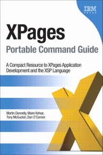

---
authors:
  - serdar

title: "Kullanıcı Grubu XPages konuşuyor..."

slug: kullanici-grubu-xpages-konusuyor...

date: 2012-03-07T19:39:08+02:00

---

Kullanıcı grubu üyelerinden uzun zamandır aldığımız taleplerden birisi de teknik içerik olarak daha zengin etkinlikler düzenlememizdi. Sanırım yüz yıldır gündemimizde olan bu konuyu da aradan çıkartmak istedik ve bir Workshop hazırlamaya karar verdik.

22 Mart 2012 Perşembe günü 13:00 - 17:00 saatleri arasında IBM Levent ofisinde yarım günlük bir etkinlik yapıyoruz. Konumuz: XPages.
<!-- more -->
XPages ile geliştirme yapmaya henüz başlamayanlar ya da acemilik döneminde olanlar için düzenlediğimiz bu etkinlikte klasik Domino geliştirmeden XPages'e geçişle ilgili genel bir yol haritası çizmeye çalışacağız. Yaşadığımız sıkıntılara karşı bazı küçük öneriler vermeye çalışacak, sıkça yapılan hatalardan yola çıkarak birkaç 'best practice' anlatacağız. Baştan uyarayım, satışçılar ve satış sunumları salona giremeyecek :)

Ben yaklaşık bir saat sürecek bir sunum hazırlıyorum. Eğer katılabilirse Ferhat da [ödüllü uygulamasından](2011-12-openntf-yarismasindan-turkiyeye-bir-odul....md "openntf-yarismasindan-turkiyeye-bir-odul....htm") bahsedecek. Aralarda çaylarımız ve kahvelerimiz IBM'den :)

Geri kalan kısımda soru-cevap olarak devam edecek bir saatlik bir oturum planladık. Bu bölüm için sorularınızı şimdiden hazırlayın, elimizden geldiği kadarıyla cevaplamaya çalışalım. Sorularınızı önceden de gönderebilirsiniz. Böylece zaman kazanmış oluruz.

XPages konusunda iddialıysanız 'buna ihtiyacım yok' demeyin; mutlaka katılın. Hem neler öğrenebileceğinizi tahmin edemezsiniz, hem de başkalarına yardımcı olma şansını geri tepmemiş olursunuz :)

Yaklaşık iki yıldır XPages ile yatıp XPages ile kalkıyorum. Bu konuda makaleler yazıyor (çok yakında duyurusunu buradan okursunuz), OpenNTF projelerine katkıda bulunuyorum. XPages'in ardındaki gerçek potansiyelin çok büyük bir kısmının bilinmediğini farkediyorum sürekli. Soru cevap bölümünde bunları da konuşalım istiyorum.

Etkinliğe kaydolmak için [LUGTR - Etkinlikler](http://www.lotusturkiye.org/home1.nsf/events.xsp) sayfasına gidebilirsiniz.

Ha, unutmadan; IBM Press, bir iyilik yapmış. XPages hakkında en son çıkan "[XPages Portable Command Guide](http://www.redbooks.ibm.com/Redbooks.nsf/ibmpressisbn/9780132943055?Open)" kitabının bir kopyasını göndermiş kullanıcı grubumuza.

Biz de bu kitabı küçük bir yarışmayla hediye etmek istiyoruz... Şimdiden iyi şanslar...
