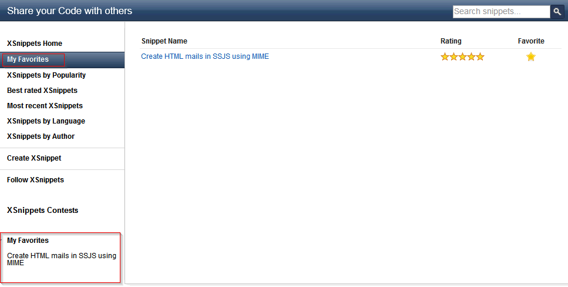

---
authors:
  - serdar

title: "XSnippets sitesine Arama ve Favori özellikleri eklendi..."

slug: xsnippets-sitesine-arama-ve-favori-ozellikleri-eklendi...

date: 2012-05-14T08:45:41+02:00

---

OpenNTF blogunda yazdığım [yazının](http://www.openntf.org/blogs/openntf.nsf/d6plinks/NHEF-8UA9FZ) bir de Türkçe'sini koyalım.

Son güncellememizden bu yana üç ay geçti ve küçük hata düzeltmelerinin yanısıra [OpenNTF XSnippets](http://openntf.org/xsnippets) sitesine gelişmiş arama fonksiyonları, OpenSearch desteği ve 'Favorilerim' özellikleri ekledik.
<!-- more -->
**Arama Fonksiyonunda geliştirmeler**
Arama özelliğinde birkaç kullanım kolaylığı ekledik. Önce video'yu izleyin:

<iframe src="http://www.screenr.com/embed/5xK8" width="650" height="396" frameborder="0"></iframe>

Öncelikle sayfanın herhangi bir yerinde bir harf ya da rakama bastığınızda arama kutusu otomatikman aktif oluyor. Bu muhtemelen küçük ince arama kutusuna tıklamaktan daha kolaydır. İkinci geliştirme arama kutusuna harfler yazdıkça konu önerilerinin gelmesi. Her giriş arka planda bir FT search tetikliyor ve sonuçları [Tim Tripcony](http://timtripcony.com/)'nin yazdığı teknikle gösteriyoruz. Eğer bu listeden bir snippet seçerseniz sonuçlar sayfasını atlıyor ve doğrudan seçtiğiniz snippet'i görüntülüyoruz.

**OpenSearch Desteği**
OpenSearch, çapraz site aramaları için yaratılan açık standardın ismi ve bugün birçok tarayıcı tarafından destekleniyor.

OpenSearch'ün iki önemli fonksiyonu var. Birincisi 'benim sitemde nasıl arama yapılır' meta bilgisini diğer sitelere bildirmek. İkincisi daha heyecan verici: 'Benim sitemde anahtar kelime arayamak için şu URL'i kullanın' duyurusunu yapabiliyorsunuz.

Arama sonuçları sayfasının sağ üst kısmında XSnippets aramasını tarayıcınıza eklemek için bir kısayol yarattık.

Chrome ve Firefox'da eklediğiniz arama motoruyla ilgili bir de anahtar kelime (keyword) belirleyebilirsiniz. Bu sayede XSnippets aramalarınızı doğrudan adres bar'dan yapabilirsiniz.

Chrome'da anahtar kelime "Add Search Engine" diyaloğunda belirleyebilirsiniz. Belirlediğiniz keyword'ü adres bar'ında yazdıktan sonra TAB'a basıp arama yapabilirsiniz. Firefox için arama motoru ekledikten sonra 'Edit Search Engines' menüsüne gidip keyword belirlemeniz gerekiyor. Burada da adres bar'da keyword'ünüzü yazıp bir boşluk bırakın ve aramak istediğiniz kelimeleri yazıp Enter tuşuna basın.

Chrome, Firefox ve Internet Explorer arama yaparken kelime önerme (suggestion) özelliğini de destekler.

*Chrome*

*Firefox*

*Internet Explorer*

**Favorilerim - My Favorites Özelliği**
XSnippets'e, beğendiğiniz ve her zaman erişmek isteyebileceğiniz snippet'leri favori olarak işaretlemenizi sağlayan 'My Favorites' özelliğini de ekledik. Snippet'leri açtığınızda sağ üstte büyükçe bir yıldız göreceksiniz.

Snippet'leri favori olarak işaretlemek için giriş yapmanız gerekir. Sizden başka kimleri aynı snippet'i beğendiğini de görebilirsiniz.

Birkez login olduğunuzda tarayıcınıza bir cookie yerleştiriyoruz. Bu sayede siteyi anonim olarak ziyaret etseniz bile favorilerinizi görmeye devam edebiliyorsunuz.

Favori snippet'lerinizi Sol menüde ve 'My Favorites' sayfasında görebilirsiniz.

Son olarak "**Best rated XSnippets** " sayfasını kullanarak snippet'leri liste üzerinde listenize dahil edebilirsiniz...

Umarım bu yeni özellikler XSnippets sitesini daha rahat kullanmanızı sağlar. İleride bu özellikleri nasıl eklediğimizi detaylandırmayı planlıyorum. Yakın bir zamanda veritabanının son halini de proje sayfasına ekleyeceğiz.
