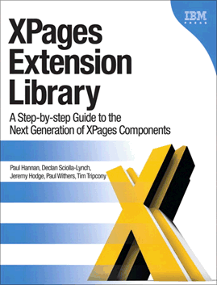

---
authors:
  - serdar

title: "İnceleme: XPages Extension Library kitabı..."

slug: inceleme-xpages-extension-library-kitabi...

date: 2012-07-02T09:15:00+02:00

---

Geçtiğimiz haftalarda IBM Press, uzun zamandır beklediğimiz "**XPages Extension Library** " kitabını piyasaya çıkardı. Böylece son 18 ay içinde üçüncü XPages kitabı da çıkmış oldu. Hatırlayacaksınız, "**Mastering XPages** " ile XPages platformunun temelleri; "**XPages Portable Command Guide** " ile özellikle sunucu mimarisi, derinlemesine ayarlar ve performans gibi konular işlenmişti.

Bu kitabın öncekilerden farklı bir özelliği var. Tüm kitap, IBM'den Paul Hannan önderliğinde IBM dışından yazarlar tarafından hazırlanmış. İsimler, şahsen de tanıdığım ve Lotus topluluğunda XPages bilgisi olarak çok öne çıkan isimler.
<!-- more -->
[Decla Sciolla-Lynch](http://www.qtzar.com/), [Jeremy Hodge](http://www.hodgebloge.com/), [Paul Withers](http://www.intec.co.uk/blog/) ve [Tim Tripcony](http://timtripcony.com/) uzun süren bir çalışmayla bu kitabı hazırlamışlar. Şu [videoda](http://www.youtube.com/watch?v=m1T0rCBmJD0) kitabın reklamını kendilerinden dinleyebilirsiniz...

Kitabın bir kopyası incelemem için bana da gönderildi. Günlerdir masamda duran kitaba bakacak yüzüm kalmamıştı :)

Sonunda kitabı inceledim. Aslında inceledim demek yalan olur, çünkü ihtiyacım oldu! XPages ile ilgili yürüttüğüm projelerde artık aktif şekilde Extension Library kullanıyorum ve bu kitap benim için vazgeçilmez bir kaynak.

540 sayfa civarında bir kalınlığa sahip kitap kabaca dört bölüme ayrılmış. Birinci bölümde Extension Library'nin kurulumu, dağıtımı ve genel özelliklerinin keşfedilmesiyle ilgili. Örneğin bu bölümdeki üçüncü kısım Extension Library ve Upgrade Pack ile gelen Teamroom XL şablonuna ayrılmış. Bu uygulama genel OneUI mimarisini anlamak ve basit bir uygulamaya nasıl başlayacağınızı göstermesi açısından çok önemli bir referans.

İkinci bölümde Extension Library ile gelen temel kontroller işlenmiş. Form layout, dynamic content, diyaloglar, picker'lar, view bileşenleri ve en önemlisi Application Layout objesi. Bu bölümde dojo'yla ilgili de güzel bir bölüm var.

Üçüncü bölümde Extension Library'nin kaymak tabakası işlenmiş: Mobil kontroller, REST servisleri, ilişkisel veri tabanı ve social enabler kontrolleri. Bu bölüm en sonunda ilişkisel veritabanı bağlantısını anlamamı sağladı!

Son olarak kısa bir bölümde XPages ile Java ve extensibility API kullanımıyla ilgili genel notlar sunuluyor. XPages ile ilgili sunumlarımı izlediyseniz, bir yerden sonra Java kullanmaya mecbur kalınacağının altını sürekli çizdiğimi biliyorsunuzdur. Bu bölüm iyi bir başlangıç olacaktır. Burada anlatılanlar benim de kurtarıcım oldu çünkü ileri düzey Java kullanımı konusunda derli toplu bir kaynak bulamıyordum şu ana kadar.

Kitap hem bir referans kaynağı hem de bir eğitim dokümanı formatında hazırlanmış. Bol miktarda örnek var. Özellikle JDBC gibi konularda kurulum ve konfigürasyon adımları çok detaylı olarak anlatılmış. Bileşenler anlatılırken kontrol referanslarına yer verilmiş. Bu özellikle çok işe yarıyor. Çünkü eğer Extension Library'nin OpenNTF versiyonunu kullanıyorsanız bazı özellikler tam olarak dokümante edilmemiş durumdalar.

Kitapla ilgili iki de podcast önereceğim. Yazarlar This Week In Lotus'un [101'inci bölümüne](http://thisweekinlotus.com/audio/twil.nsf/dx/this-week-in-lotus-101-who-promises-to-write-the-next-book) ve Taking Notes Podcast'in [155'inci bölümüne](http://www.takingnotespodcast.com/blogs/takingnotes.nsf/dx/TakingNotesEpisode155.htm) konuk oldular. Burada kendi ağızlarından kitabın macerasını ve içeriğini anlatıyorlar.

Son olarak ne kadar bu kitap?

Kitabı [IBM Press](http://www.ibmpressbooks.com/bookstore/product.asp?isbn=9780132901819)ya da [Amazon'dan](http://amzn.com/0132901811) edinebilirsiniz. Fiyatlar değişmekle birlikte unutmayın, [LotusUserGroup.org](http://www.lotususergroup.org/) üyelerinin ciddi bir indirimi var. Üye olduktan sonra sol taraftaki menüden "Member Discounts" bölümüne gidin ve promosyon kodunu öğrenin. En son baktığımda %40 indirim vardı.

Maalesef bu kitapların Türkiye'ye gelişi hem pahalıya geliyor (kargo maliyetleri) hem de uzun sürüyor. Bu yüzden tavsiyem, e-kitap olarak almanız. Hem kargo ücreti ödemezsiniz, hem de anında okumaya başlayabilirsiniz. Üstelik %20 civarında daha ucuza geliyor. Ayrıca Book+E-book opsiyonu da sunuluyor. IBM Press'in sunduğu e-kitapların bir özelliği de Watermark formatında olmaları. Bu sayede okuyucu yazılımla ilgili özel ayarlara gerek duyulmuyor. Üzerinde satınalanın isminin yazılı olduğu bir PDF geliyor ve bunu istediğiniz PDF okuyucuda okuyabiliyorsunuz.

Kitabı alan ve inceleyen varsa yorum yapmaktan çekinmeyin...
