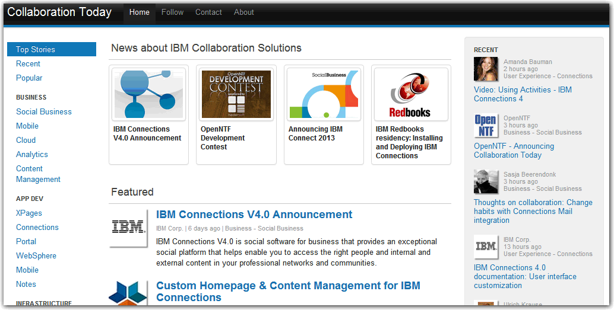

---
authors:
  - serdar

title: "Bir XPages gösterisi: CollaborationToday.info"

slug: bir-xpages-gosterisi-collaborationtoday.info

date: 2012-09-10T13:03:23+02:00

---

OpenNTF kapsamında son iki aydır üzerinde çalıştığımız yeni topluluk projesi [CollaborationToday.info](http://collaborationtoday.info/) bugün [duyuruldu](http://www.openntf.org/blogs/openntf.nsf/d6plinks/NHEF-8XZ9BK).

Daha önce XSnippets projesinde birlikte çalıştığımız ekibe Danimarka'dan bir kişi daha ekledik ve 3 kıtadan 5 ülkedeki geliştiricilerin ortak çalışması açık kaynaklı bir XPages uygulamasına dönüştü: Bendeniz, [Niklas Heidloff](http://heidloff.net/) (Almanya), [Bruce Elgort](http://bruceelgort.com/) (ABD.), [Per Henrik Lausten](http://per.lausten.dk/blog/) (Danimarka) ve [Frank van der Linden](http://www.domino-weblog.nl/) (Hollanda).
<!-- more -->
Collaboration Today, bir haber toplama platformu. Değişik kaynaklardan gelen ICS (IBM Collaboration Solutions) haberleri gönüllü editörlerin süzgecinden geçirilerek kategorize ediliyor ve yayınlanıyor. Yöneticiler ve karar vericileri ilgilendiren iş (Business), uygulama geliştiricileri ilgilendiren geliştirme (AppDev), sistem yöneticilerini ilgilendiren altyapı (Infrastructure) ve son kullanıcıları ilgilendiren kullanıcı deneyimi (User Experience) kategorilerinin yanı sıra topluluk içeriklerine (aktiviteler, toplantılar, konferanslar, podcast'ler vs.) erişim tek platformdan sağlanıyor.

Bu projede en önem verdiğimiz konu, kullanıcı arabirimiydi. IBM ürünlerinde alışılagelmiş OneUI çerçevesi yerine Twitter tarafından geliştirilen [Bootstrap](http://en.wikipedia.org/wiki/Twitter_Bootstrap) yapısını kullanmaya karar verdik. Çünkü bu yapı hem daha sade ve kullanılabilir bir deneyim sunuyor, hem de (bence en önemlisi) '***responsive design*** ' sağlıyor. Bunun ne demek olduğunu anlamak için sayfayı internet tarayıcınızda açtıktan sonra sayfa genişliğini azaltın ve sayfanın nasıl '*cevap* ' verdiğini gözleyin :)

Sitenin başka bir özelliği, çok hızlı olması. XPages'in performans açısından ne durumda olduğunu merak edenler için iyi bir test imkanı olacak. Özel bir caching algoritması, asenkron Eclipse işleri kullanılması ve haberlerin geri planda DOTS görevleriyle çekilmesi gibi bazı geliştirmelerle siteyi oldukça hızlı ve ölçeklendirilebilir hale getirmeyi başardık. Sonraki versiyonlarda daha da ilginç geliştirmeler planlıyoruz.

Bu haberleri web sitesinden, tabletinizden ya da cep telefonunuzdan okuyabildiğiniz gibi [Follow](http://collaborationtoday.info/follow.xsp) sayfasındaki bağlantıları kullanarak RSS, twitter gibi kanallarla da izleyebilirsiniz.

İlerleyen dönemde, kullanılan tüm teknikler için ayrı videolar yayınlıyor olacağız. En kısa zamanda da tüm kodu OpenNTF üzerinden açıyor olacağız.

Bugün itibariyle hafif bir 'lansman' yapmış olduk. Şu anda editörlerin sayısını arttırıyoruz. Arka planda haber çektiğimiz kaynakları çeşitlendirmemiz gerekiyor.

Bu uygulama, XPages'in doğru kullanıldığında birçok uygulama geliştirme platformuna rakip olabileceğini gösteren güzel bir örnek oldu. Umarım beğenirsiniz :)
