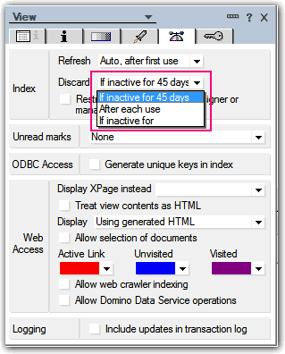
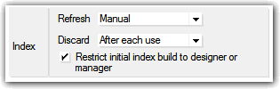

---
authors:
  - serdar

title: "İpucu: View index'lerini öldürmek..."

slug: ipucu-view-indexlerini-oldurmek...

date: 2012-09-28T07:45:00+02:00

---

Hızlı bir ipucu verelim.

Diyelim ki çok büyük bir veritabanınız var. Bu tip veritabanlarında çok fazla view oluşturmak ne kadar sakıncalıdır biliyorsunuz. View index'lerinin kapladığı yer bir yana, bunların sürekli güncellenmesi sunucuda performans kaybına neden olacaktır.
<!-- more -->
Öte yandan öyle view'larınız vardır ki, haftada, ayda hatta yılda bir defa kullanmanız gerekir. Neden bu view'ların yükünü çekesiniz?

Sunucuda sürekli çalışan Update task'i bu view'ları sizin için 'öldürebilir'.

Örneğin "After each use" derseniz, view'la işiniz bittikten sonra 1-2 saat içinde view index'i silinecek, siz bir daha o view'ı kullanana kadar oluşmayacaktır.

Böyle bir ayar, özellikle agent'lar için ideal. 'Update' task'i bu görüntüleri güncellemek için bir kuyruk oluşturur. Normalde veritabanındaki değişiklikler o görüntüyü etkiliyorsa görüntü bu kuyruğa girer. Refresh seçeneğini 'manual' yaptığımızda güncellemeler otomatikman yapılmaz. Agent'ınız 'view.update' komutuyla görüntüyü günceller. İşimiz bittiğinde de view indeksleri silinecektir. Son tıkla da görüntü güncellemesini kendi kontrolümüze alıyoruz. Sıradan kullanıcı bu görüntünün view indeksleri varsa görüntüyü açabilecek, ama henüz indeks oluşturulmadıysa büyük beyaz bir boşluk görecek :)

View index'lerini bilmek, performansı yüksek uygulamalar geliştirmenin birinci adımıdır...

Aklıma geldi, yazayım dedim :)
