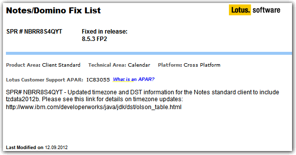

---
authors:
  - serdar

title: "Lotus Notes ve Saatleri Ayarlama Enstitüsü"

slug: lotus-notes-ve-saatleri-ayarlama-enstitusu

date: 2012-09-23T23:32:00+02:00

---

Eğer Windows 7 üzerinde çalışan Lotus Notes, takvim görüntüsünde tüm toplantılarınızı 9 saat sonrasına attıysa veya sunucuda çalışan Java/XPages kodunuz kendisini [Magadan Oblastı](http://tr.wikipedia.org/wiki/Magadan_Oblast%C4%B1) gibi adını bile duymadığınız bir yerde olduğunu sanıyorsa...
<!-- more -->

Sunucu ve istemciyi 8.5.3 FP2 versiyonuna geçirmenin vakti gelmiş :)
*Not: Şu anda sorun yaşamayabilirsiniz ama Windows 7 üzerinde 'time zone' ayarını değiştirdiğiniz anda kabus başlayacak!!!*
