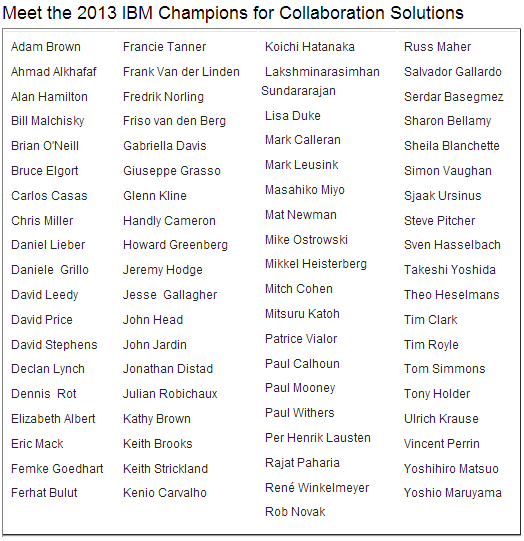

---
authors:
  - serdar

title: "IBM Şampiyonları açıklandı: İki güzel haber daha!"

slug: ibm-sampiyonlari-aciklandi-iki-guzel-haber-daha

date: 2012-12-12T11:11:34+02:00

---

Bu haftalarda iyi haberler bitmiyor!

2011 yılında IBM İşbirliği çözümleri (IBM Collaboration Solutions) alanında ilk kez açıklanan IBM Şampiyonları programına [seçilmiştim](2011-06-elli-kisiden-biri-olmak....md "elli-kisiden-biri-olmak....htm"). Dün Joyce Davis tarafından [açıklanan](https://www-304.ibm.com/connections/blogs/socialbusiness/entry/december_10_2012_10_05_pm3?lang=en_us) IBM Champions 2013 listesinde tekrar yeraldığımı öğrendim!
<!-- more -->

Güzel haber burada bitmiyor... Artık bu listeye Türkiye'den giren tek kişi değilim! Değerli dostum, Lotus Türkiye Kullanıcı Grubu'ndan da tanıdığınız ve aynı zamanda komşum olan Ferhat Bulut (nam-ı diğer [bestcoder](http://www.bestcoder.net/)!) da IBM Şampiyonu seçildi! Sıkı bir XPages uzmanı olan Ferhat, Akbank ekibinin değerli bir üyesi. Kendisi Lotus topluluğunda geçen yıl düzenlenen [OpenNTF yarışmasının](http://xpages.info/contest) ikincisi olarak da tanınıyor. Ferhat'ı tebrik ediyoruz!

Tüm şampiyonların bir listesi de aşağıda:

