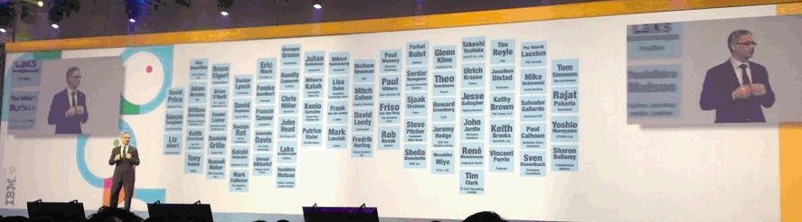

---
authors:
  - serdar

title: "IBM Connect maceram ve DOTS sunumu..."

slug: ibm-connect-maceram-ve-dots-sunumu...

date: 2013-02-06T16:16:13+02:00

---

IBM Connect 2013'e gittim ve döndüm. Hesaplayamadığım birkaç iş nedeniyle yeni yeni kendime geliyorum. Maceramı ve sunumumu paylaşmak istedim.

İkinci Orlando seyahatim çok daha güzel geçti bu kez. IBM Champion etiketinin yanına eklenen konuşmacı kartı, deneyim ve daha çok eğlence!
<!-- more -->
Bu yıl ajandam çok doluydu. Daha çok oturumu hedefledim ve birçoğuna katılabildim. Örneğin, geçen yılki iş ortakları oturumları yerine pazar günkü 'Master Class'ları tercih ettim ve iyi ki de öyle yapmışım.

İki oturum, uygulama geliştirme süreçlerine yaklaşımının farklılığı nedeniyle çok hoşuma gitti. Pazar günkü "Master Class" oturumunda Nathan T. Freeman Notes uygulamalarını [sistematik şekilde](http://openntf.org/XSnippets.nsf/snippet.xsp?id=reverse-engineering-notes-apps-sample-code) nasıl analiz edilmesi gerektiğini anlattı. Ryan J. Baxter ve Mikkel F. Heisterberg [best practices](http://lekkimworld.com/2013/01/29/slides_from_bp209_in_the_land_of_the_social_apps) sunumunda API tasar ımının inceliklerinden bahsettiler.

Sosyalleşme kısmını da unutmamak lazım. Bir sürü yeni insanla tanışmak, IBM'ciler ve diğer topluluk üyeleriyle konuşmak iyi geldi. En büyük değer bu sohbetlerde gizlidir genelde (ve ayıklamak için biraz bira gerekir!).

*Açılış serenomisinde IBM Champions...*

Tabi en önemlisi Bruce Elgort'la birlikte yaptığımız sunum oldu. Skype üzerinde yaptığımız denemelerden çok hoşnut olmadan gittim Orlando'ya. Süreyi epey aşıyorduk ve aksan problemi ya şamaktan endişeleniyordum. 19 yaşından bu yana topluluk önünde konuşurum, hiç problem yaşamadım bugüne kadar. Workshop'larıma katılanlar sevdi ğim bir konuda 3-4 saat konuşabileceğimi de bilirler. Hele başka bir dilde sunum yapmanın d üşüncesi bile kabus gibiydi. Sunuma 5 dakika kala kalp krizi geçirebilirdim.

Deneyimli konuşmacılar, özellikle ilk sunumlarda başka bir deneyimli konuşmacıyla eşleşmeyi önerirler. Şimdi çok net anlıyorum nedenini. Bruce durumu çok güzel yönetti. O olmasaydı izleyiciler dakikalarca süren sessizlik ve titreyen bir konuşmacı göreceklerdi.

Fakat sunum muhteşem geçti. Şu anda değerlendirme anketlerinin sonu çlarına bakıyorum ve harika bir sunum çıkarmış olduğumuzu g örüyorum. Puanlamaların yüksek olması bir yana şu yorum özellikle dikkatimi çekti:

> "Bu oturum, Lotusphere oturumlarının nasıl olması gerektiğinin güzel bir örneği. Deneyimli ve deneyimsiz iki konuşmacı zaten sahip olduğumuz araçlardan nasıl daha fazla değer yaratabileceğimizi öğretiyorlar. Harika!!!"

 

Oturuma ilişkin [sunum burada](https://speakerdeck.com/sbasegmez/bp207-meet-the-java-application-server-you-already-own-ibm-domino):

Buradaki slaytlar DOTS kurulumu, tasklet geliştirme ile debugging ve deploying süreçlerinin tamamını adım adım anlatıyorlar. Buna bir workshop yapmam lazım.

Bonus olarak da IBM Champions koordinatörlerinden Justin'in benimle yapt ığı söyleşiyi izleyebilirsiniz :)

<iframe width="560" height="315" src="http://www.youtube.com/embed/5uA_7yBViuQ" frameborder="0" allowfullscreen></iframe>
